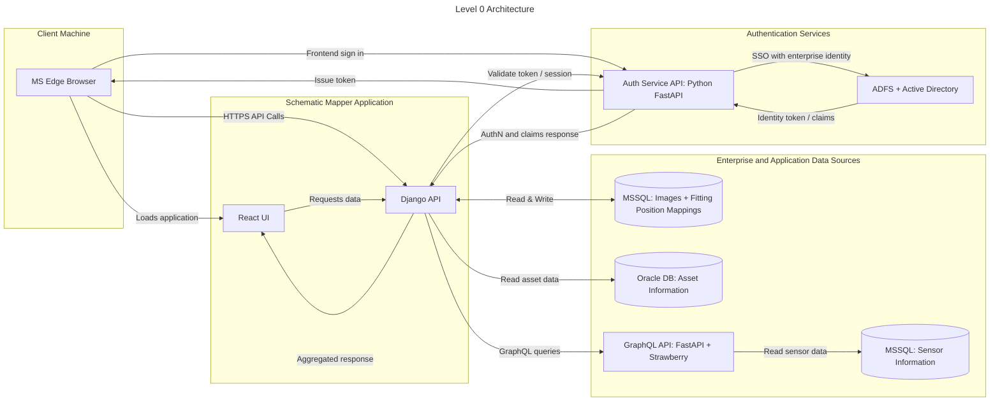
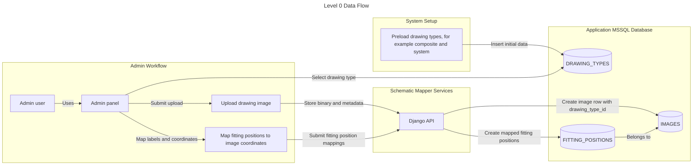
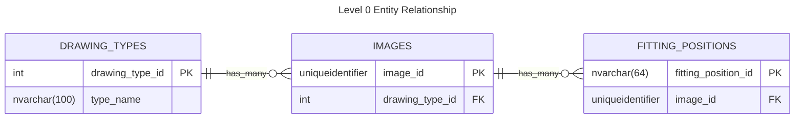
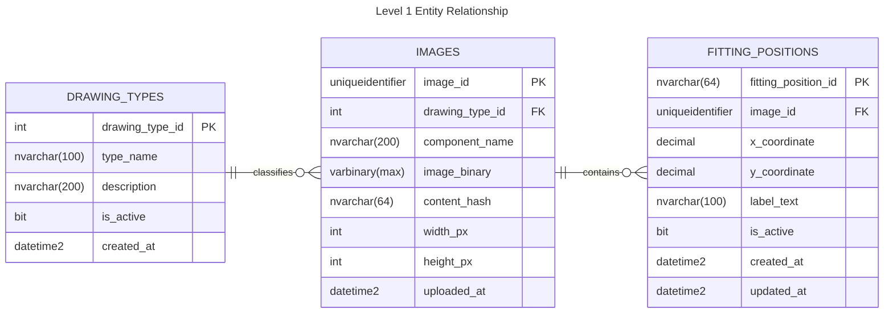
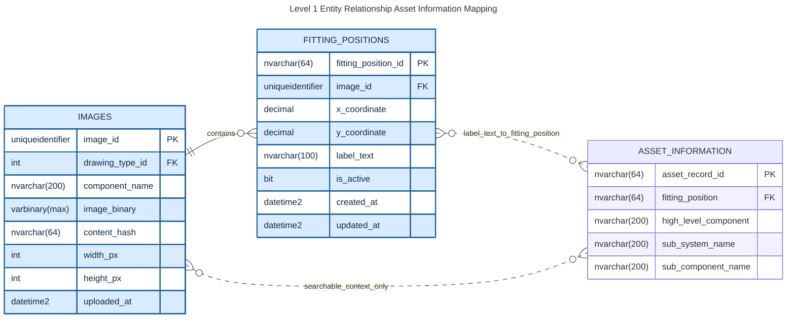
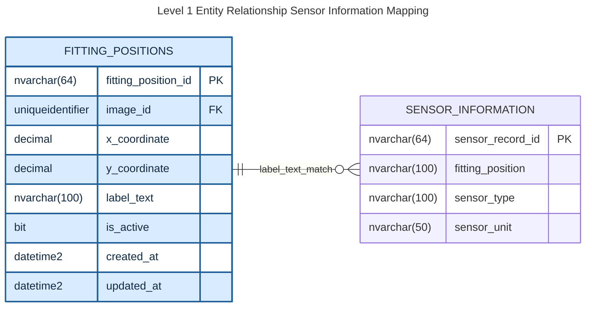
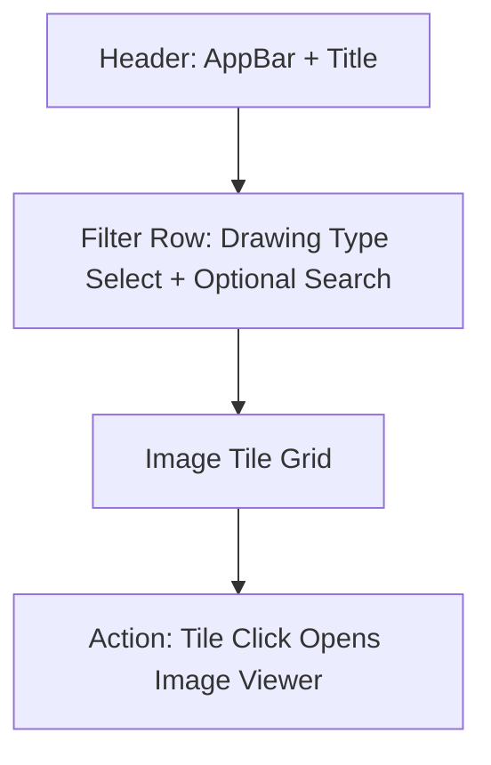
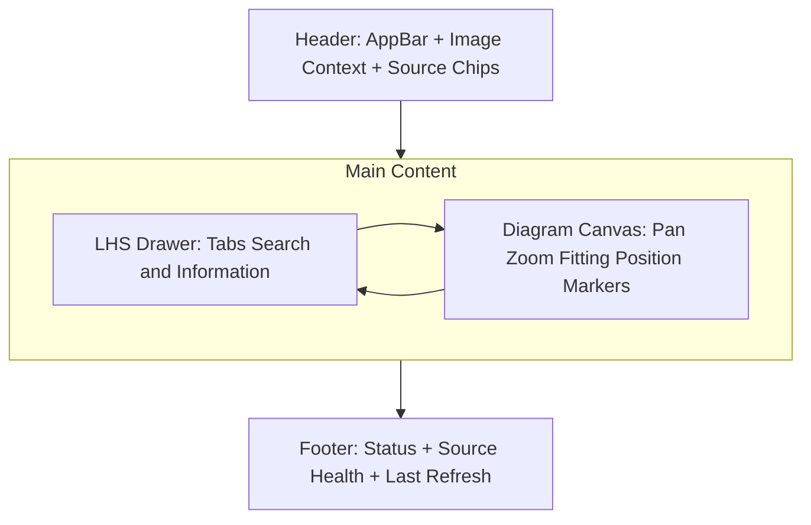
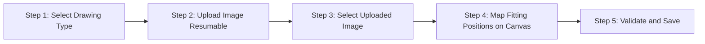

# Schematic Mapper
*Prototype application for mapping component information over mechanical drawings*

## Table of Contents
- [Problem Statement](#problem-statement)
- [End-State](#end-state)
- [Requirements](#requirements)
- [Tech Stack](#tech-stack)
- [Architecture](#architecture)
- [Database Layer](#database-layer)
- [Server Side Layer](#server-side-layer)
- [Client Side](#client-side)
- [Glossary](#glossary)

## Glossary
- **ADFS**: Active Directory Federation Services, used for enterprise authentication.
- **MVP**: Minimum Viable Product, the initial version of the application.
- **POI**: Point of Interest, referring to fitting positions on drawings.
- **WCAG**: Web Content Accessibility Guidelines, standards for web accessibility.

## Problem Statement
There is currently no method of visualizing component information over mechanical drawings.

## End-State
In its end state the Schematic Mapping application is to be a scalable and extendable platform that can be integrated with enterprise data sources to visualize component information and health data on mechanical drawings. Serving as both a training aid and informing engineers of possible compounding health issues.

## Requirements

**High Level**

1. Must be a web application.
1. Must be able to scale to an enterprise grade application.
1. Must be optimized for users on MS Edge browsers.
1. Must be optimized for desktop devices.
1. Must be able to run on Windows-based servers through IIS.
1. The application must be designed to allow for ease of integration with new data sources as made available by the enterprise.
    - These sources will be read only access.
1. All technologies used must be license free and free to use for enterprise.

**User Interface**
<br>
*Should be similar to Google Maps in appearance.*

1. The user interface must be able to display vector format drawings of ~15mb in size.
    - Users must be able to pan & zoom on these diagrams.
    - The interface must be performant in handling these visualizations.
    - Hovering over fitting positions on the drawing is to show a tooltip detailing information.
1. The user interface is to include a left hand side panel that lists component information.
    - This component information is to relate to fitting positions on the drawings, mapped via X & Y co-ordinates.
    - The side panel is to include the ability to tab between different data sources i.e. asset information & sensor recordings.
    - The side panel is to include search functionality.
    - Clicking on a result in the side bar is to pan to the fitting position on the drawing. 
    - Clicking on a fitting position on the drawing is to open the information within the side bar.
1. There is to be an admin section that allows for image upload and the mapping of co-ordinates to fitting position identifiers.

**Data Access**

1. Images and co-ordinate/fitting position mappings should be stored in a MSSQL database that is owned by the application.
    - This is the only intended write access database for **MVP**.
1. For **MVP** asset information is to be pulled via API from an Oracle database that is managed by a separate area of the enterprise.
1. For **MVP** sensor information is to be pulled via an existing GraphQL API written in Python on the FastAPI & Strawberry frameworks from an MSSQL database that is managed by a separate area of the enterprise.

**Authorization**

1. The application must integrate with an existing enterprise user service solution underpinned by ADFS and Active Directory.

### Requirements Summary

| Category | Key Requirements |
|----------|------------------|
| High Level | Web app, scalable to enterprise, optimized for MS Edge/desktop, runs on Windows/IIS, extensible data integration, license-free tech |
| User Interface | Display 15MB vector drawings with pan/zoom, tooltips on hover, left panel with tabs for data sources, search, click interactions |
| Data Access | Internal MSSQL for images/mappings, external Oracle API for assets, GraphQL for sensors |
| Authorization | Integration with ADFS/Active Directory |

The requirements above inform the selection of the tech stack detailed below.

## Tech Stack

Layer | Technologies |
--|--|
Database| MSSQL & Oracle
Server Side| Python & Django & Pytest with Ruff (Linting/Formatting) & Mypy (Type Checking)
Client Side| TypeScript & React with MaterialUI components on Vite & Vitest, Biome (Linting/Formatting)
Authorization| *Existing ADFS & Active Directory Service*

---

## Architecture



*Alt: Level 0 Architecture diagram showing client browser, application server with React UI and Django API, and enterprise data sources including MSSQL, Oracle, and GraphQL.*

### Database Layer

#### Internal Data Storage

- A MSSQL database that stores Drawings, Drawing Types & Fitting Position Labels

#### Data Flow



Level 0 flow notes:
- Drawing types are preloaded before admin upload workflows begin.
- Admin uploads an image of a selected drawing type.
- Admin maps fitting positions to that image through the admin panel.

#### Entity Relationship



Level 0 notes:
- One `DRAWING_TYPES` record can relate to many `IMAGES`.
- Each `IMAGES` record belongs to exactly one `DRAWING_TYPES` record.
- One `IMAGES` record can relate to many `FITTING_POSITIONS`.
- To enforce only one row per drawing type category (for example `composite`, `system`), add `UNIQUE (type_name)` on `DRAWING_TYPES`.



- `label_text` is unique per image via composite constraint `UNIQUE (image_id, label_text)`.
- The same `label_text` value can appear on different images.


#### External Data Storage

#### Entity Relationship



Asset mapping notes:
- Primary link is `FITTING_POSITIONS.label_text` to `ASSET_INFORMATION.fitting_position`.
- `ASSET_INFORMATION.fitting_position` is guaranteed to exist in Oracle.
- `IMAGES.component_name` and `ASSET_INFORMATION.high_level_component` are searchable context fields, not authoritative join keys.



Sensor mapping notes:
- Primary link is `FITTING_POSITIONS.label_text` to `SENSOR_INFORMATION.fitting_position`.
- `sensor_type` captures the kind of sensor.
- `sensor_unit` captures the unit of measure recorded by that sensor.
- `image_id` does not exist in external sources; image scoping is applied through internal fitting-position mappings.

---

### Server Side Layer

*Uses `REST` as the primary API style for the Django application. Keeping upstream integrations behind internal service adapters, including the existing sensor GraphQL source.*

#### Server Side Architecture

1. API layer (`Django REST Framework`)
    - Exposes stable endpoints for React UI and Admin workflows.
    - Performs auth checks using the enterprise auth service.

2. Application service layer
    - Implements business workflows: image upload, fitting position mapping, POI aggregation.
    - Orchestrates internal DB operations and external source reads.

3. Source adapter layer
    - One adapter per external source (`AssetAdapter`, `SensorAdapter`, future adapters).
    - Handles source-specific authentication, request/response contracts, retries, and error mapping.

4. Normalization and mapping layer
    - Transforms external payloads into canonical response objects for the UI.
    - Applies authoritative join rules using `FITTING_POSITIONS.label_text` to source fitting-position fields.
    - Uses `IMAGES.component_name` only as contextual/search metadata.

5. Persistence layer (`Django ORM`)
    - Uses Django models and migrations for internal MSSQL schema evolution.
    - Keeps write operations limited to app-owned internal tables.


#### API Endpoints

##### Image Management Endpoints
- `GET /api/images`: list available images for user selection (supports filtering by drawing type/component and cursor-based loading).
- `GET /api/images/{image_id}`: image metadata for diagram context.
- `GET /api/images/{image_id}/fitting-positions`: labels and coordinates for map overlay.
- `GET /api/fitting-positions/{fitting_position_id}/details`: aggregated asset and sensor detail response.

##### Search Endpoints
- `GET /api/search?query=&image_id=&limit=&cursor=&sources=`: search across internal and selected external source fields (requires `image_id`, cursor-based loading for infinite scroll).

##### Admin Endpoints
- `POST /api/admin/images`: admin image upload with drawing type.
- `POST /api/admin/uploads`: create upload session and return `upload_id`.
##### Admin Endpoints
- `POST /api/admin/images`: admin image upload with drawing type.
- `POST /api/admin/uploads`: create upload session and return `upload_id`.
    1. Upload method
        - Support resumable chunked uploads as the default for reliability.
        - Keep single-request upload support for trusted fast networks and small files.

    2. Upload session model
        - Track staged uploads in an internal `IMAGE_UPLOADS` session record with states: `initiated`, `uploading`, `verifying`, `completed`, `failed`, `aborted`.
        - Store upload metadata: `upload_id`, file name, file size, drawing type, expected checksum, uploader identity, and timestamps.

    3. Integrity and idempotency
        - Require a client-provided checksum (`SHA-256`) for each completed upload.
        - Verify server-side checksum before committing to `IMAGES`.
        - Require idempotency key for upload initiation and finalization to prevent duplicate image records on retries.
        - Persist uploaded image only after checksum and validation pass.

    4. Validation and safety
        - Enforce max size and allowed MIME/type list for supported diagram formats.
        - Reject malformed or unsupported files before final commit.
        - Keep staged files isolated from final storage until verification succeeds.

    5. Failure handling
        - Allow chunk retries without restarting the full upload.
        - Support resume by querying missing chunk numbers for an `upload_id`.
        - On finalization failure, keep session in `failed` state with clear error code and recovery action.
        - Schedule cleanup for abandoned/expired upload sessions and orphaned chunks.
        - Note: Network interruptions during chunk upload should trigger automatic retry with resume capability.

    6. Commit behavior
        - Finalize in a transaction-like flow: verify file -> create `IMAGES` record -> mark upload session `completed`.
        - Set `IMAGES.content_hash` from verified checksum.
        - Return created `image_id` and upload status metadata to the admin UI.

    7. Operational controls
        - Emit structured logs and metrics for upload success rate, failure rate, mean upload time, and checksum failures.
        - Configure upload timeouts and max concurrent uploads per user/session.
        - Include request correlation IDs for each upload lifecycle action.
- `PUT /api/admin/uploads/{upload_id}/parts/{part_number}`: upload or retry a chunk.
- `POST /api/admin/uploads/{upload_id}/complete`: finalize upload, validate checksum, and create image record.
- `DELETE /api/admin/uploads/{upload_id}`: abort upload and cleanup staged parts.
- `POST /api/admin/fitting-positions/bulk`: bulk create/update coordinate mappings.

#### Search Architecture

1. Search scope
    - Search is only enabled after the user selects an image in the UI.
    - `image_id` is a required API parameter for all search requests.
    - `image_id` is internal-only (`IMAGES` and related internal mappings); external sources do not store `image_id`.
    - Internal search targets all internal searchable business columns for selected image scope.
    - Non-searchable internal columns (for example `image_binary`) are explicitly excluded.
    - External search targets named columns only (not full-table search), defined per source during implementation.
    - External searchable columns are configuration-driven to allow flexible onboarding and schema changes.
    - All fields specified as searchable in this specification must be searchable through configuration.

2. Search service placement
    - Implement a dedicated `SearchService` in the application service layer.
    - API layer only validates inputs and delegates to `SearchService`.
    - Add `SearchIndexService` to maintain a reduced unified search projection.
    - Add `SearchConfigService` to load and validate searchable-column configuration per source.

3. Query strategy
    - Enforce `image_id` scoped search for map context.
    - Reject requests without `image_id` with `400 Bad Request`.
    - Apply external-source filtering in two steps:
        - Step 1: resolve selected image to internal fitting positions (`fitting_position_id`, `label_text`).
        - Step 2: query configured source columns using mapped internal keys/labels and materialize searchable fields.
    - Ranking and boosting rules are configuration-driven (for example prioritize `sub_component_name` and `sensor_type`).
    - Ranking is based on match type priority (exact > prefix > partial), then alphabetical.
    - Support prefix and partial matching for `label_text`.
    - Support source filtering via `sources=internal,asset,sensor`.
    - Return deduplicated results at `fitting_position_id` level (no duplicate fitting positions in a single response).
    - Return ranked results with deterministic ordering (exact match, prefix match, partial match).

4. Performance strategy
    - External source indexes are not assumed and not required.
    - Add DB indexes only on internal application-owned search structures.
        - `FITTING_POSITIONS (image_id, label_text)`
        - `FITTING_POSITIONS (label_text)`
        - `IMAGES (component_name)`
    - Maintain a reduced search projection (table or materialized view) keyed by `fitting_position_id` with configured external searchable columns only.
    - Add indexes on projection columns in the internal DB for low-latency search.
    - Refresh strategy for projection:
        - Asset source projection refresh: weekly.
        - Sensor source projection refresh: yearly.
        - Internal image metadata refresh expectation: yearly.
        - Internal fitting-position mapping refresh expectation: weekly.
    - Apply result limits with cursor-based incremental loading to support infinite scroll and just-in-time loading.

5. Search configuration
    - Searchable fields are defined via configuration (for example `search_sources.yaml` or DB-backed config table).
    - Configuration includes:
        - source name and enablement flag
        - external table/view name
        - allowed searchable columns (internal and external)
        - field priority/weight for ranking
        - normalization rules (case folding, trimming, alias mapping)
    - Configuration changes should not require API contract changes.

6. Search response shape
    - Return enough metadata for client actions:
        - `fitting_position_id`
        - `label_text`
        - `image_id`
        - `x_coordinate`, `y_coordinate`
        - `component_name`
        - `matched_source` (`internal`, `asset`, `sensor`)
        - `matched_field` (for example `sub_system_name`, `sensor_type`)
        - `has_more`
        - `next_cursor`
    - Include `match_type` (`exact`, `prefix`, `partial`) for UI highlighting.

7. Search API example
    - Example request:
        - `GET /api/search?query=pump&image_id=2f84d8f2-2a22-4a2f-9b2f-7de6b77ab123&limit=25&cursor=eyJvZmZzZXQiOjB9&sources=internal,asset,sensor`
    - Example validation error when image not selected:

        ```json
        {
        "error": "image_id is required before search",
        "code": "search_image_required",
        "status": 400
        }
        ```

    - Example response:

        ```json
        {
            "query": "pump",
            "image_id": "2f84d8f2-2a22-4a2f-9b2f-7de6b77ab123",
            "limit": 25,
            "results": [
                {
                    "fitting_position_id": "FP-10021",
                    "label_text": "PUMP-01-INLET",
                    "image_id": "2f84d8f2-2a22-4a2f-9b2f-7de6b77ab123",
                    "x_coordinate": 1240.336,
                    "y_coordinate": 482.119,
                    "component_name": "Cooling Pump Assembly",
                    "matched_source": "internal",
                    "matched_field": "label_text",
                    "match_type": "prefix"
                },
                {
                    "fitting_position_id": "FP-10022",
                    "label_text": "PUMP-01-OUTLET",
                    "image_id": "2f84d8f2-2a22-4a2f-9b2f-7de6b77ab123",
                    "x_coordinate": 1298.101,
                    "y_coordinate": 487.002,
                    "component_name": "Cooling Pump Assembly",
                    "matched_source": "asset",
                    "matched_field": "sub_system_name",
                    "match_type": "partial"
                },
                {
                    "fitting_position_id": "FP-10410",
                    "label_text": "PUMP-02-DISCHARGE",
                    "image_id": "2f84d8f2-2a22-4a2f-9b2f-7de6b77ab123",
                    "x_coordinate": 1668.774,
                    "y_coordinate": 515.903,
                    "component_name": "Cooling Pump Assembly",
                    "matched_source": "sensor",
                    "matched_field": "sensor_type",
                    "match_type": "partial"
                }
            ],
            "source_status": {
                "internal": "ok",
                "asset": "ok",
                "sensor": "ok"
            },
            "has_more": true,
            "next_cursor": "eyJvZmZzZXQiOjI1fQ==",
            "request_id": "6f6e94fd-a2cd-4c7f-a1a7-2d52ed07e59d"
        }
        ```

#### Testing Strategy (`pytest`)

1. Test stack
    - `pytest`
    - `pytest-django`
    - `pytest-mock`
    - `responses` or `respx` for external API mocking (use in CI pipelines for integration tests)
    - `pytest-cov` for coverage reporting, targeting 100% unit test coverage
    - `mypy` with `django-stubs` and `djangorestframework-stubs` for static type checking; configured via `[tool.mypy]` in `pyproject.toml` with `strict = true`

1. Test organisation
    - The `tests/` directory lives at the root of the backend and mirrors the source code folder structure (for example `tests/api/` covers `api/`, `tests/config/` covers `config/`).
    - Test files are named `test_<module>.py` to match the module they cover (for example `tests/api/test_views.py` covers `api/views.py`).
    - Tests within each file are grouped into classes named after the subject under test (for example `TestHealthView`, `TestSearchService`).
    - `pytest.ini` sets `testpaths = tests` so discovery is explicit and scoped.

1. Test layers
    - Unit tests:
        - `SearchService` ranking, filtering, deduplication, and cursor-loading behavior.
        - Normalization/mapping functions for asset and sensor payloads.
        - Adapter error handling and timeout behavior.
    - Integration tests:
        - Django API endpoints using DB fixtures.
        - Aggregation endpoint with mocked external sources.
        - Partial-failure behavior (`source_status=degraded`).
    - Contract tests:
        - Validate expected response shapes for external sources.
        - Detect upstream schema changes early.

1. Search-specific test cases
    - Search evaluates all configured internal searchable columns for the selected image scope.
    - Exact match on configured external column (for example `sub_component_name`) returns expected source result.
    - Exact match on configured external column (for example `sensor_type`) returns expected source result.
    - Exact `label_text` match returns top-ranked result.
    - Prefix match returns expected ordered subset.
    - Ranking priority/weights are respected per configuration.
    - Disabled external columns are not searchable.
    - Duplicate hits from multiple fields/sources collapse to one result per `fitting_position_id`.
    - `image_id` scoping excludes labels from other images.
    - Missing `image_id` returns `400` with `search_image_required`.
    - Empty or too-short query returns validation error.
    - Cursor-based loading contracts are enforced (`has_more`, `next_cursor`, stable ordering).

1. Reliability test cases
    - One external source timeout still returns usable response.
    - Both sources unavailable returns controlled degraded/error payload.
    - Correlation ID is present in logs and propagated across adapters.

1. Image upload reliability test cases
    - Chunk retry succeeds without creating duplicate image records.
    - Upload resume works when connection drops mid-upload.
    - Checksum mismatch blocks finalization and records `failed` upload status.
    - Repeated finalize calls with same idempotency key return same result.
    - Aborted upload removes staged chunks and cannot be finalized.
    - Expired upload sessions are cleaned up by scheduled job.


#### Scalability and Resilience Controls

- Per-source timeout budgets and retry limits.
- Circuit breaker behavior for repeatedly failing sources.
- Read-through caching for slower external datasets.
- Request correlation IDs across all downstream calls.
- Async/background refresh option for expensive source lookups.


#### Other Considerations

`label_text` can become brittle over time. Introduce an internal cross-reference table to map `fitting_position_id` to source-native keys while keeping UI contracts stable as new adapters are added.

---

### Client Side

#### Wire Frames

**Screen: Image Selection**

Purpose:
- Entry screen where users choose drawing type, browse image tiles, and launch Screen 1.

MUI component composition:
- `AppBar`, `Toolbar`, `Container`, `FormControl`, `InputLabel`, `Select`, `MenuItem`
- `TextField` for optional search, `Grid`, `Card`, `CardMedia`, `CardContent`, `CardActionArea`
- `Skeleton` for loading states, `Pagination` optional (or infinite scroll)



```text
+----------------------------------------------------------------------------------+
| Header (AppBar): [Schematic Mapper] [User]                                       |
+----------------------------------------------------------------------------------+
| Filters: [Drawing Type Dropdown] [Search Images] [Source Filter optional]        |
+----------------------------------------------------------------------------------+
| Tile Grid (Card list):                                                           |
| [Image Tile] [Image Tile] [Image Tile] [Image Tile]                              |
|  - preview thumbnail                                                             |
|  - image name                                                                    |
|  - component name                                                                |
|  - drawing type badge                                                            |
| Click tile => navigate to Screen 1 with selected image_id                        |
+----------------------------------------------------------------------------------+
```

Interaction notes:
- Drawing type selection is mandatory before tile list is shown.
- Tile click passes `image_id` and loads Image Viewer screen initial context.

**Screen: Image Viewer**

Purpose:
- Primary operational view for diagram exploration, fitting position interaction, and source-aware detail review.

Access precondition:
- User must arrive with a valid selected `image_id` from Image Selection Screen.
- Direct navigation without `image_id` is blocked and redirects to Image Selection Screen.

MUI component composition:
- `AppBar`, `Toolbar`, `Typography`, `IconButton`, `Button`, `Chip`, `Avatar`
- `Drawer` (persistent left panel), `Tabs`, `Tab`, `TextField`, `List`, `ListItemButton`, `Badge`
- `Box` for diagram canvas wrapper, `Paper` for overlays, `Tooltip` for fitting position hover
- `BottomNavigation` or `Paper` footer status bar



```text
+----------------------------------------------------------------------------------+
| Header (AppBar): [Menu] [Image Name + Type] [Source Chips] [User] [Help]         |
+-------------------------------+--------------------------------------------------+
| LHS Panel (Drawer)            | Diagram Canvas                                   |
| Tabs: [Search] [Information]  | - Vector drawing                                 |
|                               | - Pan/zoom controls                              |
| Search Tab                    | - Fitting position markers + hover tooltips      |
| - Search field                | - Click fitting position => opens Info tab item  |
| - Infinite result list        |                                                  |
| - Result click => pan fitting |                                                  |
|                               |                                                  |
| Information Tab               |                                                  |
| - Selected fitting pos summary|                                                  |
| - Asset/Sensor sub-sections   |                                                  |
+-------------------------------+--------------------------------------------------+
| Footer: [Source status] [request_id] [last refreshed] [zoom level]               |
+----------------------------------------------------------------------------------+
```

Interaction notes:
- Search is disabled until an image is selected.
- LHS tabs remain persistent; selected fitting position syncs across map and panel.
- Source health in header/footer mirrors backend `source_status`.
- Client route guard enforces `image_id` presence (for example `/viewer/:imageId` only).
- If `image_id` is missing/invalid, show notice and redirect to Image Selection.

**Workflow: Admin Upload and Mapping**

Purpose:
- Admin workflow to upload/select image, then map fitting positions using a map-like interface.

MUI component composition:
- Reuses Image Selection screen components for image selection and Image Viewing screen components for map/panel interactions.
- Adds `Stepper`, `LinearProgress`, `Alert`, `Dialog`, `Snackbar` for upload/mapping workflow feedback.



```text
+----------------------------------------------------------------------------------+
| Header (AppBar): [Admin Panel] [User]                                            |
+----------------------------------------------------------------------------------+
| Stepper: 1 Type -> 2 Upload -> 3 Select -> 4 Map -> 5 Save                       |
+----------------------------------------------------------------------------------+
| Step 2 Upload                                                                    |
| [Drawing Type Select] [File Picker] [Upload Progress] [Resume/Retry status]      |
+-------------------------------+--------------------------------------------------+
| Step 4 Mapping LHS Panel      | Mapping Canvas (reuses Screen 1 map canvas)      |
| Tabs: [Unmapped] [Mapped]     | - click to add marker                            |
| - fitting position search     | - drag marker to adjust                          |
| - validation warnings         | - marker color by mapped/unmapped                |
+-------------------------------+--------------------------------------------------+
| Footer: [Validation summary] [Save] [Publish] [Cancel]                           |
+----------------------------------------------------------------------------------+
```

Reuse notes:
- Reuse Image Selection Screen filter/tile components for admin image selection.
- Reuse Image Viewer map canvas, marker behavior, and LHS panel pattern.
- Add admin-only controls for upload state, mapping validation, and save/publish.

#### Components
*Components are organized following the Atomic Design pattern*

##### Atoms

- `AppLogo`: brand mark in header.
- `IconButtonAction`: icon-only actions (`zoom_in`, `zoom_out`, `layers`, `help`, `close`).
- `StatusChip`: small source/status chip (`ok`, `degraded`, `error`).
- `TypeBadge`: drawing type badge (`composite`, `system`).
- `HealthDot`: colored availability indicator.
- `SearchInput`: standardized search text input with loading/clear states.
- `SectionLabel`: small uppercase section title used in drawers/panels.
- `MetricText`: compact value label used in footer/status bars.
- `POIMarkerPin`: marker glyph rendered on diagram canvas.
- `POIMarkerCluster`: cluster badge for dense marker areas.

##### Molecules

- `HeaderIdentity`: `AppLogo` + title + current image context.
- `UserMenuTrigger`: avatar + menu trigger.
- `SourceHealthGroup`: grouped `StatusChip` + `HealthDot` elements.
- `SearchResultItem`: label text + match metadata + source icon.
- `POITooltipCard`: quick POI hover summary.
- `DetailFieldRow`: label/value row for asset or sensor details.
- `FilterBar`: drawing type select + optional text filter.
- `ImageTileCard`: preview thumbnail + name + type + component metadata.
- `UploadProgressRow`: filename + progress bar + retry/resume action.
- `ValidationSummaryRow`: mapping validation count + severity badge.

##### Organisms

- `TopAppHeader`: global header for viewer, selection, and admin.
- `ViewerLeftDrawer`: tabbed drawer with `Search` and `Information` views.
- `SearchResultsPanel`: infinite-scroll result list + loading/error states.
- `POIDetailPanel`: selected fitting position details with source sections.
- `DiagramCanvasViewport`: vector renderer host with pan/zoom/marker overlay.
- `ViewerFooterStatusBar`: source health, request ID, refresh time, zoom level.
- `ImageSelectionGrid`: responsive grid of `ImageTileCard` components.
- `ImageSelectionFilters`: top filter region for type + search.
- `AdminWorkflowStepper`: step control for type -> upload -> select -> map -> save.
- `UploadSessionPanel`: resumable upload interaction and session status.
- `MappingWorkbench`: canvas + unmapped/mapped lists + validation panel.

##### Templates

- `ImageSelectionTemplate`
    - Header + filters + image tile grid + empty/loading/error states.
- `ImageViewerTemplate`
    - Header + persistent LHS drawer + canvas + footer status bar.
- `AdminMappingTemplate`
    - Header + stepper + upload/select/map stages + action footer.

##### Pages

- `ImageSelectionPage`
    - Route entry point for choosing drawing type and image.
- `ImageViewerPage`
    - Guarded route requiring `image_id`.
- `AdminUploadMappingPage`
    - Admin-only workflow with resumable upload and fitting-position mapping.

##### Cross-Cutting Rules

- Reuse template-level layouts across pages to reduce UI drift.
- Keep search, marker, and detail interactions consistent between viewer and admin mapping workbench.
- All async components must provide loading, empty, and error states.
- All interactive controls must be keyboard accessible.

#### Typography & Color Scheme

##### Typography

- Primary font family: `Public Sans`.
- Monospace font family: `IBM Plex Mono` for IDs, request IDs, and technical metadata.
- Fallback stack: `'Public Sans', 'Segoe UI', sans-serif`.

Type scale (MUI mapping):
- `h1` (`40/48`, `700`): screen titles where needed.
- `h2` (`32/40`, `700`): major section headers.
- `h3` (`24/32`, `600`): panel headers.
- `h4` (`20/28`, `600`): card and drawer section headings.
- `body1` (`16/24`, `400`): default content text.
- `body2` (`14/20`, `400`): secondary content text.
- `caption` (`12/16`, `500`): metadata and helper text.
- `button` (`14/20`, `600`, uppercase false): actions.

Usage guidance:
- Use `body1` for primary panel readability.
- Use `caption` for health timestamps/request IDs.
- Keep line length under 90 characters in detail panels.

##### Color Scheme

Theme direction:
- Light-first operational theme inspired by map products, with strong contrast and status clarity.

Core palette:
- `primary.main`: `#0B6BCB` (interactive blue)
- `primary.dark`: `#084F97`
- `primary.light`: `#E7F1FB`
- `secondary.main`: `#0F766E` (teal for secondary emphasis)
- `background.default`: `#F4F7FB`
- `background.paper`: `#FFFFFF`
- `text.primary`: `#102A43`
- `text.secondary`: `#486581`
- `divider`: `#D9E2EC`

Semantic/status palette:
- `success.main`: `#1E8E3E`
- `warning.main`: `#B7791F`
- `error.main`: `#C53030`
- `info.main`: `#2563EB`

Map-specific tokens:
- `map.canvas.bg`: `#EEF3F8`
- `map.grid.line`: `#D7E2EE`
- `map.poi.default`: `#0B6BCB`
- `map.poi.selected`: `#C53030`
- `map.poi.cluster`: `#0F766E`
- `map.poi.unmapped`: `#B7791F`

Panel and chrome tokens:
- `panel.drawer.bg`: `#FFFFFF`
- `panel.drawer.tab.active`: `#E7F1FB`
- `panel.drawer.tab.text.active`: `#0B6BCB`
- `footer.bg`: `#102A43`
- `footer.text`: `#F8FAFC`

Accessibility and consistency:
- Maintain WCAG AA contrast for text and controls.
- Do not encode status by color alone; pair with icon/label.
- Keep status colors consistent across viewer and admin workflows.
- Enforce color tokens via MUI theme overrides and avoid hardcoded ad-hoc colors.

#### API Integration

- Use `TanStack Query` (`@tanstack/react-query`) as the primary API integration and caching layer.
- Use `Axios` as the HTTP client under a typed `services/api` module.
- Use `Zod` for runtime response validation and parsing.
- Use `react-error-boundary` for screen-level API failure isolation and fallback UI.
- Keep server state in TanStack Query; keep UI-only state in React component state or a lightweight store.

##### Client API Layer Structure

- `services/api/httpClient.ts`: Axios instance, base URL, auth headers, request ID propagation, and interceptors.
- `services/api/endpoints.ts`: typed endpoint functions.
- `services/api/queryKeys.ts`: centralized query key factory.
- `services/api/hooks/`: screen-level query/mutation hooks.
- `services/api/schemas.ts`: Zod schemas for request/response validation.

##### Query and Mutation Mapping

- Image Selection Screen
    - `useQuery`: `GET /api/images` with filters (`drawingType`, `search`, `cursor`).
    - Infinite loading: `useInfiniteQuery` when tile list grows.

- Image Viewer Screen
    - `useQuery`: `GET /api/images/{image_id}` for header/context.
    - `useQuery`: `GET /api/images/{image_id}/fitting-positions` for marker layer.
    - `useInfiniteQuery`: `GET /api/search?query=&image_id=&cursor=&limit=&sources=`.
    - `useQuery`: `GET /api/fitting-positions/{id}/details` on POI selection.

- Admin Upload and Mapping Screen
    - `useMutation`: `POST /api/admin/uploads` (start upload session).
    - `useMutation`: `PUT /api/admin/uploads/{upload_id}/parts/{part_number}` (chunk upload/retry).
    - `useMutation`: `POST /api/admin/uploads/{upload_id}/complete` (finalize).
    - `useMutation`: `DELETE /api/admin/uploads/{upload_id}` (abort).
    - `useMutation`: `POST /api/admin/fitting-positions/bulk` (save mappings).

##### Search Integration Pattern

- `image_id` is mandatory in all search hooks.
- Search hook is disabled until `image_id` exists (`enabled: !!imageId`).
- Use `useInfiniteQuery` with backend `next_cursor` and `has_more`.
- Query key should include:
    - `image_id`
    - normalized query text
    - selected `sources`
    - page size (`limit`)
- Deduplication is server-defined by `fitting_position_id`; client should still guard against duplicate render keys.

##### Caching Policy (Client)

- `GET /api/images` (selection list)
    - `staleTime`: 5 minutes
    - `gcTime`: 30 minutes

- `GET /api/images/{image_id}`
    - `staleTime`: 15 minutes
    - `gcTime`: 60 minutes

- `GET /api/images/{image_id}/fitting-positions`
    - `staleTime`: 5 minutes
    - `gcTime`: 30 minutes

- `GET /api/search...`
    - `staleTime`: 30 seconds
    - `gcTime`: 10 minutes
    - Reset cache when `image_id` or query string changes.

- `GET /api/fitting-positions/{id}/details`
    - `staleTime`: 60 seconds
    - `gcTime`: 15 minutes

##### Cache Invalidation Rules

- After successful upload finalization:
    - Invalidate image list queries.
    - Prefetch new image context by returned `image_id`.

- After successful bulk fitting-position mapping save:
    - Invalidate `fitting-positions` for current `image_id`.
    - Invalidate active search queries for current `image_id`.
    - Invalidate selected POI detail query if affected.

##### Resilience and Retry Behavior

- Enable retries for idempotent reads (`GET`) with bounded retry count.
- Disable automatic retries for non-idempotent finalize actions unless idempotency key is present.
- Expose source health (`source_status`) in UI from response payload.
- Show partial-data state when backend returns degraded response (e.g., display available data with warnings when one source fails).

##### Security and Transport

- Attach auth token on each request via interceptor/wrapper.
- Handle `401/403` globally and route to sign-in flow.
- Never cache sensitive auth payloads in local storage.


#### Testing Strategy (`vitest`)

1. Test stack
    - `vitest` as the test runner.
    - `@testing-library/react` for component and page behavior tests.
    - `@testing-library/user-event` for realistic user interactions.
    - `msw` for deterministic API mocking at the network boundary.
    - `@tanstack/react-query` test utilities with isolated `QueryClient` per test.
    - `@testing-library/jest-dom` matchers for accessible UI assertions.

1. Test organisation
    - Test files are co-located with the source file they cover (for example `App.test.tsx` lives next to `App.tsx`, `services/api/health.test.ts` lives next to `health.ts`).
    - Test files are named `<module>.test.ts(x)` to match the module they cover.
    - Tests within each file are grouped using `describe` blocks named after the subject under test (for example `describe("App", ...)`, `describe("useHealthQuery", ...)`).
    - `src/test/setup.ts` is the vitest setup file for global test configuration (for example jest-dom matchers); it is not a test file.

1. Test layers
    - Unit tests:
        - Presentational components (`StatusChip`, `ImageTileCard`, `SearchResultItem`, `POITooltipCard`).
        - Utility modules (query key factories, cursor helpers, response mappers).
        - Zod schema parsing behavior (`services/api/schemas.ts`) for valid and invalid payloads.
    - Hook tests:
        - Query hooks in `services/api/hooks/` with mocked Axios + MSW responses.
        - Mutation hooks for upload session start, chunk upload, finalize, abort, and mapping save.
        - Retry behavior, enabled conditions, and cache invalidation side effects.
    - Integration tests:
        - Page-level flows with router + QueryClient + MSW wired together.
        - Cross-component interactions between drawer, map canvas, and detail panel.
        - Error boundary fallback rendering when one or more requests fail.

1. Route guard and navigation tests
    - Direct navigation to Image Viewer without `image_id` redirects to Image Selection.
    - Valid `/viewer/:imageId` route loads image metadata and marker layer.
    - Invalid or missing `image_id` shows user notice and prevents search execution.
    - Tile click from Image Selection routes to viewer with expected `image_id`.

1. Search and viewer behavior test cases
    - Search hook remains disabled until `image_id` exists (`enabled: !!imageId`).
    - Search query key changes when `image_id`, query text, `sources`, or `limit` changes.
    - Infinite loading consumes `next_cursor` and stops when `has_more` is false.
    - Result click pans/highlights the correct POI and syncs Information tab selection.
    - Duplicate result keys are not rendered when backend returns repeated fitting positions.
    - `source_status=degraded` is shown as partial-data UI state instead of hard failure.

1. Caching and invalidation test cases
    - `staleTime` and `gcTime` policies are applied per endpoint category.
    - Upload finalize success invalidates image list queries and prefetches returned `image_id`.
    - Bulk fitting-position save invalidates fitting-position, search, and affected detail queries.
    - Query cache resets correctly when switching from one selected image to another.

1. Upload workflow test cases
    - Start upload creates session and displays progress state.
    - Chunk retry updates progress without duplicating visible rows or state entries.
    - Finalize success transitions admin workflow to selectable/mappable image state.
    - Finalize failure keeps workflow recoverable with actionable error messaging.
    - Abort upload clears UI session state and disables finalize actions.

1. Error handling and resilience tests
    - Global `401/403` handling triggers sign-in flow behavior.
    - Network timeout on one panel does not crash sibling panels due to error boundaries.
    - Axios interceptor error mapping produces user-safe messages.
    - Zod parse failures are surfaced as controlled client errors and logged with request context.

1. Accessibility and interaction regression tests
    - Keyboard navigation for tabs, search list items, and primary actions.
    - Focus management on route change, dialog open/close, and error fallback states.
    - Tooltip and status indicators expose text labels (not color only).

1. Test data and environment controls
    - Use stable fixture builders for images, fitting positions, asset details, and sensor details.
    - Seed deterministic cursor pages to validate infinite scroll ordering.
    - Disable shared QueryClient state between tests to avoid cache leakage.
    - Run MSW in strict mode to fail on unhandled requests.

---

### Problem Statement Coverage

Problem to solve:
- There is currently no method of visualizing component information over mechanical drawings.

How this specification addresses it:
- Establishes image ingestion and mapping workflows so drawings and fitting positions become queryable (`### Database Layer`, `### Server Side Layer`).
- Defines a map-like viewer with pan/zoom, POI markers, tooltip interaction, and synchronized detail panel (`### Client Side`).
- Defines image-scoped search and POI detail retrieval across internal and enterprise data sources (`#### Search Architecture`, `#### API Integration`).

### End-State Coverage

End-state theme 1: scalable and extendable platform
- Adapter-based server architecture supports onboarding future data sources with minimal API contract changes.
- Configuration-driven search fields and ranking reduce code churn as source schemas evolve.
- Reliability controls (timeouts, retries, circuit breaker patterns, resumable uploads) support enterprise operation.

End-state theme 2: integration with enterprise data sources
- MVP integrations explicitly include Oracle asset data and GraphQL sensor data.
- Source normalization and mapping rules define how heterogeneous records are merged into a stable UI contract.
- Partial-failure behavior and source health reporting preserve user utility during source outages.

End-state theme 3: visualization of component and health data on drawings
- Viewer and side panel behaviors are defined for POI-to-data interaction.
- Aggregated fitting-position details combine asset context and sensor context per selected POI.
- Search and result navigation are image-aware to keep map context intact.

End-state theme 4: support training and engineering decision support
- UI patterns support discovery and orientation (search-first, click-to-pan, POI tooltip, synchronized detail views).
- Source attribution, status, and refresh metadata help users trust and interpret information.
- Admin mapping workflow supports maintaining high-quality POI mappings over time.

### MVP Success Criteria

Functional outcomes:
- A user can select a drawing and interact with mapped POIs on a performant canvas.
- A user can open POI details and see aggregated asset and sensor information with source attribution.
- A user can search within the selected drawing and navigate from results to POIs.
- An admin can upload drawings and maintain fitting-position mappings with resumable reliability.

Non-functional outcomes:
- The platform runs in enterprise browser and hosting constraints defined in this specification.
- Degraded external dependencies do not fully block core map and detail workflows.
- New read-only data sources can be added via adapters and configuration without redesigning the client contract.

---

### AI Agent Execution Guidelines & Project Scaffold
*These guidelines are specifically for an autonomous AI agent to follow when building the prototype, ensuring minimal human intervention while adhering to local environment constraints.*

#### Project Structure
The project should be structured as a monorepo containing both the frontend and backend:
- `/backend`: The Django project.
- `/frontend`: The React/Vite project.
- `/docs`: Documentation (where this spec lives).

#### Environment & Dependencies
- **Python Management:** Use `uv` for all backend environment and dependency management.
    - Initialize the backend using `uv init`.
    - Add dependencies using `uv add django djangorestframework psycopg2-binary pytest pytest-django django-cors-headers django-environ`.
    - Add development dependencies using `uv add --dev ruff mypy django-stubs djangorestframework-stubs`.
    - Run commands using `uv run python manage.py ...`, `uv run pytest`, `uv run mypy .`, `uv run ruff check .`, or `uv run ruff format .`.
- **Frontend Management:** Use `npm` for all frontend package management.
    - Initialize via `npm create vite@latest frontend -- --template react-ts`.
    - Install dependencies using `npm install @mui/material @emotion/react @emotion/styled @mui/icons-material @tanstack/react-query axios zod react-router-dom`.
    - Install development dependencies using `npm install --save-dev @biomejs/biome`.
    - Run Biome via the npm scripts: `npm run lint` to check for issues, `npm run format` to check and auto-apply fixes.
        - `npm run lint` runs `biome check src/`
        - `npm run format` runs `biome check --write src/`
- **Database Server:** A PostgreSQL instance is already running locally on the native OS (managed via pgAdmin4). DO NOT create a Docker container for the database.
    - The agent should connect to the local postgres instance (e.g., `127.0.0.1:5432`).
    - The user will provide or configure the credentials in a `.env` file. The agent should read configuration from `.env`.
    - The agent can generate raw SQL scripts to create the `schematic_internal_db` and `schematic_mock_asset_db` databases, and ask the user to run them in pgAdmin4 if the agent's database user lacks the `CREATEDB` privilege.

#### Agent Execution Rules
- **Phase Confinement:** Strictly follow the Implementation Plan one Phase at a time. Stop and ask the user for permission before beginning the next Phase.
- **Verification:** Run terminal commands to test the code continuously (e.g., output of `uv run pytest`, `npm run build`, or using `curl` to verify API endpoints). Ensure code is working before finalizing a phase.
- **Linting & Formatting:** Always run `uv run ruff check --fix .` and `uv run ruff format .` for the backend, and `npm run format` for the frontend before finalizing any changes.
- **Type Checking:** Always run `uv run mypy .` for the backend before finalizing any changes. All source files must be annotated; `strict = true` is enforced.
- **Incremental Tests:** Write automated tests (`pytest` for Django, `vitest` for React) as part of each Phase's completion criteria.
- **Clean Communication:** At the end of every Phase, provide a concise bulleted summary of files created, packages installed, and what test commands were run and passed.

---

### Implementation Plan (Prototype)
*Implementation plan based on the "walking skeleton" principle.*

- The prototype is to use a local postgres instance and link to two separate databases, one that acts as the applications internal datastore and one that mimics the asset database, which will be populated with mock data. 

- As it is developed external to the enterprise there is to be no authentication integration.

- There is also to be no integration with the Sensor information as the GraphQL API is not available external to the client.

- There is to be no CI/CD integration for the prototype.

### Phase 1: Foundation & "Hello World"
**Goal:** Prove the core infrastructure, build process, and basic client-server-database connectivity.

-   **Infrastructure:** Set up the Git repository, local development environments, and basic build scripts.
-   **Database:** Initialize the local PostgreSQL instance with two separate databases: the internal datastore and the mock asset database.
-   **Server (Django):** Setup the Django project and `pytest`. Create a simple `/api/health` endpoint that connects to the internal PostgreSQL database to verify connectivity.
-   **Client (React/Vite):** Setup the Vite + React TypeScript project. Create a basic landing page that fetches the `/api/health` endpoint and displays the status.
-   **Result:** A runnable application where the UI successfully communicates with the API, and the API successfully communicates with the database.

### Phase 2: Database Scaffolding (No Authentication)
**Goal:** Establish the foundational database schema, bypassing enterprise authentication for the prototype.

-   **Database:** Create and apply Django migrations for the core internal tables (`DRAWING_TYPES`, `IMAGES`, `FITTING_POSITIONS`) onto the internal PostgreSQL database. Set up mock schema for the asset database and populate it with mock data.
-   **Server:** Expose standard API endpoints without requiring valid auth tokens (or use a basic dummy user for session context if required).
-   **Client:** Set up frontend routing and API integration layers without sign-in guards.
-   **Result:** Core schema is applied and API endpoints are reachable and functional without enterprise authentication barriers.

### Phase 3: The First Vertical Slice (Read-Only Diagram)
**Goal:** Prove the primary user workflow (viewing a diagram and a single mapped point of interest) using internal data only.

-   **Data Preparation:** Create a simple seed script to inject one `DRAWING_TYPES` record, one `IMAGES` record (a lightweight placeholder SVG/vector), and one `FITTING_POSITIONS` mapping into the internal PostgreSQL database.
-   **Server:** Implement the `GET /api/images` and `GET /api/images/{image_id}/fitting-positions` endpoints.
-   **Client:** 
    -   Build a rudimentary Image Selection screen that lists the seeded image.
    -   Build a rudimentary Image Viewer screen that loads the seeded image onto the `DiagramCanvasViewport` and plots a single `POIMarkerPin` at the seeded coordinates.
-   **Result:** A user can access the app, select the placeholder image, and see it rendered with a mapped point of interest.

### Phase 4: External Source Integration (The Aggregation Skeleton)
**Goal:** Prove the system can federate data from the asset source and handle degraded states gracefully.

-   **Server:** Implement the `GET /api/fitting-positions/{fitting_position_id}/details` endpoint. Provide the skeletal adapter for the asset database which will connect to the mocked PostgreSQL asset database. 
-   **Client:** Implement the LHS Information Tab and POI click interaction to fetch and display the aggregated data.
-   **Resilience Test:** Force the asset adapter to timeout or fail, ensuring the API returns a `source_status=degraded` and the UI handles it without crashing.

### Phase 5: Admin Upload & Finalizing Prototype
**Goal:** Complete the admin workflow and introduce the search functionality.

-   **Server/Client:** Implement the resumable image upload endpoints and the Admin Mapping Step-by-Step UI.
-   **Server:** Implement the `SearchService` and `GET /api/search` endpoint.
-   **Client:** Implement the Search Tab on the LHS panel.


### Phase 6: Review Codebase Against Spec & Update
**Goal:** Close the gaps identified between the prototype codebase and the design principles and requirements defined in this specification. Each item below maps to a concrete shortfall found in the review.

#### 6a: MUI Theme (Typography & Color)
- Create `src/theme.ts` that exports a MUI `createTheme` configuration applying the full palette and typography scale defined in the `Typography & Color Scheme` section of this spec.
    - Core palette: `primary`, `secondary`, `background`, `text`, `divider`.
    - Semantic status palette: `success`, `warning`, `error`, `info`.
    - Typography: `Public Sans` as the primary font family, `IBM Plex Mono` as the monospace font, correct weights and sizes per the type scale.
    - Button variant override: `uppercase: false`.
- Wrap the application root in `main.tsx` with MUI's `ThemeProvider` passing the exported theme.
- **Verification:** `npm run build` passes; the app visually reflects the correct primary blue and background.

#### 6b: Database Indexes
- Add a new Django migration that creates the two missing indexes called out in the Search Architecture performance strategy:
    - `FITTING_POSITIONS (label_text)` — standalone index to accelerate label-text lookups across images.
    - `IMAGES (component_name)` — index to accelerate component-name search.
- The existing unique constraint on `(image, label_text)` already covers the composite index; no additional migration is needed for that.
- **Verification:** `uv run python manage.py migrate` applies cleanly; `uv run pytest` passes with all existing tests.

#### 6c: Drawing Type Filter on Image Selection
- **Backend:** Update `GET /api/images` to accept an optional `drawing_type_id` query parameter and filter results accordingly. Update the `list_images` view and add a corresponding test in `test_views.py`.
- **Frontend:** Update `ImageSelectionPage` to:
    - Fetch the image list without a filter on mount to obtain all available drawing types.
    - Render a `FormControl` / `Select` / `MenuItem` drawing type dropdown above the tile grid (matching the wireframe in this spec).
    - Gate the tile grid display on a drawing type being selected — show a prompt until one is chosen.
    - Re-query `GET /api/images?drawing_type_id=<id>` when a type is selected.
    - Update `useImages` hook (or add an overload) to accept an optional `drawingTypeId` filter parameter and pass it through `fetchImages`.
- Update `ImageSelectionPage.test.tsx` to cover: filter dropdown renders, tile grid hidden before selection, tile grid shown after selection, correct `image_id` navigated to on tile click.
- **Verification:** `npm run test` and `uv run pytest` pass.

#### 6d: Pan & Zoom on Diagram Canvas
- Install a pan/zoom library: `npm install @panzoom/panzoom`.
- Refactor the diagram canvas section of `ImageViewerPage` to:
    - Wrap the SVG `` in a container `<div>` that acts as the pan/zoom host.
    - Initialise Panzoom on the host element via a `useRef` + `useEffect`, with options: `contain: "outside"`, `minScale: 0.5`, `maxScale: 10`.
    - Expose zoom in / zoom out icon buttons (`ZoomIn`, `ZoomOut` from `@mui/icons-material`) that call `panzoom.zoomIn()` / `panzoom.zoomOut()`.
    - Add a reset button that calls `panzoom.reset()`.
    - Forward pan-to-marker: export a `panToMarker(x, y)` function that calls `panzoom.pan(...)` such that the target coordinate is centred in the viewport — invoke this when a search result is clicked.
- **Verification:** The user can drag to pan and scroll to zoom; clicking a search result centres the canvas on the target marker.

#### 6e: Search Result Click Pans to Marker
- Wire the `onSelectFp` callback in `SearchPanel` so that after updating `selectedFpId` and switching the active tab to Information, it also calls the `panToMarker` function exposed by the canvas (introduced in 6d) with the selected fitting position's `x_coordinate` and `y_coordinate`.
- Coordinates are available in the search result item (`x_coordinate`, `y_coordinate` are returned by the search API and present in `SearchResultItem`); no additional API call is required.
- Update `ImageViewerPage.test.tsx` to assert that clicking a search result switches the active tab to Information.
- **Verification:** `npm run test` passes; manually clicking a result pans the canvas to the corresponding marker.

#### 6f: `react-error-boundary` — Screen-Level Error Isolation
- Install the package: `npm install react-error-boundary`.
- Create a minimal `ErrorFallback` component (inline or in a shared file) that renders an `Alert` with severity `"error"` and a retry button using the `resetErrorBoundary` prop.
- Wrap each of the three top-level page components (`ImageSelectionPage`, `ImageViewerPage`, `AdminPage`) in an `ErrorBoundary` from `react-error-boundary` with the `ErrorFallback` as the `fallbackRender` prop. Apply the boundary in `App.tsx` around each `<Route>` element.
- **Verification:** `npm run build` passes; `npm run test` passes.

#### 6g: TanStack Query Caching Policies
- Apply `staleTime` and `gcTime` to every hook, matching the values in the `Caching Policy (Client)` section of this spec:

    | Hook | `staleTime` | `gcTime` |
    |---|---|---|
    | `useImages` (list) | 5 min | 30 min |
    | `useImage` (detail) | 15 min | 60 min |
    | `useFittingPositions` | 5 min | 30 min |
    | `useSearch` | 30 sec | 10 min |
    | `useFittingPositionDetails` | 60 sec | 15 min |

- Express all durations in milliseconds (e.g. `5 * 60 * 1000`).
- **Verification:** `npm run test` passes; no behaviour regressions.

#### 6h: Cache Invalidation — Upload Finalize & Bulk Save
- In `useCompleteUpload`, add an `onSuccess` handler to:
    - Invalidate `queryKeys.images.list()` so the image selection grid picks up the new image.
    - Prefetch `queryKeys.images.detail(result.image_id)` using `queryClient.prefetchQuery`.
- In `useSaveBulkFittingPositions`, extend the existing `onSuccess` handler to also:
    - Invalidate `queryKeys.search(variables.imageId, ...)` — use `queryClient.invalidateQueries` with a partial key match on `["search", variables.imageId]` to reset all active search queries for that image.
    - Invalidate `queryKeys.fittingPositions.detail(...)` — use a partial key match on `["fitting-positions"]` to clear any cached detail panels that may reference stale position data.
- **Verification:** `npm run test` passes; after an upload completes, the image list updates without a manual page refresh.

#### Completion Criteria for Phase 6
All of the following must pass before Phase 6 is considered complete:
- `uv run pytest` — all backend tests pass.
- `uv run mypy .` — no type errors.
- `uv run ruff check .` — no lint errors.
- `npm run test` — all frontend tests pass.
- `npm run build` — production build succeeds.
- `npm run lint` — no Biome errors.

### Phase 7: Review Codebase Against Spec & Update
**Goal:** Close all conformance gaps identified in the Phase 6 review — grouped by severity (Critical → Major → Minor). Each sub-item maps directly to a specific shortfall found during the audit.

---

#### 7a: Complete MUI Theme Tokens — IBM Plex Mono & Map/Panel Colours *(Critical)*
*Addresses: IBM Plex Mono absent from theme; map-specific and panel/chrome colour tokens missing; hardcoded inline colours in `ImageViewerPage`.*

- Extend `src/theme.ts`:
    - Add `IBM Plex Mono` as the monospace font family. Register it in the MUI typography object alongside `Public Sans` so that request IDs, fitting-position IDs, and technical metadata rendered with `fontFamily: "monospace"` resolve to the correct face.
    - Add the full `map` token group as a custom theme palette extension:
        - `map.canvas.bg`: `#EEF3F8`
        - `map.grid.line`: `#D7E2EE`
        - `map.poi.default`: `#0B6BCB`
        - `map.poi.selected`: `#C53030`
        - `map.poi.cluster`: `#0F766E`
        - `map.poi.unmapped`: `#B7791F`
    - Add the full `panel` and `footer` token group:
        - `panel.drawer.bg`: `#FFFFFF`
        - `panel.drawer.tab.active`: `#E7F1FB`
        - `panel.drawer.tab.text.active`: `#0B6BCB`
        - `footer.bg`: `#102A43`
        - `footer.text`: `#F8FAFC`
    - Extend the MUI `Palette` and `PaletteOptions` TypeScript interfaces (via module augmentation in `theme.ts`) so the custom token groups are typed and accessible via `theme.palette.*`.
- Remove hardcoded ad-hoc colour strings from `ImageViewerPage.tsx` (e.g. `background: "#EEF3F8"`, marker fill values) and replace with `theme.palette.map.*` and `theme.palette.footer.*` via `useTheme()` or `sx` prop references.
- **Verification:** `npm run build` and `npm run lint` pass; MUI TypeScript compiler emits no errors on palette access; canvas background and footer background pull from the theme.

---

#### 7b: Viewer Footer Status Bar *(Critical)*
*Addresses: `ViewerFooterStatusBar` component absent from `ImageViewerPage`; `source_status`, `request_id`, zoom level, and last-refresh time are not surfaced in the UI.*

- Create `src/components/ViewerFooterStatusBar.tsx`. Props:
    - `sourceStatus: Record<string, string>` — one chip per source key, coloured by status (`ok` → success, `degraded` → warning, `error` → error). Use `StatusChip` styling consistent with the `map.poi` palette.
    - `requestId: string | null` — render with `IBM Plex Mono` (`fontFamily: "monospace"`) in a `MetricText`-style `Typography caption`.
    - `lastRefreshed: Date | null` — human-readable relative timestamp (e.g. `"just now"`, `"2 min ago"`).
    - `zoomLevel: number` — current panzoom scale formatted to one decimal place (e.g. `1.0×`).
- Style the footer bar as a full-width `Paper` strip using `footer.bg` / `footer.text` tokens, matching the wireframe in this spec (`Box` with `display: flex`, `alignItems: center`, `gap`).
- In `ImageViewerPage.tsx`:
    - Lift `source_status` and `request_id` out of the last successful search response and store in component state. Pass as props to `ViewerFooterStatusBar`.
    - Read the current zoom level from `panzoom.getScale()` on each zoom/pan event (listen to the `"panzoomchange"` event emitted by `@panzoom/panzoom`) and store in state. Pass as prop.
    - Record `lastRefreshed` as a `Date` whenever the search query settles. Pass as prop.
    - Render `<ViewerFooterStatusBar>` below the main canvas/drawer layout row, so it spans the full width of the screen.
- Add a unit test for `ViewerFooterStatusBar` that asserts: source chips render with correct labels, request ID is displayed, zoom level is formatted correctly, and an `ok` status chip has the success colour role.
- **Verification:** `npm run test` passes; the footer is visible in `ImageViewerPage` with all four data points populated after a search completes.

---

#### 7c: AppBar Header on All Screens *(Major)*
*Addresses: no `AppBar` / `Toolbar` present on `ImageSelectionPage` or `ImageViewerPage`; wireframe requires a `TopAppHeader` organism on every screen.*

- Create `src/components/TopAppHeader.tsx`. Props:
    - `title: string` — primary text rendered in `Toolbar` `Typography`.
    - `contextLabel?: string` — optional secondary label (e.g. image name + drawing type) shown in `Typography variant="body2"`.
- Use MUI `AppBar` (`position="static"`) + `Toolbar`. Apply `primary.main` background via `color="primary"` on `AppBar`.
- Include an `AppLogo` placeholder text (`"SM"` in a small `Avatar`) on the left.
- Place `TopAppHeader` at the top of `ImageSelectionPage`, `ImageViewerPage`, and `AdminPage`.
    - `ImageSelectionPage`: `title="Schematic Mapper"`.
    - `ImageViewerPage`: `title="Schematic Mapper"`, `contextLabel` = loaded image's `component_name` + drawing type (from the `useImage` query result).
    - `AdminPage`: `title="Admin Panel"`.
- Update `ImageSelectionPage.test.tsx` to assert the heading text is present.
- Update `ImageViewerPage.test.tsx` to assert the heading text is present.
- **Verification:** `npm run test` passes; all three screens display the header bar.

---

#### 7d: `httpClient` Request & Response Interceptors *(Major)*
*Addresses: `httpClient.ts` has no interceptors; the spec requires auth header injection, request ID propagation, and global 401/403 handling.*

- In `services/api/httpClient.ts`, add a **request interceptor** that:
    - Injects a `X-Request-ID` header with a newly generated `crypto.randomUUID()` value on every outgoing request (prototype stand-in for correlation ID propagation — no auth token in the prototype build).
- Add a **response interceptor** that:
    - On `401` or `403` response status, `console.warn` with the request URL and status (sign-in redirect is a no-op in the prototype; the interceptor must exist and be wired so it can be replaced when auth is added).
    - On any other error, re-throws the `AxiosError` unchanged so TanStack Query handles it normally.
- Export the `httpClient` instance as the default export (no change to callers required).
- Add a unit test (`services/api/httpClient.test.ts`) covering: `X-Request-ID` header is present on outgoing requests; a mocked 401 response triggers the warn path without throwing; a mocked 500 response propagates the error.
- **Verification:** `npm run test` passes; `npm run lint` passes.

---

#### 7e: MSW API Mocking in Tests *(Major)*
*Addresses: tests currently mock Axios directly; the spec requires `msw` for deterministic API mocking at the network boundary.*

- Install `msw`: `npm install --save-dev msw`.
- Create `src/test/handlers.ts` defining MSW request handlers for every endpoint used by existing tests:
    - `GET /api/health` → `{ status: "ok", db: "connected" }`
    - `GET /api/images` → fixture list response
    - `GET /api/images/:imageId` → fixture detail response
    - `GET /api/images/:imageId/fitting-positions` → fixture positions response
    - `GET /api/search` → fixture search response (including `source_status`, `request_id`, `has_more: false`)
    - `GET /api/fitting-positions/:id/details` → fixture detail response
    - `POST /api/admin/uploads` → fixture session response
    - `POST /api/admin/uploads/:id/complete` → fixture complete response
    - `POST /api/admin/fitting-positions/bulk` → `204 No Content`
- Update `src/test/setup.ts` to:
    - Import `setupServer` from `msw/node`.
    - Call `server.listen({ onUnhandledRequest: "error" })` before all tests (strict mode — fail on unhandled requests per the spec).
    - Call `server.resetHandlers()` after each test.
    - Call `server.close()` after all tests.
- Refactor existing test files to remove direct `vi.mock("axios")` / `vi.spyOn` Axios calls and instead rely on the MSW handlers. Inject a `QueryClient` with `retry: false` and `gcTime: 0` per test to prevent cache leakage.
- **Verification:** `npm run test` passes with all existing tests green and no unhandled-request warnings.

---

#### 7f: `sources` Query Parameter Validation *(Major)*
*Addresses: the `sources` parameter in `GET /api/search` is not validated; unknown source names pass through silently.*

- Define an allowlist of valid source names at the top of `api/views.py` (or in `api/search_service.py`): `VALID_SEARCH_SOURCES = {"internal", "asset", "sensor"}`.
- In the search view, after parsing the `sources` query parameter, validate that every supplied value is in `VALID_SEARCH_SOURCES`. If any unknown value is present, return `400 Bad Request` with:
    ```json
    { "error": "Invalid source: \"<value>\"", "code": "search_invalid_source", "status": 400 }
    ```
- Add tests in `test_views.py` under `TestSearchView` covering: valid sources pass through; a single unknown source returns 400 with the correct error code; mixed valid + invalid also returns 400.
- **Verification:** `uv run pytest` passes.

---

#### 7g: `SearchConfigService` & `SearchIndexService` *(Major)*
*Addresses: searchable fields are hardcoded in `search_service.py`; the spec requires configuration-driven field lists with a dedicated `SearchConfigService` and `SearchIndexService`.*

- Create `api/search_config_service.py` implementing `SearchConfigService`:
    - Holds a Python dataclass or `TypedDict` per source entry: `source_name`, `enabled`, `searchable_columns` (list of column names), `field_weights` (dict of column → priority integer).
    - Provides a `get_config(source_name: str) -> SourceSearchConfig` method and `get_enabled_sources() -> list[SourceSearchConfig]`.
    - For the prototype, seed the configuration in-process (no YAML file or DB table required yet) with the internal source columns (`label_text`, `component_name`) and asset source columns (`sub_component_name`, `high_level_component`).
- Create `api/search_index_service.py` implementing `SearchIndexService`:
    - Exposes a `get_searchable_fields(image_id: str) -> list[SearchProjectionRow]` method that builds the reduced unified projection for a given image by joining `FittingPosition` rows with the configured searchable columns from each enabled source.
    - `SearchProjectionRow` contains: `fitting_position_id`, `label_text`, `x_coordinate`, `y_coordinate`, `component_name`, and any configured external columns present on the mock asset data.
- Refactor `SearchService` in `search_service.py` to delegate column discovery to `SearchConfigService` and projection building to `SearchIndexService` rather than hardcoding column names.
- Add `TestSearchConfigService` and `TestSearchIndexService` test classes in `tests/api/test_search_service.py` covering: known source returns correct column list; unknown source raises; disabled source is excluded from enabled list; projection includes only configured columns.
- **Verification:** `uv run pytest` passes; `uv run mypy .` reports no errors.

---

#### 7h: Structured Django Logging Configuration *(Minor)*
*Addresses: `settings.py` has no structured `LOGGING` configuration; the spec requires structured logs and correlation ID propagation across adapters.*

- Add a `LOGGING` dict to `config/settings.py` using Django's standard `dictConfig` format:
    - Root logger: `WARNING`.
    - `api` logger: `DEBUG`, propagate to root.
    - Use `logging.StreamHandler` writing to `stdout` (IIS-compatible; log aggregation comes from stdout in the target deployment).
    - Formatter: structured JSON-like format including `asctime`, `levelname`, `name`, `message`, and `request_id` (populated via a `logging.Filter` that reads from a thread-local set by the request interceptor — stub the filter for the prototype).
    - Keep the formatter simple enough to pass `mypy strict` without third-party log packages.
- Add a test in `tests/api/test_views.py` (or a dedicated `tests/config/test_logging.py`) asserting that the `api` logger is configured and that a log record from the `api` namespace is captured at `DEBUG` level.
- **Verification:** `uv run pytest` passes; `uv run ruff check .` passes.

---

#### 7i: POI Hover Tooltip Card *(Minor)*
*Addresses: POI marker hover currently shows no tooltip; the spec requires a `POITooltipCard` molecule with quick-summary data.*

- Create `src/components/POITooltipCard.tsx`. Props:
    - `labelText: string`
    - `componentName: string`
    - `fittingPositionId: string`
- Render a compact MUI `Paper` (or use MUI `Tooltip`'s `title` prop with a custom node) showing:
    - `TypeBadge` with the drawing type.
    - `labelText` in `body2`.
    - `fittingPositionId` in `caption` with `fontFamily: "monospace"` (IBM Plex Mono).
- In `ImageViewerPage.tsx`, wrap each POI `<Box>` marker in a MUI `Tooltip` with `title={<POITooltipCard ... />}` and `placement="top"`. The tooltip should open on hover (`enterDelay={300}`) and not interfere with click-to-select behaviour.
- Add a unit test for `POITooltipCard` asserting the label text, component name, and fitting position ID are rendered.
- **Verification:** `npm run test` passes; hovering a POI marker in the viewer shows the tooltip card.

---

#### 7j: Bulk Save Uniqueness Validation *(Minor)*
*Addresses: `POST /api/admin/fitting-positions/bulk` accepts duplicate `fitting_position_id` values in a single payload without rejecting them.*

- In `api/views.py` (or the serializer for bulk fitting positions), validate that the submitted list contains no duplicate `fitting_position_id` values before attempting any DB writes.
- If duplicates are found, return `400 Bad Request` with:
    ```json
    { "error": "Duplicate fitting_position_id values in payload", "code": "bulk_duplicate_ids", "status": 400 }
    ```
- Add a test in `test_views.py` under `TestBulkFittingPositionsView` (or equivalent) covering: payload with duplicate IDs returns 400 with `bulk_duplicate_ids`; payload with all-unique IDs succeeds as before.
- **Verification:** `uv run pytest` passes.

---

#### 7k: Admin Screen Prototype Disclaimer *(Minor)*
*Addresses: the admin route has no access guard or disclaimer; in the prototype (no auth) an unaware user could navigate directly to `/admin` without context.*

- In `AdminPage.tsx` (or `App.tsx`), render a dismissable `Alert severity="warning"` banner at the top of the admin page with the text: `"Admin area — this section is unprotected in the prototype build. Authentication will be enforced in the enterprise deployment."`. 
- The banner dismisses on click (controlled `open` state) and does not reappear within the same session.
- **Verification:** `npm run test` passes; the banner renders on `/admin` and can be dismissed.

---

#### Completion Criteria for Phase 7
All of the following must pass before Phase 7 is considered complete:
- `uv run pytest` — all backend tests pass.
- `uv run mypy .` — no type errors.
- `uv run ruff check .` — no lint errors.
- `npm run test` — all frontend tests pass.
- `npm run build` — production build succeeds.
- `npm run lint` — no Biome errors.