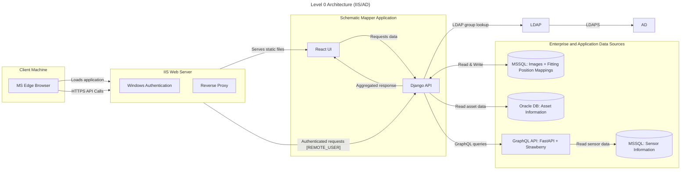
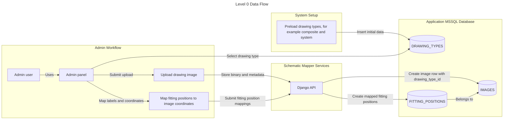
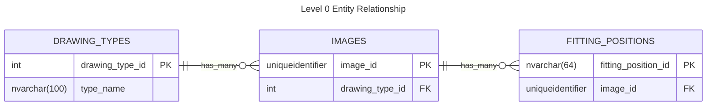
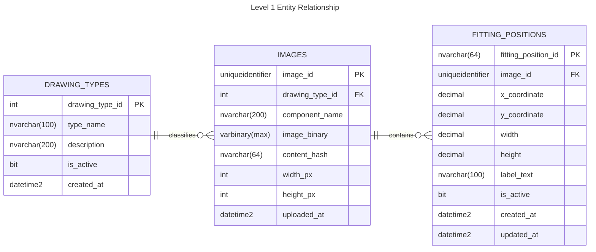
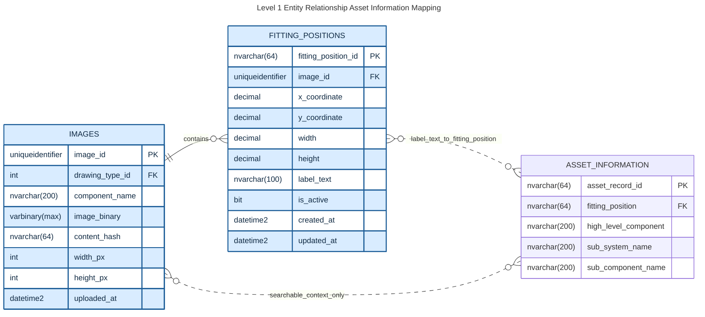
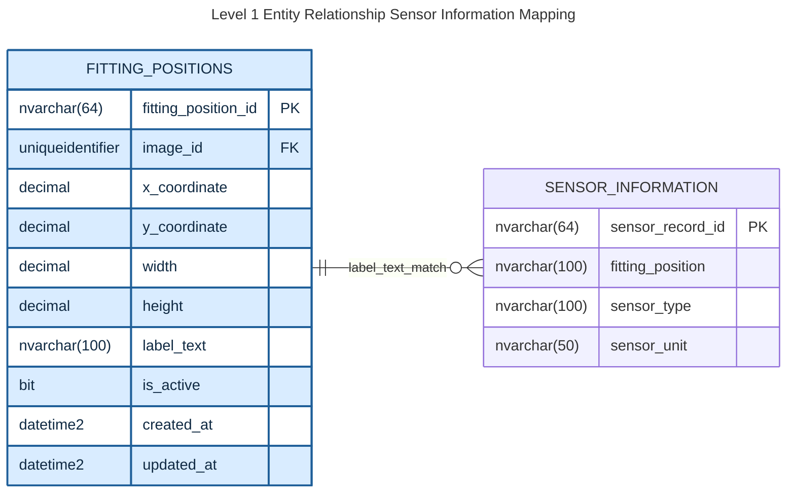
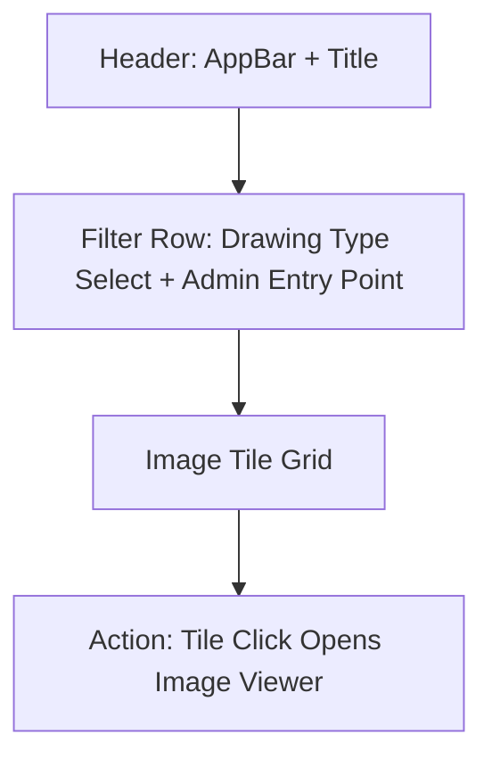
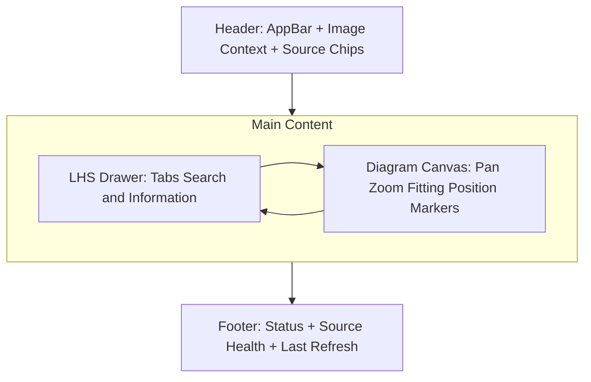
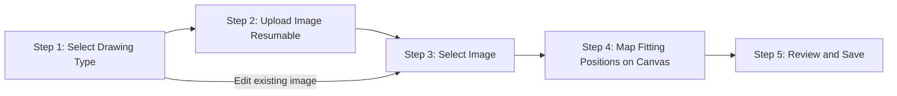

# Schematic Mapper
*Prototype application for mapping component information over mechanical drawings*

## Table of Contents
- [Problem Statement](#problem-statement)
- [End-State](#end-state)
- [Requirements](#requirements)
- [Tech Stack](#tech-stack)
- [Architecture](#architecture)
- [Database Layer](#database-layer)
- [Server Side Layer](#server-side-layer)
- [Client Side](#client-side)
- [Glossary](#glossary)

## Glossary
- **ADFS**: Active Directory Federation Services, used for enterprise authentication.
- **MVP**: Minimum Viable Product, the initial version of the application.
- **POI**: Point of Interest, referring to fitting positions on drawings.
- **WCAG**: Web Content Accessibility Guidelines, standards for web accessibility.

## Problem Statement
There is currently no method of visualizing component information over mechanical drawings.

## End-State
In its end state the Schematic Mapping application is to be a scalable and extendable platform that can be integrated with enterprise data sources to visualize component information and health data on mechanical drawings. Serving as both a training aid and informing engineers of possible compounding health issues.

## Requirements
**High Level**

1. Must be a web application.
1. Must be able to scale to an enterprise grade application.
1. Must be optimized for users on MS Edge browsers.
1. Must be optimized for desktop devices.
1. Must be able to run on Windows-based servers through IIS.
1. The application must be designed to allow for ease of integration with new data sources as made available by the enterprise.
    - These sources will be read only access.
1. All technologies used must be license free and free to use for enterprise.

**User Interface**
<br>
*Should be similar to Google Maps in appearance.*

1. The user interface must be able to display vector format drawings of ~15mb in size.
    - Users must be able to pan & zoom on these diagrams.
    - On initial load, and when the user activates the reset-view control, the viewer must scale and centre the drawing so the full image fits within the visible viewport without cropping any edge.
    - The interface must be performant in handling these visualizations.
    - The interface must support up to 3,000 mapped fitting positions (POI markers) per diagram while maintaining interactive pan/zoom responsiveness (≤100 ms render latency).
    - Marker clustering and viewport culling must be employed so that only visible, non-overlapping markers are rendered to the DOM at any given time.
    - Hovering over fitting positions on the drawing is to show a tooltip detailing information.
1. The user interface is to include a left hand side panel that lists component information.
    - This component information is to relate to fitting positions on the drawings, mapped via X & Y co-ordinates.
    - The side panel is to include the ability to tab between different data sources i.e. asset information & sensor recordings.
    - The side panel is to include search functionality.
    - Clicking on a result in the side bar is to pan to the fitting position on the drawing. 
    - Clicking on a fitting position on the drawing is to open the information within the side bar.
1. There is to be an admin section that allows for image upload and the mapping of co-ordinates to fitting position identifiers.
    - In the prototype, the admin workflow must be reachable through a visible entry point on the main image-selection screen and provide an obvious return path back to the viewer workflow.
    - When editing an existing image, deleting mappings must be staged locally until the user completes Review and Save; canceling the workflow must discard staged deletions and leave persisted mappings unchanged.
    - Completing Save from the review step must return the user to the image selection screen.

**Data Access**

1. Images and co-ordinate/fitting position mappings should be stored in a MSSQL database that is owned by the application.
    - This is the only intended write access database for **MVP**.
1. For **MVP** asset information is to be pulled via API from an Oracle database that is managed by a separate area of the enterprise.
1. For **MVP** sensor information is to be pulled via an existing GraphQL API written in Python on the FastAPI & Strawberry frameworks from an MSSQL database that is managed by a separate area of the enterprise.

**Authorization**

1. The application must use Windows Authentication via IIS, integrating directly with Active Directory for user authentication. All authentication is handled by IIS; the application does not implement its own login or token validation. User identity is provided to the backend via IIS environment variables or headers (e.g., REMOTE_USER).
2. For authorization, the backend queries Active Directory via LDAP (using LDAPS) to determine user group membership and map to application roles. **Only users in the following two AD groups are permitted access:**
    - **app_admin**: Members are granted admin access to all application features, including admin workflows and image upload/mapping.
    - **app_viewer**: Members are granted standard user access (read-only, no admin privileges).
    - Users not in either group are denied access to the application.

**Local Development and Testing (Without IIS/AD/LDAP)**

To support local development and testing without requiring IIS, Active Directory, or LDAP, the backend must provide a development mode that bypasses or mocks authentication and authorization. This enables developers to run the application and all tests locally with minimal setup.

- A configuration option (e.g., environment variable `AUTH_MODE=dev`) must be available to switch the backend into development mode.
- In development mode:
    - Authentication middleware should inject a mock user identity (e.g., `dev_admin` or `dev_viewer`).
    - Authorization middleware should assign the appropriate role (admin or viewer) based on a second environment variable (e.g., `DEV_USER_ROLE=admin` or `viewer`).
    - LDAP/AD lookups are skipped or mocked.
- This mode must be used for local development, automated testing, and CI pipelines.
- The frontend and backend must both work out-of-the-box in this mode, requiring only local database setup.

**Example .env for Local Development:**
```env
AUTH_MODE=dev
DEV_USER_IDENTITY=dev_admin
DEV_USER_ROLE=admin
```

**Security Note:**
Development mode must never be enabled in production or on any externally accessible environment.

### Requirements Summary

| Category | Key Requirements |
|----------|------------------|
| High Level | Web app, scalable to enterprise, optimized for MS Edge/desktop, runs on Windows/IIS, extensible data integration, license-free tech |
| User Interface | Display 15MB vector drawings with pan/zoom supporting up to 3,000 POI markers per diagram; viewport culling and grid-based clustering for ≤100 ms render latency; tooltips on hover; left panel with tabs for data sources, search, click interactions |
| Data Access | Internal MSSQL for images/mappings, external Oracle API for assets, GraphQL for sensors |
| Authorization | Windows Authentication via IIS and Active Directory; **only users in app_admin or app_viewer AD groups are permitted**; LDAP (LDAPS) for group membership |

The requirements above inform the selection of the tech stack detailed below.

## Tech Stack

Layer | Technologies |
--|--|
Database| MSSQL & Oracle
Server Side| Python & Django & Pytest with Ruff (Linting/Formatting) & Mypy (Type Checking)
Client Side| TypeScript & React with MaterialUI components on Vite & Vitest, Biome (Linting/Formatting)
Authorization| Windows Authentication via IIS and Active Directory

---

## Architecture



*Alt: Level 0 Architecture diagram showing IIS handling authentication and proxying to React UI and Django API, with enterprise data sources.*

### Database Layer

#### Internal Data Storage

- A MSSQL database that stores Drawings, Drawing Types & Fitting Position Labels

#### Data Flow



Level 0 flow notes:
- Drawing types are preloaded before admin upload workflows begin.
- Admin uploads an image of a selected drawing type.
- Admin maps fitting positions to that image through the admin panel.

#### Entity Relationship



Level 0 notes:
- One `DRAWING_TYPES` record can relate to many `IMAGES`.
- Each `IMAGES` record belongs to exactly one `DRAWING_TYPES` record.
- One `IMAGES` record can relate to many `FITTING_POSITIONS`.
- To enforce only one row per drawing type category (for example `composite`, `system`), add `UNIQUE (type_name)` on `DRAWING_TYPES`.



- `label_text` is unique per image via composite constraint `UNIQUE (image_id, label_text)`.
- The same `label_text` value can appear on different images.
- `component_name` is unique across all images via normalized constraint `UNIQUE (Lower(Trim(component_name)))`.
- `width` and `height` store the bounding box dimensions of the fitting position area on the drawing; default `0` for point-only mappings.


#### External Data Storage

#### Entity Relationship



Asset mapping notes:
- Primary link is `FITTING_POSITIONS.label_text` to `ASSET_INFORMATION.fitting_position`.
- `ASSET_INFORMATION.fitting_position` is guaranteed to exist in Oracle.
- `IMAGES.component_name` and `ASSET_INFORMATION.high_level_component` are searchable context fields, not authoritative join keys.



Sensor mapping notes:
- Primary link is `FITTING_POSITIONS.label_text` to `SENSOR_INFORMATION.fitting_position`.
- `sensor_type` captures the kind of sensor.
- `sensor_unit` captures the unit of measure recorded by that sensor.
- `image_id` does not exist in external sources; image scoping is applied through internal fitting-position mappings.

---

### Server Side Layer

*Uses `REST` as the primary API style for the Django application. All authentication and authorization are handled by IIS using Windows Authentication and Active Directory. The backend receives user identity via IIS-provided environment variables or headers (e.g., REMOTE_USER). Upstream integrations remain behind internal service adapters, including the existing sensor GraphQL source.*

#### Server Side Architecture

1. API layer (`Django REST Framework`)
    - Exposes stable endpoints for React UI and Admin workflows.
    - Receives authenticated user identity from IIS (REMOTE_USER or equivalent header).
    - Uses a Python LDAP library (django-auth-ldap) to query Active Directory for group membership on each request (or caches per session).
    - Maps AD group membership to Django user roles for authorization (e.g., admin access).

2. Application service layer
    - Implements business workflows: image upload, fitting position mapping, POI aggregation.
    - Orchestrates internal DB operations and external source reads.

3. Source adapter layer
    - One adapter per external source (`AssetAdapter`, `SensorAdapter`, future adapters).
    - Handles source-specific authentication, request/response contracts, retries, and error mapping.

4. Normalization and mapping layer
    - Transforms external payloads into canonical response objects for the UI.
    - Applies authoritative join rules using `FITTING_POSITIONS.label_text` to source fitting-position fields.
    - Uses `IMAGES.component_name` only as contextual/search metadata.

5. Persistence layer (`Django ORM`)
    - Uses Django models and migrations for internal MSSQL schema evolution.
    - Keeps write operations limited to app-owned internal tables.

#### Backend Project Structure

The `api` Django app is organised into domain-aligned packages that mirror the five-layer architecture above.

```
api/
├── __init__.py
├── apps.py                       # Django app config
├── admin.py                      # Django admin registration
├── constants.py                  # Shared constants (limits, regex, defaults)
├── models.py                     # ORM models (Image, FittingPosition, ImageUpload, etc.)
├── cache.py                      # Generic TTL read-through cache
├── middleware.py                  # Request-ID middleware
├── urls.py                       # URL routing → views package
├── views/
│   ├── __init__.py               # Re-exports all view functions
│   ├── health.py                 # GET /api/health
│   ├── images.py                 # Image & fitting-position read endpoints
│   ├── admin.py                  # Upload lifecycle, admin image upload, bulk FPs
│   └── search.py                 # GET /api/search
├── serializers/
│   ├── __init__.py               # Re-exports all serializer classes
│   ├── image_serializers.py      # DrawingType, Image, FittingPosition serializers
│   ├── upload_serializers.py     # Upload session & chunk serializers
│   └── search_serializers.py     # Search result serializers
├── services/
│   ├── __init__.py
│   ├── image_service.py          # SVG dimension parsing, thumbnail generation
│   ├── upload_service.py         # Upload session state machine & verification
│   ├── search_service.py         # Multi-source search orchestration
│   ├── search_config_service.py  # Per-source search field configuration
│   └── search_index_service.py   # In-memory search projection with TTL cache
├── adapters/
│   ├── __init__.py               # Re-exports adapter types and functions
│   └── asset_adapter.py          # Asset DB adapter (circuit breaker, TTL cache)
├── migrations/
└── management/
    └── commands/                  # refresh_search_projection, cleanup_uploads, etc.
```

**Package responsibilities:**

| Package | Layer | Responsibility |
|---|---|---|
| `views/` | API | HTTP request handling, input validation, response shaping |
| `serializers/` | API | DRF serialisation / deserialisation contracts |
| `services/` | Application | Business logic, orchestration, state machines |
| `adapters/` | Source adapter | External data-source access with resilience patterns |
| `models.py` | Persistence | Django ORM models and migration history |
| `constants.py` | Cross-cutting | Shared configuration constants |


#### API Endpoints

##### Image Management Endpoints
- `GET /api/images`: list available images for user selection (supports filtering by drawing type/component and cursor-based loading).
- `GET /api/images/{image_id}`: image metadata for diagram context.
- `GET /api/images/{image_id}/fitting-positions`: labels and coordinates for map overlay.
- `GET /api/fitting-positions/{fitting_position_id}/details`: aggregated asset and sensor detail response.

##### Search Endpoints
- `GET /api/search?query=&image_id=&limit=&cursor=&sources=`: search across internal and selected external source fields (requires `image_id`, cursor-based loading for infinite scroll).

##### Admin Endpoints
- `POST /api/admin/images`: admin image upload with drawing type.
- `POST /api/admin/uploads`: create upload session and return `upload_id`.
##### Admin Endpoints
- `POST /api/admin/images`: admin image upload with drawing type.
- `POST /api/admin/uploads`: create upload session and return `upload_id`.
    1. Upload method
        - Support resumable chunked uploads as the default for reliability.
        - Keep single-request upload support for trusted fast networks and small files.

    2. Upload session model
        - Track staged uploads in an internal `IMAGE_UPLOADS` session record with states: `initiated`, `uploading`, `verifying`, `completed`, `failed`, `aborted`.
        - Store upload metadata: `upload_id`, file name, file size, drawing type, expected checksum, uploader identity, and timestamps.

    3. Integrity and idempotency
        - Require a client-provided checksum (`SHA-256`) for each completed upload.
        - Verify server-side checksum before committing to `IMAGES`.
        - Require idempotency key for upload initiation and finalization to prevent duplicate image records on retries.
        - Persist uploaded image only after checksum and validation pass.

    4. Validation and safety
        - Enforce max size and allowed MIME/type list for supported diagram formats.
        - Reject malformed or unsupported files before final commit.
        - Keep staged files isolated from final storage until verification succeeds.

    5. Failure handling
        - Allow chunk retries without restarting the full upload.
        - Support resume by querying missing chunk numbers for an `upload_id`.
        - On finalization failure, keep session in `failed` state with clear error code and recovery action.
        - Schedule cleanup for abandoned/expired upload sessions and orphaned chunks.
        - Note: Network interruptions during chunk upload should trigger automatic retry with resume capability.

    6. Commit behavior
        - Finalize in a transaction-like flow: verify file -> create `IMAGES` record -> mark upload session `completed`.
        - Set `IMAGES.content_hash` from verified checksum.
        - Return created `image_id` and upload status metadata to the admin UI.

    7. Operational controls
        - Emit structured logs and metrics for upload success rate, failure rate, mean upload time, and checksum failures.
        - Configure upload timeouts and max concurrent uploads per user/session.
        - Include request correlation IDs for each upload lifecycle action.
- `PUT /api/admin/uploads/{upload_id}/parts/{part_number}`: upload or retry a chunk.
- `POST /api/admin/uploads/{upload_id}/complete`: finalize upload, validate checksum, and create image record.
- `DELETE /api/admin/uploads/{upload_id}`: abort upload and cleanup staged parts.
- `POST /api/admin/fitting-positions/bulk`: bulk create/update coordinate mappings.
- `DELETE /api/admin/fitting-positions/{fitting_position_id}`: delete a single fitting position mapping.

#### Search Architecture

1. Search scope
    - Search is only enabled after the user selects an image in the UI.
    - `image_id` is a required API parameter for all search requests.
    - `image_id` is internal-only (`IMAGES` and related internal mappings); external sources do not store `image_id`.
    - Internal search targets all internal searchable business columns for selected image scope.
    - Non-searchable internal columns (for example `image_binary`) are explicitly excluded.
    - External search targets named columns only (not full-table search), defined per source during implementation.
    - External searchable columns are configuration-driven to allow flexible onboarding and schema changes.
    - All fields specified as searchable in this specification must be searchable through configuration.

2. Search service placement
    - Implement a dedicated `SearchService` in the application service layer.
    - API layer only validates inputs and delegates to `SearchService`.
    - Add `SearchIndexService` to maintain a reduced unified search projection.
    - Add `SearchConfigService` to load and validate searchable-column configuration per source.

3. Query strategy
    - Enforce `image_id` scoped search for map context.
    - Reject requests without `image_id` with `400 Bad Request`.
    - Apply external-source filtering in two steps:
        - Step 1: resolve selected image to internal fitting positions (`fitting_position_id`, `label_text`).
        - Step 2: query configured source columns using mapped internal keys/labels and materialize searchable fields.
    - Ranking and boosting rules are configuration-driven (for example prioritize `sub_component_name` and `sensor_type`).
    - Ranking is based on match type priority (exact > prefix > partial), then alphabetical.
    - Support prefix and partial matching for `label_text`.
    - Support source filtering via `sources=internal,asset,sensor`.
    - Return deduplicated results at `fitting_position_id` level (no duplicate fitting positions in a single response).
    - Return ranked results with deterministic ordering (exact match, prefix match, partial match).

4. Performance strategy
    - External source indexes are not assumed and not required.
    - Add DB indexes only on internal application-owned search structures.
        - `FITTING_POSITIONS (image_id, label_text)`
        - `FITTING_POSITIONS (label_text)`
        - `IMAGES (component_name)`
    - Maintain a reduced search projection (table or materialized view) keyed by `fitting_position_id` with configured external searchable columns only.
    - Add indexes on projection columns in the internal DB for low-latency search.
    - Refresh strategy for projection:
        - Asset source projection refresh: weekly.
        - Sensor source projection refresh: yearly.
        - Internal image metadata refresh expectation: yearly.
        - Internal fitting-position mapping refresh expectation: weekly.
    - Apply result limits with cursor-based incremental loading to support infinite scroll and just-in-time loading.

5. Search configuration
    - Searchable fields are defined via configuration (for example `search_sources.yaml` or DB-backed config table).
    - Configuration includes:
        - source name and enablement flag
        - external table/view name
        - allowed searchable columns (internal and external)
        - field priority/weight for ranking
        - normalization rules (case folding, trimming, alias mapping)
    - Configuration changes should not require API contract changes.

6. Search response shape
    - Return enough metadata for client actions:
        - `fitting_position_id`
        - `label_text`
        - `image_id`
        - `x_coordinate`, `y_coordinate`
        - `component_name`
        - `matched_source` (`internal`, `asset`, `sensor`)
        - `matched_field` (for example `sub_system_name`, `sensor_type`)
        - `has_more`
        - `next_cursor`
    - Include `match_type` (`exact`, `prefix`, `partial`) for UI highlighting.

7. Search API example
    - Example request:
        - `GET /api/search?query=pump&image_id=2f84d8f2-2a22-4a2f-9b2f-7de6b77ab123&limit=25&cursor=eyJvZmZzZXQiOjB9&sources=internal,asset,sensor`
    - Example validation error when image not selected:

        ```json
        {
        "error": "image_id is required before search",
        "code": "search_image_required",
        "status": 400
        }
        ```

    - Example response:

        ```json
        {
            "query": "pump",
            "image_id": "2f84d8f2-2a22-4a2f-9b2f-7de6b77ab123",
            "limit": 25,
            "results": [
                {
                    "fitting_position_id": "FP-10021",
                    "label_text": "PUMP-01-INLET",
                    "image_id": "2f84d8f2-2a22-4a2f-9b2f-7de6b77ab123",
                    "x_coordinate": 1240.336,
                    "y_coordinate": 482.119,
                    "component_name": "Cooling Pump Assembly",
                    "matched_source": "internal",
                    "matched_field": "label_text",
                    "match_type": "prefix"
                },
                {
                    "fitting_position_id": "FP-10022",
                    "label_text": "PUMP-01-OUTLET",
                    "image_id": "2f84d8f2-2a22-4a2f-9b2f-7de6b77ab123",
                    "x_coordinate": 1298.101,
                    "y_coordinate": 487.002,
                    "component_name": "Cooling Pump Assembly",
                    "matched_source": "asset",
                    "matched_field": "sub_system_name",
                    "match_type": "partial"
                },
                {
                    "fitting_position_id": "FP-10410",
                    "label_text": "PUMP-02-DISCHARGE",
                    "image_id": "2f84d8f2-2a22-4a2f-9b2f-7de6b77ab123",
                    "x_coordinate": 1668.774,
                    "y_coordinate": 515.903,
                    "component_name": "Cooling Pump Assembly",
                    "matched_source": "sensor",
                    "matched_field": "sensor_type",
                    "match_type": "partial"
                }
            ],
            "source_status": {
                "internal": "ok",
                "asset": "ok",
                "sensor": "ok"
            },
            "has_more": true,
            "next_cursor": "eyJvZmZzZXQiOjI1fQ==",
            "request_id": "6f6e94fd-a2cd-4c7f-a1a7-2d52ed07e59d"
        }
        ```

#### Testing Strategy (`pytest`)

1. Test stack
    - `pytest`
    - `pytest-django`
    - `pytest-mock`
    - `responses` or `respx` for external API mocking (use in CI pipelines for integration tests)
    - `pytest-cov` for coverage reporting, targeting 100% unit test coverage
    - `mypy` with `django-stubs` and `djangorestframework-stubs` for static type checking; configured via `[tool.mypy]` in `pyproject.toml` with `strict = true`

1. Test organisation
    - The `tests/` directory lives at the root of the backend and mirrors the source code folder structure (for example `tests/api/` covers `api/`, `tests/config/` covers `config/`).
    - Test files are named `test_<module>.py` to match the module they cover (for example `tests/api/test_views.py` covers `api/views.py`).
    - Tests within each file are grouped into classes named after the subject under test (for example `TestHealthView`, `TestSearchService`).
    - `pytest.ini` sets `testpaths = tests` so discovery is explicit and scoped.

1. Test layers
    - Unit tests:
        - `SearchService` ranking, filtering, deduplication, and cursor-loading behavior.
        - Normalization/mapping functions for asset and sensor payloads.
        - Adapter error handling and timeout behavior.
    - Integration tests:
        - Django API endpoints using DB fixtures.
        - Aggregation endpoint with mocked external sources.
        - Partial-failure behavior (`source_status=degraded`).
    - Contract tests:
        - Validate expected response shapes for external sources.
        - Detect upstream schema changes early.

1. Authentication and Authorization test cases
    - Backend endpoints correctly read user identity from IIS-provided environment variables or headers (e.g., REMOTE_USER).
    - Backend queries Active Directory via LDAP (LDAPS) for group membership and maps to application roles.
    - Group/role mapping from Active Directory is respected for admin-only endpoints.
    - Requests without valid IIS authentication are rejected.

    **Testing IIS/LDAP/AD Authentication and Authorization**
    - IIS authentication is simulated in tests by setting the `REMOTE_USER` header or environment variable in the Django test client.
    - LDAP/AD group membership is mocked by patching the LDAP backend (e.g., `django-auth-ldap`) to return the desired group memberships for test users.
    - Pytest fixtures are provided for both `app_admin` and `app_viewer` roles, allowing tests to easily exercise both permission levels on protected routes.
    - Example fixture for `app_admin`:
        ```python
        import pytest
        from unittest.mock import patch

        @pytest.fixture
        def admin_user_client(client):
            with patch('django_auth_ldap.backend.LDAPBackend.get_group_permissions') as mock_groups:
                mock_groups.return_value = {'app_admin'}
                client.defaults['REMOTE_USER'] = 'adminuser'
                yield client
        ```
    - Example fixture for `app_viewer`:
        ```python
        @pytest.fixture
        def viewer_user_client(client):
            with patch('django_auth_ldap.backend.LDAPBackend.get_group_permissions') as mock_groups:
                mock_groups.return_value = {'app_viewer'}
                client.defaults['REMOTE_USER'] = 'vieweruser'
                yield client
        ```
    - Example usage in a test:
        ```python
        def test_admin_route_access(admin_user_client):
            response = admin_user_client.get('/api/admin/protected-route/')
            assert response.status_code == 200

        def test_admin_route_denied_for_viewer(viewer_user_client):
            response = viewer_user_client.get('/api/admin/protected-route/')
            assert response.status_code == 403
        ```
    - These fixtures should be placed in `tests/conftest.py` and used in any test file that needs to verify group-based authorization logic.
    - This approach allows full coverage of authentication and authorization logic without requiring a real IIS or AD server.

1. Search-specific test cases
    - Search evaluates all configured internal searchable columns for the selected image scope.
    - Exact match on configured external column (for example `sub_component_name`) returns expected source result.
    - Exact match on configured external column (for example `sensor_type`) returns expected source result.
    - Exact `label_text` match returns top-ranked result.
    - Prefix match returns expected ordered subset.
    - Ranking priority/weights are respected per configuration.
    - Disabled external columns are not searchable.
    - Duplicate hits from multiple fields/sources collapse to one result per `fitting_position_id`.
    - `image_id` scoping excludes labels from other images.
    - Missing `image_id` returns `400` with `search_image_required`.
    - Empty or too-short query returns validation error.
    - Cursor-based loading contracts are enforced (`has_more`, `next_cursor`, stable ordering).

1. Reliability test cases
    - One external source timeout still returns usable response.
    - Both sources unavailable returns controlled degraded/error payload.
    - Correlation ID is present in logs and propagated across adapters.

1. Image upload reliability test cases
    - Chunk retry succeeds without creating duplicate image records.
    - Upload resume works when connection drops mid-upload.
    - Checksum mismatch blocks finalization and records `failed` upload status.
    - Repeated finalize calls with same idempotency key return same result.
    - Aborted upload removes staged chunks and cannot be finalized.
    - Expired upload sessions are cleaned up by scheduled job.


#### Scalability and Resilience Controls

- Per-source timeout budgets and retry limits.
- Circuit breaker behavior for repeatedly failing sources.
- Read-through caching for slower external datasets.
- Request correlation IDs across all downstream calls.
- Async/background refresh option for expensive source lookups.


#### Other Considerations

`label_text` can become brittle over time. Introduce an internal cross-reference table to map `fitting_position_id` to source-native keys while keeping UI contracts stable as new adapters are added.

---

### Client Side

#### Wire Frames

**Screen: Image Selection**

Purpose:
- Entry screen where users choose drawing type, browse image tiles, and launch Screen 1.

MUI component composition:
- `AppBar`, `Toolbar`, `Container`, `FormControl`, `InputLabel`, `Select`, `MenuItem`, `Button`
- `Grid`, `Card`, `CardMedia`, `CardContent`, `CardActionArea`
- `Skeleton` for loading states, `Pagination` optional (or infinite scroll)



```text
+----------------------------------------------------------------------------------+
| Header (AppBar): [Schematic Mapper] [User]                                       |
+----------------------------------------------------------------------------------+
| Filters: [Drawing Type Dropdown]                      [Open Admin Upload]        |
+----------------------------------------------------------------------------------+
| Tile Grid (Card list):                                                           |
| [Image Tile] [Image Tile] [Image Tile] [Image Tile]                              |
|  - preview thumbnail                                                             |
|  - image name                                                                    |
|  - component name                                                                |
|  - drawing type badge                                                            |
| Click tile => navigate to Screen 1 with selected image_id                        |
+----------------------------------------------------------------------------------+
```

Interaction notes:
- Drawing type selection is mandatory before tile list is shown; the first available drawing type is auto-selected on load.
- Tile click passes `image_id` and loads Image Viewer screen initial context.
- An "Open Admin Upload" button provides the visible entry point to the admin workflow.

**Screen: Image Viewer**

Purpose:
- Primary operational view for diagram exploration, fitting position interaction, and source-aware detail review.

Access precondition:
- User must arrive with a valid selected `image_id` from Image Selection Screen.
- Direct navigation without `image_id` is blocked and redirects to Image Selection Screen.

MUI component composition:
- `AppBar`, `Toolbar`, `Typography`, `IconButton`, `Button`, `Chip`, `Avatar`
- `Drawer` (persistent left panel), `Tabs`, `Tab`, `TextField`, `List`, `ListItemButton`, `Badge`
- `Box` for diagram canvas wrapper, `Paper` for overlays, `Tooltip` for fitting position hover
- `BottomNavigation` or `Paper` footer status bar



```text
+----------------------------------------------------------------------------------+
| Header (AppBar): [Menu] [Image Name + Type] [Source Chips] [User] [Help]         |
+-------------------------------+--------------------------------------------------+
| LHS Panel (Drawer)            | Diagram Canvas                                   |
| Tabs: [Search] [Information]  | - Vector drawing                                 |
|                               | - Pan/zoom controls                              |
| Search Tab                    | - Fitting position markers + hover tooltips      |
| - Search field                | - Click fitting position => opens Info tab item  |
| - Infinite result list        |                                                  |
| - Result click => pan fitting |                                                  |
|                               |                                                  |
| Information Tab               |                                                  |
| - Selected fitting pos summary|                                                  |
| - Asset/Sensor sub-sections   |                                                  |
+-------------------------------+--------------------------------------------------+
| Footer: [Source status] [request_id] [last refreshed] [zoom level]               |
+----------------------------------------------------------------------------------+
```

Interaction notes:
- Search is disabled until an image is selected.
- LHS tabs remain persistent; selected fitting position syncs across map and panel.
- Source health in header/footer mirrors backend `source_status`.
- Client route guard enforces `image_id` presence (for example `/viewer/:imageId` only).
- If `image_id` is missing/invalid, show notice and redirect to Image Selection.
- Viewer URL encodes shareable state as query parameters: `fp` (selected fitting position ID), `q` (search query), `src` (active search sources), `z` (zoom level relative to fit scale). Opening a shared URL restores the selected POI, search context, and zoom level.
- Clicking a fitting position on the canvas pins a detail tooltip card; clicking elsewhere or the close button dismisses it.

**Workflow: Admin Upload and Mapping**

Purpose:
- Admin workflow to upload/select image, then map fitting positions using a map-like interface.
- Uploaded component names must be unique across stored drawings regardless of letter case and surrounding whitespace. Attempts to reuse a normalized name must be rejected before the upload proceeds.

MUI component composition:
- Reuses Image Selection screen components for image selection and Image Viewing screen components for map/panel interactions.
- Adds `Stepper`, `LinearProgress`, `Alert`, `Dialog`, `Snackbar` for upload/mapping workflow feedback.



```text
+----------------------------------------------------------------------------------+
| Header (AppBar): [Admin Panel] [User]                                            |
+----------------------------------------------------------------------------------+
| Stepper: 1 Type -> 2 Upload -> 3 Select -> 4 Map -> 5 Review & Save              |
+----------------------------------------------------------------------------------+
| Step 2 Upload                                                                    |
| [Drawing Type Select] [File Picker] [Upload Progress] [Resume/Retry status]      |
+-------------------------------+--------------------------------------------------+
| Step 4 Mapping LHS Panel      | Mapping Canvas (reuses Screen 1 map canvas)      |
| Tabs: [Unmapped] [Mapped]     | - drag to draw label box                         |
| - fitting position search     | - show selected box dimensions                   |
| - validation warnings         | - mapped boxes persist; save center coordinate   |
+-------------------------------+--------------------------------------------------+
| Footer: [Validation summary] [Save] [Publish] [Cancel]                           |
+----------------------------------------------------------------------------------+
```

Reuse notes:
- Reuse Image Selection Screen filter/tile components for admin image selection.
- Reuse Image Viewer map canvas, marker behavior, and LHS panel pattern.
- Add admin-only controls for upload state, mapping validation, and save/publish.


#### Authentication & Authorization Flow (Frontend)

**Overview:**
The frontend (React application) does not implement its own authentication or token management. Instead, it relies on the backend to determine the current user's identity and role, which are derived from Active Directory (AD) group membership via IIS/LDAP integration.

**Flow:**

1. **User Identity and Role Fetch**
    - On application load, the frontend makes a request to a backend endpoint (e.g., `/api/health` or a dedicated `/api/user`) to retrieve the current user's identity and role.
    - The backend determines the user’s role (`admin` or `viewer`) based on AD group membership and returns this information in the response.

2. **Role Context in Frontend**
    - The frontend stores the user’s role in a React context/provider.
    - This context is made available throughout the application, allowing any component to access the current user’s role.

3. **UI Control Based on Role**
    - UI elements and navigation options are conditionally rendered based on the user’s role:
      - **Admin users** (members of the `app_admin` AD group) see admin features such as image upload and mapping workflows.
      - **Viewer users** (members of the `app_viewer` AD group) see only standard viewing features.
    - Attempting to access unauthorized features (e.g., admin routes as a viewer) results in a redirect or an appropriate error message.

4. **Handling Unauthorized/Unauthenticated States**
    - If the backend indicates the user is not authenticated or not in an allowed group, the frontend displays an access denied message and hides all application features.
    - No sensitive UI elements are rendered for unauthorized users.

5. **Development Mode**
    - In local development mode (`AUTH_MODE=dev`), the backend injects a mock user identity and role, which the frontend consumes in the same way as in production.

**Security Note:**
All authorization decisions are enforced on the backend. The frontend’s role-based UI controls are for user experience only and do not provide security guarantees.

---

#### Components
*Components are organized following the Atomic Design pattern*

##### Atoms

- `AppLogo`: brand mark in header.
- `IconButtonAction`: icon-only actions (`zoom_in`, `zoom_out`, `layers`, `help`, `close`).
- `StatusChip`: small source/status chip (`ok`, `degraded`, `error`).
- `TypeBadge`: drawing type badge (`composite`, `system`).
- `HealthDot`: colored availability indicator.
- `SearchInput`: standardized search text input with loading/clear states.
- `SectionLabel`: small uppercase section title used in drawers/panels.
- `MetricText`: compact value label used in footer/status bars.
- `POIMarkerPin`: marker glyph rendered on diagram canvas.
- `POIMarkerCluster`: cluster badge for dense marker areas.

##### Molecules

- `HeaderIdentity`: `AppLogo` + title + current image context.
- `UserMenuTrigger`: avatar + menu trigger.
- `SourceHealthGroup`: grouped `StatusChip` + `HealthDot` elements.
- `SearchResultItem`: label text + match metadata + source icon.
- `POITooltipCard`: quick POI hover summary.
- `DetailFieldRow`: label/value row for asset or sensor details.
- `FilterBar`: drawing type select + optional text filter.
- `ImageTileCard`: preview thumbnail + name + type + component metadata.
- `UploadProgressRow`: filename + progress bar + retry/resume action.
- `ValidationSummaryRow`: mapping validation count + severity badge.

##### Organisms

- `TopAppHeader`: global header for viewer, selection, and admin.
- `ViewerLeftDrawer`: tabbed drawer with `Search` and `Information` views.
- `SearchResultsPanel`: infinite-scroll result list + loading/error states.
- `POIDetailPanel`: selected fitting position details with source sections.
- `DiagramCanvasViewport`: vector renderer host with pan/zoom/marker overlay.
- `ViewerFooterStatusBar`: source health, request ID, refresh time, zoom level.
- `ImageSelectionGrid`: responsive grid of `ImageTileCard` components.
- `ImageSelectionFilters`: top filter region for type + search.
- `AdminWorkflowStepper`: step control for type -> upload -> select -> map -> save.
- `UploadSessionPanel`: resumable upload interaction and session status.
- `MappingWorkbench`: canvas + unmapped/mapped lists + validation panel.

##### Templates

- `ImageSelectionTemplate`
    - Header + filters + image tile grid + empty/loading/error states.
- `ImageViewerTemplate`
    - Header + persistent LHS drawer + canvas + footer status bar.
- `AdminMappingTemplate`
    - Header + stepper + upload/select/map stages + action footer.

##### Pages

- `ImageSelectionPage`
    - Route entry point for choosing drawing type and image.
- `ImageViewerPage`
    - Guarded route requiring `image_id`.
- `AdminUploadMappingPage`
    - Admin-only workflow with resumable upload and fitting-position mapping.

##### Cross-Cutting Rules

- Reuse template-level layouts across pages to reduce UI drift.
- Keep search, marker, and detail interactions consistent between viewer and admin mapping workbench.
- All async components must provide loading, empty, and error states.
- All interactive controls must be keyboard accessible.

#### Typography & Color Scheme

##### Typography

- Primary font family: `Public Sans`.
- Monospace font family: `IBM Plex Mono` for IDs, request IDs, and technical metadata.
- Fallback stack: `'Public Sans', 'Segoe UI', sans-serif`.

Type scale (MUI mapping):
- `h1` (`40/48`, `700`): screen titles where needed.
- `h2` (`32/40`, `700`): major section headers.
- `h3` (`24/32`, `600`): panel headers.
- `h4` (`20/28`, `600`): card and drawer section headings.
- `body1` (`16/24`, `400`): default content text.
- `body2` (`14/20`, `400`): secondary content text.
- `caption` (`12/16`, `500`): metadata and helper text.
- `button` (`14/20`, `600`, uppercase false): actions.

Usage guidance:
- Use `body1` for primary panel readability.
- Use `caption` for health timestamps/request IDs.
- Keep line length under 90 characters in detail panels.

##### Color Scheme

Theme direction:
- Light-first operational theme inspired by map products, with strong contrast and status clarity.

Core palette:
- `primary.main`: `#0B6BCB` (interactive blue)
- `primary.dark`: `#084F97`
- `primary.light`: `#E7F1FB`
- `secondary.main`: `#0F766E` (teal for secondary emphasis)
- `background.default`: `#F4F7FB`
- `background.paper`: `#FFFFFF`
- `text.primary`: `#102A43`
- `text.secondary`: `#486581`
- `divider`: `#D9E2EC`

Semantic/status palette:
- `success.main`: `#1E8E3E`
- `warning.main`: `#B7791F`
- `error.main`: `#C53030`
- `info.main`: `#2563EB`

Map-specific tokens:
- `map.canvas.bg`: `#EEF3F8`
- `map.grid.line`: `#D7E2EE`
- `map.poi.default`: `#0B6BCB`
- `map.poi.selected`: `#C53030`
- `map.poi.cluster`: `#0F766E`
- `map.poi.unmapped`: `#B7791F`

Panel and chrome tokens:
- `panel.drawer.bg`: `#FFFFFF`
- `panel.drawer.tab.active`: `#E7F1FB`
- `panel.drawer.tab.text.active`: `#0B6BCB`
- `footer.bg`: `#102A43`
- `footer.text`: `#F8FAFC`

Accessibility and consistency:
- Maintain WCAG AA contrast for text and controls.
- Do not encode status by color alone; pair with icon/label.
- Keep status colors consistent across viewer and admin workflows.
- Enforce color tokens via MUI theme overrides and avoid hardcoded ad-hoc colors.

#### Scale & Rendering Performance (3,000 POI / 15 MB SVG)

##### Target Scale

| Metric | Target |
|---|---|
| Max fitting positions per diagram | 3,000 |
| Max diagram file size (SVG) | 15 MB |
| Pan/zoom render latency | ≤ 100 ms per frame |
| Max DOM marker nodes at any time | ≤ 500 (via clustering + viewport culling) |

##### Clustering Strategy

- Use a **grid-based spatial clustering** algorithm (`O(n)` time complexity) instead of pairwise distance checks.
- Divide the viewport into square cells of `threshold / scale` pixels in image-space.
- Markers that fall into the same cell are grouped into a single cluster.
- The clustering threshold is a configurable constant (default 40 px at scale 1).
- At higher zoom levels the effective cell size shrinks, progressively un-clustering markers until individual pins are revealed.

##### Viewport Culling

- Before rendering, compute the visible viewport rectangle from the current pan offset and scale.
- Expand the rectangle by a configurable buffer (default 100 px) to avoid pop-in during fast pans.
- Only markers (or clusters) whose position falls within the expanded rectangle are rendered to the DOM.
- Markers outside the viewport produce zero DOM nodes.

##### Memoization & Render Gating

- Marker atom components (`POIMarkerPin`, `POIMarkerCluster`) are wrapped with `React.memo` to avoid re-renders when props have not changed.
- The `canvasMarkers` array derived from API data is wrapped in `useMemo` so the downstream clustering memo only recalculates when the source data changes.
- Scale state updates from the panzoom library are gated through `requestAnimationFrame` so that at most one re-cluster is queued per animation frame.

##### API Transport

- The backend `GET /api/images/{image_id}/fitting-positions` endpoint returns all fitting positions for the image in a single response (no pagination), since the full coordinate set is required for clustering and viewport culling on the client.
- `GZipMiddleware` is enabled on the Django backend to compress the JSON payload (~600 KB uncompressed → ~80–120 KB gzipped for 3,000 records).
- The `FittingPosition` model carries an explicit database index on `image_id` to ensure the query remains fast as the table grows.

#### API Integration

- Use `TanStack Query` (`@tanstack/react-query`) as the primary API integration and caching layer.
- Use `Axios` as the HTTP client under a typed `services/api` module.
- Use `Zod` for runtime response validation and parsing.
- Use `react-error-boundary` for screen-level API failure isolation and fallback UI.
- Keep server state in TanStack Query; keep UI-only state in React component state or a lightweight store.

##### Client API Layer Structure

- `services/api/httpClient.ts`: Axios instance, base URL, auth headers, request ID propagation, and interceptors.
- `services/api/endpoints.ts`: typed endpoint functions.
- `services/api/queryKeys.ts`: centralized query key factory.
- `services/api/hooks/`: screen-level query/mutation hooks.
- `services/api/schemas.ts`: Zod schemas for request/response validation.

##### Query and Mutation Mapping

- Image Selection Screen
    - `useQuery`: `GET /api/images` with filters (`drawingType`, `search`, `cursor`).
    - Infinite loading: `useInfiniteQuery` when tile list grows.

- Image Viewer Screen
    - `useQuery`: `GET /api/images/{image_id}` for header/context.
    - `useQuery`: `GET /api/images/{image_id}/fitting-positions` for marker layer.
    - `useInfiniteQuery`: `GET /api/search?query=&image_id=&cursor=&limit=&sources=`.
    - `useQuery`: `GET /api/fitting-positions/{id}/details` on POI selection.

- Admin Upload and Mapping Screen
    - `useMutation`: `POST /api/admin/uploads` (start upload session).
    - `useMutation`: `PUT /api/admin/uploads/{upload_id}/parts/{part_number}` (chunk upload/retry).
    - `useMutation`: `POST /api/admin/uploads/{upload_id}/complete` (finalize).
    - `useMutation`: `DELETE /api/admin/uploads/{upload_id}` (abort).
    - `useMutation`: `POST /api/admin/fitting-positions/bulk` (save mappings).

##### Search Integration Pattern

- `image_id` is mandatory in all search hooks.
- Search hook is disabled until `image_id` exists (`enabled: !!imageId`).
- Use `useInfiniteQuery` with backend `next_cursor` and `has_more`.
- Query key should include:
    - `image_id`
    - normalized query text
    - selected `sources`
    - page size (`limit`)
- Deduplication is server-defined by `fitting_position_id`; client should still guard against duplicate render keys.

##### Caching Policy (Client)

- `GET /api/images` (selection list)
    - `staleTime`: 5 minutes
    - `gcTime`: 30 minutes

- `GET /api/images/{image_id}`
    - `staleTime`: 15 minutes
    - `gcTime`: 60 minutes

- `GET /api/images/{image_id}/fitting-positions`
    - `staleTime`: 5 minutes
    - `gcTime`: 30 minutes

- `GET /api/search...`
    - `staleTime`: 30 seconds
    - `gcTime`: 10 minutes
    - Reset cache when `image_id` or query string changes.

- `GET /api/fitting-positions/{id}/details`
    - `staleTime`: 60 seconds
    - `gcTime`: 15 minutes

##### Cache Invalidation Rules

- After successful upload finalization:
    - Invalidate image list queries.
    - Prefetch new image context by returned `image_id`.

- After successful bulk fitting-position mapping save:
    - Invalidate `fitting-positions` for current `image_id`.
    - Invalidate active search queries for current `image_id`.
    - Invalidate selected POI detail query if affected.

##### Resilience and Retry Behavior

- Enable retries for idempotent reads (`GET`) with bounded retry count.
- Disable automatic retries for non-idempotent finalize actions unless idempotency key is present.
- Expose source health (`source_status`) in UI from response payload.
- Show partial-data state when backend returns degraded response (e.g., display available data with warnings when one source fails).

##### Security and Transport

- All authentication is handled by IIS using Windows Authentication (Active Directory). The application does not implement its own login or token validation.
- The backend trusts the IIS-provided user identity (REMOTE_USER or equivalent header).
- For authorization, the backend queries Active Directory via LDAPS (secure LDAP) for group membership and minimal user attributes only.
- No auth tokens are used in API requests.
- All API requests must be made over HTTPS.
- Never cache sensitive user information in local storage.


#### Testing Strategy (`vitest`)

1. Test stack
    - `vitest` as the test runner.
    - `@testing-library/react` for component and page behavior tests.
    - `@testing-library/user-event` for realistic user interactions.
    - `msw` for deterministic API mocking at the network boundary.
    - `@tanstack/react-query` test utilities with isolated `QueryClient` per test.
    - `@testing-library/jest-dom` matchers for accessible UI assertions.

1. Test organisation
    - Test files are co-located with the source file they cover (for example `App.test.tsx` lives next to `App.tsx`, `services/api/health.test.ts` lives next to `health.ts`).
    - Test files are named `<module>.test.ts(x)` to match the module they cover.
    - Tests within each file are grouped using `describe` blocks named after the subject under test (for example `describe("App", ...)`, `describe("useHealthQuery", ...)`).
    - `src/test/setup.ts` is the vitest setup file for global test configuration (for example jest-dom matchers); it is not a test file.

1. Test layers
    - Unit tests:
        - Presentational components (`StatusChip`, `ImageTileCard`, `SearchResultItem`, `POITooltipCard`).
        - Utility modules (query key factories, cursor helpers, response mappers).
        - Zod schema parsing behavior (`services/api/schemas.ts`) for valid and invalid payloads.
    - Hook tests:
        - Query hooks in `services/api/hooks/` with mocked Axios + MSW responses.
        - Mutation hooks for upload session start, chunk upload, finalize, abort, and mapping save.
        - Retry behavior, enabled conditions, and cache invalidation side effects.
    - Integration tests:
        - Page-level flows with router + QueryClient + MSW wired together.
        - Cross-component interactions between drawer, map canvas, and detail panel.
        - Error boundary fallback rendering when one or more requests fail.

1. Route guard and navigation tests
    - Direct navigation to Image Viewer without `image_id` redirects to Image Selection.
    - Valid `/viewer/:imageId` route loads image metadata and marker layer.
    - Invalid or missing `image_id` shows user notice and prevents search execution.
    - Tile click from Image Selection routes to viewer with expected `image_id`.

1. Search and viewer behavior test cases
    - Search hook remains disabled until `image_id` exists (`enabled: !!imageId`).
    - Search query key changes when `image_id`, query text, `sources`, or `limit` changes.
    - Infinite loading consumes `next_cursor` and stops when `has_more` is false.
    - Result click pans/highlights the correct POI and syncs Information tab selection.
    - Duplicate result keys are not rendered when backend returns repeated fitting positions.
    - `source_status=degraded` is shown as partial-data UI state instead of hard failure.

1. Caching and invalidation test cases
    - `staleTime` and `gcTime` policies are applied per endpoint category.
    - Upload finalize success invalidates image list queries and prefetches returned `image_id`.
    - Bulk fitting-position save invalidates fitting-position, search, and affected detail queries.
    - Query cache resets correctly when switching from one selected image to another.

1. Upload workflow test cases
    - Start upload creates session and displays progress state.
    - Chunk retry updates progress without duplicating visible rows or state entries.
    - Finalize success transitions admin workflow to selectable/mappable image state.
    - Finalize failure keeps workflow recoverable with actionable error messaging.
    - Abort upload clears UI session state and disables finalize actions.

1. Error handling and resilience tests
    - Global `401/403` handling triggers sign-in flow behavior.
    - Network timeout on one panel does not crash sibling panels due to error boundaries.
    - Axios interceptor error mapping produces user-safe messages.
    - Zod parse failures are surfaced as controlled client errors and logged with request context.

1. Accessibility and interaction regression tests
    - Keyboard navigation for tabs, search list items, and primary actions.
    - Focus management on route change, dialog open/close, and error fallback states.
    - Tooltip and status indicators expose text labels (not color only).

1. Test data and environment controls
    - Use stable fixture builders for images, fitting positions, asset details, and sensor details.
    - Seed deterministic cursor pages to validate infinite scroll ordering.
    - Disable shared QueryClient state between tests to avoid cache leakage.
    - Run MSW in strict mode to fail on unhandled requests.

#### Frontend Project Structure

```
src/
├── main.tsx                           # React root mount (StrictMode + QueryClientProvider + Router)
├── App.tsx                            # Top-level routes, error boundary, lazy-loaded pages
├── theme.ts                           # MUI theme (palette, typography, component overrides)
├── components/
│   ├── atoms/                         # Leaf UI primitives (AppLogo, StatusChip, SearchInput, etc.)
│   ├── molecules/                     # Composed elements (FilterBar, ImageTileCard, SearchResultItem, etc.)
│   ├── organisms/                     # Feature sections (DiagramCanvasViewport, ViewerLeftDrawer, etc.)
│   └── templates/                     # Page-level layout shells (ImageSelectionTemplate, ImageViewerTemplate, etc.)
├── pages/                             # Route entry points (lazy-loaded via React.lazy)
│   ├── ImageSelectionPage.tsx         # Drawing type + image tile selection
│   ├── ImageViewerPage.tsx            # Diagram canvas + search + fitting-position detail
│   └── AdminUploadMappingPage.tsx     # Stepper workflow: type → upload → select → map → save
├── services/
│   └── api/
│       ├── httpClient.ts              # Axios instance, base URL, interceptors
│       ├── endpoints.ts               # Typed endpoint functions (Zod-validated responses)
│       ├── schemas.ts                 # Zod schemas for API request/response contracts
│       ├── queryKeys.ts               # Centralised TanStack Query key factory
│       ├── config.ts                  # Cache timing, operational constants (staleTime, gcTime, chunk size)
│       ├── fileUtils.ts               # Crypto utilities (SHA-256 hash, base64 encoding)
│       └── hooks/                     # TanStack Query hooks (one per endpoint/workflow)
│           ├── useDrawingTypes.ts     # GET /api/drawing-types
│           ├── useImages.ts           # GET /api/images, GET /api/images/:id
│           ├── useFittingPositions.ts # GET /api/images/:id/fitting-positions
│           ├── useFittingPositionDetails.ts  # GET /api/fitting-positions/:id/details
│           ├── useSearch.ts           # GET /api/search
│           ├── useHealth.ts           # GET /api/health
│           ├── useAdminUpload.ts      # Upload mutations (create session, upload chunk, complete, abort)
│           └── useChunkedUpload.ts    # Orchestration hook: session → chunks → finalise
└── test/
    ├── setup.ts                       # Vitest global setup (jest-dom matchers, MSW server lifecycle)
    ├── fixtures.ts                    # Shared deterministic test data (images, positions, uploads)
    └── handlers.ts                    # MSW request handlers (imports fixtures, exports server)
```

**Package responsibilities:**

| Package | Responsibility |
|---|---|
| `components/atoms/` | Leaf UI primitives with no business logic or API awareness |
| `components/molecules/` | Composed elements combining atoms with layout/interaction logic |
| `components/organisms/` | Feature-level sections that may consume hooks and manage local state |
| `components/templates/` | Page layout shells providing slot-based composition for organisms |
| `pages/` | Route entry points; orchestrate templates, hooks, and navigation |
| `services/api/` | HTTP client, Zod schemas, endpoint functions, TanStack Query hooks |
| `services/api/hooks/` | One hook per API endpoint/workflow; encapsulates cache policy and mutations |
| `services/api/config.ts` | Centralised cache timing and operational constants (no magic numbers) |
| `services/api/fileUtils.ts` | Crypto/encoding utilities extracted from page-level business logic |
| `test/` | MSW handlers, shared fixtures, and vitest global setup |

---

### Problem Statement Coverage

Problem to solve:
- There is currently no method of visualizing component information over mechanical drawings.

How this specification addresses it:
- Establishes image ingestion and mapping workflows so drawings and fitting positions become queryable (`### Database Layer`, `### Server Side Layer`).
- Defines a map-like viewer with pan/zoom, POI markers, tooltip interaction, and synchronized detail panel (`### Client Side`).
- Defines image-scoped search and POI detail retrieval across internal and enterprise data sources (`#### Search Architecture`, `#### API Integration`).

### End-State Coverage

End-state theme 1: scalable and extendable platform
- Adapter-based server architecture supports onboarding future data sources with minimal API contract changes.
- Configuration-driven search fields and ranking reduce code churn as source schemas evolve.
- Reliability controls (timeouts, retries, circuit breaker patterns, resumable uploads) support enterprise operation.

End-state theme 2: integration with enterprise data sources
- MVP integrations explicitly include Oracle asset data and GraphQL sensor data.
- Source normalization and mapping rules define how heterogeneous records are merged into a stable UI contract.
- Partial-failure behavior and source health reporting preserve user utility during source outages.

End-state theme 3: visualization of component and health data on drawings
- Viewer and side panel behaviors are defined for POI-to-data interaction.
- Aggregated fitting-position details combine asset context and sensor context per selected POI.
- Search and result navigation are image-aware to keep map context intact.

End-state theme 4: support training and engineering decision support
- UI patterns support discovery and orientation (search-first, click-to-pan, POI tooltip, synchronized detail views).
- Source attribution, status, and refresh metadata help users trust and interpret information.
- Admin mapping workflow supports maintaining high-quality POI mappings over time.

### MVP Success Criteria

Functional outcomes:
- A user can select a drawing and interact with mapped POIs on a performant canvas.
- A user can open POI details and see aggregated asset and sensor information with source attribution.
- A user can search within the selected drawing and navigate from results to POIs.
- An admin can upload drawings and maintain fitting-position mappings with resumable reliability.

Non-functional outcomes:
- The platform runs in enterprise browser and hosting constraints defined in this specification.
- Degraded external dependencies do not fully block core map and detail workflows.
- New read-only data sources can be added via adapters and configuration without redesigning the client contract.

___