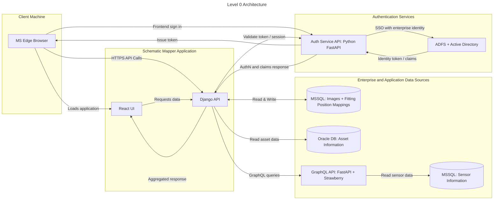
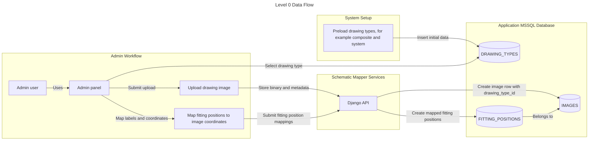
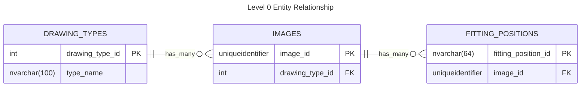
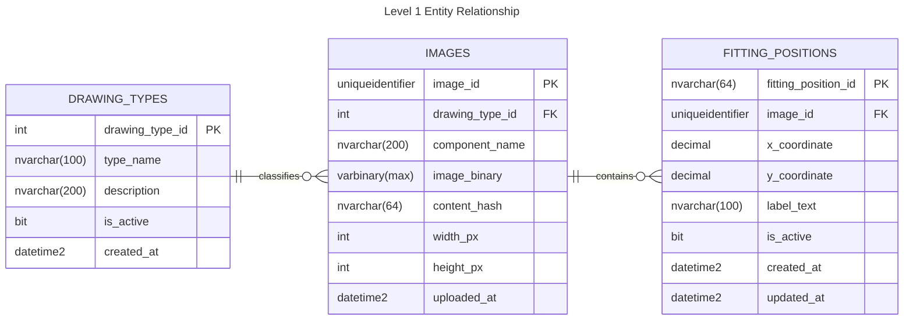
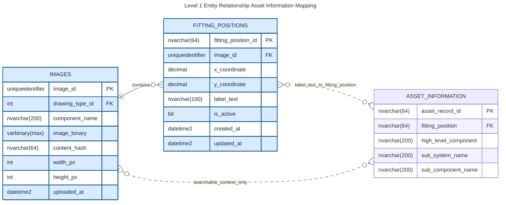
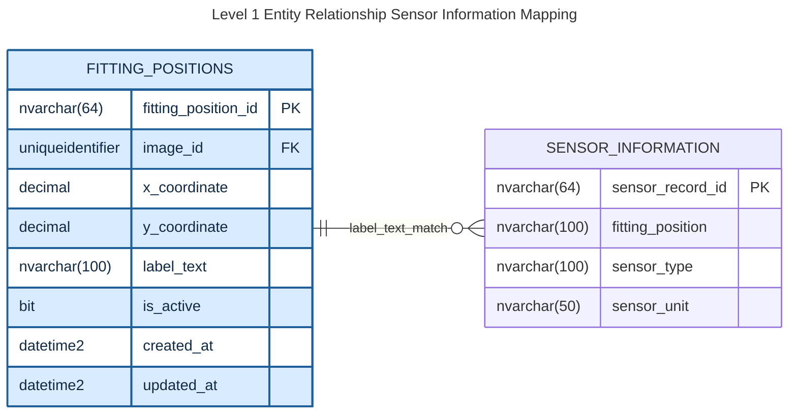
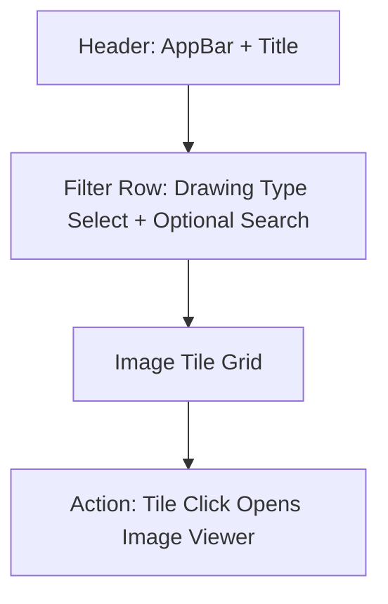
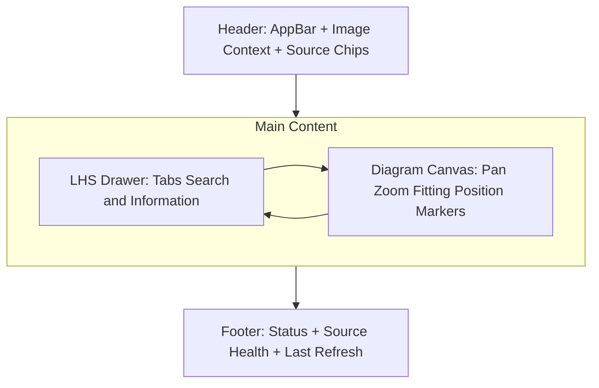
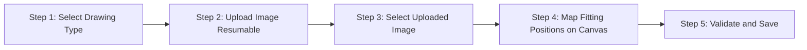

# Schematic Mapper
*Prototype application for mapping component information over mechanical drawings*

## Table of Contents
- [Problem Statement](#problem-statement)
- [End-State](#end-state)
- [Requirements](#requirements)
- [Tech Stack](#tech-stack)
- [Architecture](#architecture)
- [Database Layer](#database-layer)
- [Server Side Layer](#server-side-layer)
- [Client Side](#client-side)
- [Frontend Project Structure](#frontend-project-structure)
- [Glossary](#glossary)

## Glossary
- **ADFS**: Active Directory Federation Services, used for enterprise authentication.
- **MVP**: Minimum Viable Product, the initial version of the application.
- **POI**: Point of Interest, referring to fitting positions on drawings.
- **WCAG**: Web Content Accessibility Guidelines, standards for web accessibility.

## Problem Statement
There is currently no method of visualizing component information over mechanical drawings.

## End-State
In its end state the Schematic Mapping application is to be a scalable and extendable platform that can be integrated with enterprise data sources to visualize component information and health data on mechanical drawings. Serving as both a training aid and informing engineers of possible compounding health issues.

## Requirements

**High Level**

1. Must be a web application.
1. Must be able to scale to an enterprise grade application.
1. Must be optimized for users on MS Edge browsers.
1. Must be optimized for desktop devices.
1. Must be able to run on Windows-based servers through IIS.
1. The application must be designed to allow for ease of integration with new data sources as made available by the enterprise.
    - These sources will be read only access.
1. All technologies used must be license free and free to use for enterprise.

**User Interface**
<br>
*Should be similar to Google Maps in appearance.*

1. The user interface must be able to display vector format drawings of ~15mb in size.
    - Users must be able to pan & zoom on these diagrams.
    - The interface must be performant in handling these visualizations.
    - The interface must support up to 3,000 mapped fitting positions (POI markers) per diagram while maintaining interactive pan/zoom responsiveness (≤100 ms render latency).
    - Marker clustering and viewport culling must be employed so that only visible, non-overlapping markers are rendered to the DOM at any given time.
    - Hovering over fitting positions on the drawing is to show a tooltip detailing information.
1. The user interface is to include a left hand side panel that lists component information.
    - This component information is to relate to fitting positions on the drawings, mapped via X & Y co-ordinates.
    - The side panel is to include the ability to tab between different data sources i.e. asset information & sensor recordings.
    - The side panel is to include search functionality.
    - Clicking on a result in the side bar is to pan to the fitting position on the drawing. 
    - Clicking on a fitting position on the drawing is to open the information within the side bar.
1. There is to be an admin section that allows for image upload and the mapping of co-ordinates to fitting position identifiers.

**Data Access**

1. Images and co-ordinate/fitting position mappings should be stored in a MSSQL database that is owned by the application.
    - This is the only intended write access database for **MVP**.
1. For **MVP** asset information is to be pulled via API from an Oracle database that is managed by a separate area of the enterprise.
1. For **MVP** sensor information is to be pulled via an existing GraphQL API written in Python on the FastAPI & Strawberry frameworks from an MSSQL database that is managed by a separate area of the enterprise.

**Authorization**

1. The application must integrate with an existing enterprise user service solution underpinned by ADFS and Active Directory.

### Requirements Summary

| Category | Key Requirements |
|----------|------------------|
| High Level | Web app, scalable to enterprise, optimized for MS Edge/desktop, runs on Windows/IIS, extensible data integration, license-free tech |
| User Interface | Display 15MB vector drawings with pan/zoom supporting up to 3,000 POI markers per diagram; viewport culling and grid-based clustering for ≤100 ms render latency; tooltips on hover; left panel with tabs for data sources, search, click interactions |
| Data Access | Internal MSSQL for images/mappings, external Oracle API for assets, GraphQL for sensors |
| Authorization | Integration with ADFS/Active Directory |

The requirements above inform the selection of the tech stack detailed below.

## Tech Stack

Layer | Technologies |
--|--|
Database| MSSQL & Oracle
Server Side| Python & Django & Pytest with Ruff (Linting/Formatting) & Mypy (Type Checking)
Client Side| TypeScript & React with MaterialUI components on Vite & Vitest, Biome (Linting/Formatting)
Authorization| *Existing ADFS & Active Directory Service*

---

## Architecture



*Alt: Level 0 Architecture diagram showing client browser, application server with React UI and Django API, and enterprise data sources including MSSQL, Oracle, and GraphQL.*

### Database Layer

#### Internal Data Storage

- A MSSQL database that stores Drawings, Drawing Types & Fitting Position Labels

#### Data Flow



Level 0 flow notes:
- Drawing types are preloaded before admin upload workflows begin.
- Admin uploads an image of a selected drawing type.
- Admin maps fitting positions to that image through the admin panel.

#### Entity Relationship



Level 0 notes:
- One `DRAWING_TYPES` record can relate to many `IMAGES`.
- Each `IMAGES` record belongs to exactly one `DRAWING_TYPES` record.
- One `IMAGES` record can relate to many `FITTING_POSITIONS`.
- To enforce only one row per drawing type category (for example `composite`, `system`), add `UNIQUE (type_name)` on `DRAWING_TYPES`.



- `label_text` is unique per image via composite constraint `UNIQUE (image_id, label_text)`.
- The same `label_text` value can appear on different images.


#### External Data Storage

#### Entity Relationship



Asset mapping notes:
- Primary link is `FITTING_POSITIONS.label_text` to `ASSET_INFORMATION.fitting_position`.
- `ASSET_INFORMATION.fitting_position` is guaranteed to exist in Oracle.
- `IMAGES.component_name` and `ASSET_INFORMATION.high_level_component` are searchable context fields, not authoritative join keys.



Sensor mapping notes:
- Primary link is `FITTING_POSITIONS.label_text` to `SENSOR_INFORMATION.fitting_position`.
- `sensor_type` captures the kind of sensor.
- `sensor_unit` captures the unit of measure recorded by that sensor.
- `image_id` does not exist in external sources; image scoping is applied through internal fitting-position mappings.

---

### Server Side Layer

*Uses `REST` as the primary API style for the Django application. Keeping upstream integrations behind internal service adapters, including the existing sensor GraphQL source.*

#### Server Side Architecture

1. API layer (`Django REST Framework`)
    - Exposes stable endpoints for React UI and Admin workflows.
    - Performs auth checks using the enterprise auth service.

2. Application service layer
    - Implements business workflows: image upload, fitting position mapping, POI aggregation.
    - Orchestrates internal DB operations and external source reads.

3. Source adapter layer
    - One adapter per external source (`AssetAdapter`, `SensorAdapter`, future adapters).
    - Handles source-specific authentication, request/response contracts, retries, and error mapping.

4. Normalization and mapping layer
    - Transforms external payloads into canonical response objects for the UI.
    - Applies authoritative join rules using `FITTING_POSITIONS.label_text` to source fitting-position fields.
    - Uses `IMAGES.component_name` only as contextual/search metadata.

5. Persistence layer (`Django ORM`)
    - Uses Django models and migrations for internal MSSQL schema evolution.
    - Keeps write operations limited to app-owned internal tables.

#### Backend Project Structure

The `api` Django app is organised into domain-aligned packages that mirror the five-layer architecture above.

```
api/
├── __init__.py
├── apps.py                       # Django app config
├── admin.py                      # Django admin registration
├── constants.py                  # Shared constants (limits, regex, defaults)
├── models.py                     # ORM models (Image, FittingPosition, ImageUpload, etc.)
├── cache.py                      # Generic TTL read-through cache
├── middleware.py                  # Request-ID middleware
├── urls.py                       # URL routing → views package
├── views/
│   ├── __init__.py               # Re-exports all view functions
│   ├── health.py                 # GET /api/health
│   ├── images.py                 # Image & fitting-position read endpoints
│   ├── admin.py                  # Upload lifecycle, admin image upload, bulk FPs
│   └── search.py                 # GET /api/search
├── serializers/
│   ├── __init__.py               # Re-exports all serializer classes
│   ├── image_serializers.py      # DrawingType, Image, FittingPosition serializers
│   ├── upload_serializers.py     # Upload session & chunk serializers
│   └── search_serializers.py     # Search result serializers
├── services/
│   ├── __init__.py
│   ├── image_service.py          # SVG dimension parsing, thumbnail generation
│   ├── upload_service.py         # Upload session state machine & verification
│   ├── search_service.py         # Multi-source search orchestration
│   ├── search_config_service.py  # Per-source search field configuration
│   └── search_index_service.py   # In-memory search projection with TTL cache
├── adapters/
│   ├── __init__.py               # Re-exports adapter types and functions
│   └── asset_adapter.py          # Asset DB adapter (circuit breaker, TTL cache)
├── migrations/
└── management/
    └── commands/                  # refresh_search_projection, cleanup_uploads, etc.
```

**Package responsibilities:**

| Package | Layer | Responsibility |
|---|---|---|
| `views/` | API | HTTP request handling, input validation, response shaping |
| `serializers/` | API | DRF serialisation / deserialisation contracts |
| `services/` | Application | Business logic, orchestration, state machines |
| `adapters/` | Source adapter | External data-source access with resilience patterns |
| `models.py` | Persistence | Django ORM models and migration history |
| `constants.py` | Cross-cutting | Shared configuration constants |


#### API Endpoints

##### Image Management Endpoints
- `GET /api/images`: list available images for user selection (supports filtering by drawing type/component and cursor-based loading).
- `GET /api/images/{image_id}`: image metadata for diagram context.
- `GET /api/images/{image_id}/fitting-positions`: labels and coordinates for map overlay.
- `GET /api/fitting-positions/{fitting_position_id}/details`: aggregated asset and sensor detail response.

##### Search Endpoints
- `GET /api/search?query=&image_id=&limit=&cursor=&sources=`: search across internal and selected external source fields (requires `image_id`, cursor-based loading for infinite scroll).

##### Admin Endpoints
- `POST /api/admin/images`: admin image upload with drawing type.
- `POST /api/admin/uploads`: create upload session and return `upload_id`.
##### Admin Endpoints
- `POST /api/admin/images`: admin image upload with drawing type.
- `POST /api/admin/uploads`: create upload session and return `upload_id`.
    1. Upload method
        - Support resumable chunked uploads as the default for reliability.
        - Keep single-request upload support for trusted fast networks and small files.

    2. Upload session model
        - Track staged uploads in an internal `IMAGE_UPLOADS` session record with states: `initiated`, `uploading`, `verifying`, `completed`, `failed`, `aborted`.
        - Store upload metadata: `upload_id`, file name, file size, drawing type, expected checksum, uploader identity, and timestamps.

    3. Integrity and idempotency
        - Require a client-provided checksum (`SHA-256`) for each completed upload.
        - Verify server-side checksum before committing to `IMAGES`.
        - Require idempotency key for upload initiation and finalization to prevent duplicate image records on retries.
        - Persist uploaded image only after checksum and validation pass.

    4. Validation and safety
        - Enforce max size and allowed MIME/type list for supported diagram formats.
        - Reject malformed or unsupported files before final commit.
        - Keep staged files isolated from final storage until verification succeeds.

    5. Failure handling
        - Allow chunk retries without restarting the full upload.
        - Support resume by querying missing chunk numbers for an `upload_id`.
        - On finalization failure, keep session in `failed` state with clear error code and recovery action.
        - Schedule cleanup for abandoned/expired upload sessions and orphaned chunks.
        - Note: Network interruptions during chunk upload should trigger automatic retry with resume capability.

    6. Commit behavior
        - Finalize in a transaction-like flow: verify file -> create `IMAGES` record -> mark upload session `completed`.
        - Set `IMAGES.content_hash` from verified checksum.
        - Return created `image_id` and upload status metadata to the admin UI.

    7. Operational controls
        - Emit structured logs and metrics for upload success rate, failure rate, mean upload time, and checksum failures.
        - Configure upload timeouts and max concurrent uploads per user/session.
        - Include request correlation IDs for each upload lifecycle action.
- `PUT /api/admin/uploads/{upload_id}/parts/{part_number}`: upload or retry a chunk.
- `POST /api/admin/uploads/{upload_id}/complete`: finalize upload, validate checksum, and create image record.
- `DELETE /api/admin/uploads/{upload_id}`: abort upload and cleanup staged parts.
- `POST /api/admin/fitting-positions/bulk`: bulk create/update coordinate mappings.

#### Search Architecture

1. Search scope
    - Search is only enabled after the user selects an image in the UI.
    - `image_id` is a required API parameter for all search requests.
    - `image_id` is internal-only (`IMAGES` and related internal mappings); external sources do not store `image_id`.
    - Internal search targets all internal searchable business columns for selected image scope.
    - Non-searchable internal columns (for example `image_binary`) are explicitly excluded.
    - External search targets named columns only (not full-table search), defined per source during implementation.
    - External searchable columns are configuration-driven to allow flexible onboarding and schema changes.
    - All fields specified as searchable in this specification must be searchable through configuration.

2. Search service placement
    - Implement a dedicated `SearchService` in the application service layer.
    - API layer only validates inputs and delegates to `SearchService`.
    - Add `SearchIndexService` to maintain a reduced unified search projection.
    - Add `SearchConfigService` to load and validate searchable-column configuration per source.

3. Query strategy
    - Enforce `image_id` scoped search for map context.
    - Reject requests without `image_id` with `400 Bad Request`.
    - Apply external-source filtering in two steps:
        - Step 1: resolve selected image to internal fitting positions (`fitting_position_id`, `label_text`).
        - Step 2: query configured source columns using mapped internal keys/labels and materialize searchable fields.
    - Ranking and boosting rules are configuration-driven (for example prioritize `sub_component_name` and `sensor_type`).
    - Ranking is based on match type priority (exact > prefix > partial), then alphabetical.
    - Support prefix and partial matching for `label_text`.
    - Support source filtering via `sources=internal,asset,sensor`.
    - Return deduplicated results at `fitting_position_id` level (no duplicate fitting positions in a single response).
    - Return ranked results with deterministic ordering (exact match, prefix match, partial match).

4. Performance strategy
    - External source indexes are not assumed and not required.
    - Add DB indexes only on internal application-owned search structures.
        - `FITTING_POSITIONS (image_id, label_text)`
        - `FITTING_POSITIONS (label_text)`
        - `IMAGES (component_name)`
    - Maintain a reduced search projection (table or materialized view) keyed by `fitting_position_id` with configured external searchable columns only.
    - Add indexes on projection columns in the internal DB for low-latency search.
    - Refresh strategy for projection:
        - Asset source projection refresh: weekly.
        - Sensor source projection refresh: yearly.
        - Internal image metadata refresh expectation: yearly.
        - Internal fitting-position mapping refresh expectation: weekly.
    - Apply result limits with cursor-based incremental loading to support infinite scroll and just-in-time loading.

5. Search configuration
    - Searchable fields are defined via configuration (for example `search_sources.yaml` or DB-backed config table).
    - Configuration includes:
        - source name and enablement flag
        - external table/view name
        - allowed searchable columns (internal and external)
        - field priority/weight for ranking
        - normalization rules (case folding, trimming, alias mapping)
    - Configuration changes should not require API contract changes.

6. Search response shape
    - Return enough metadata for client actions:
        - `fitting_position_id`
        - `label_text`
        - `image_id`
        - `x_coordinate`, `y_coordinate`
        - `component_name`
        - `matched_source` (`internal`, `asset`, `sensor`)
        - `matched_field` (for example `sub_system_name`, `sensor_type`)
        - `has_more`
        - `next_cursor`
    - Include `match_type` (`exact`, `prefix`, `partial`) for UI highlighting.

7. Search API example
    - Example request:
        - `GET /api/search?query=pump&image_id=2f84d8f2-2a22-4a2f-9b2f-7de6b77ab123&limit=25&cursor=eyJvZmZzZXQiOjB9&sources=internal,asset,sensor`
    - Example validation error when image not selected:

        ```json
        {
        "error": "image_id is required before search",
        "code": "search_image_required",
        "status": 400
        }
        ```

    - Example response:

        ```json
        {
            "query": "pump",
            "image_id": "2f84d8f2-2a22-4a2f-9b2f-7de6b77ab123",
            "limit": 25,
            "results": [
                {
                    "fitting_position_id": "FP-10021",
                    "label_text": "PUMP-01-INLET",
                    "image_id": "2f84d8f2-2a22-4a2f-9b2f-7de6b77ab123",
                    "x_coordinate": 1240.336,
                    "y_coordinate": 482.119,
                    "component_name": "Cooling Pump Assembly",
                    "matched_source": "internal",
                    "matched_field": "label_text",
                    "match_type": "prefix"
                },
                {
                    "fitting_position_id": "FP-10022",
                    "label_text": "PUMP-01-OUTLET",
                    "image_id": "2f84d8f2-2a22-4a2f-9b2f-7de6b77ab123",
                    "x_coordinate": 1298.101,
                    "y_coordinate": 487.002,
                    "component_name": "Cooling Pump Assembly",
                    "matched_source": "asset",
                    "matched_field": "sub_system_name",
                    "match_type": "partial"
                },
                {
                    "fitting_position_id": "FP-10410",
                    "label_text": "PUMP-02-DISCHARGE",
                    "image_id": "2f84d8f2-2a22-4a2f-9b2f-7de6b77ab123",
                    "x_coordinate": 1668.774,
                    "y_coordinate": 515.903,
                    "component_name": "Cooling Pump Assembly",
                    "matched_source": "sensor",
                    "matched_field": "sensor_type",
                    "match_type": "partial"
                }
            ],
            "source_status": {
                "internal": "ok",
                "asset": "ok",
                "sensor": "ok"
            },
            "has_more": true,
            "next_cursor": "eyJvZmZzZXQiOjI1fQ==",
            "request_id": "6f6e94fd-a2cd-4c7f-a1a7-2d52ed07e59d"
        }
        ```

#### Testing Strategy (`pytest`)

1. Test stack
    - `pytest`
    - `pytest-django`
    - `pytest-mock`
    - `responses` or `respx` for external API mocking (use in CI pipelines for integration tests)
    - `pytest-cov` for coverage reporting, targeting 100% unit test coverage
    - `mypy` with `django-stubs` and `djangorestframework-stubs` for static type checking; configured via `[tool.mypy]` in `pyproject.toml` with `strict = true`

1. Test organisation
    - The `tests/` directory lives at the root of the backend and mirrors the source code folder structure (for example `tests/api/` covers `api/`, `tests/config/` covers `config/`).
    - Test files are named `test_<module>.py` to match the module they cover (for example `tests/api/test_views.py` covers `api/views.py`).
    - Tests within each file are grouped into classes named after the subject under test (for example `TestHealthView`, `TestSearchService`).
    - `pytest.ini` sets `testpaths = tests` so discovery is explicit and scoped.

1. Test layers
    - Unit tests:
        - `SearchService` ranking, filtering, deduplication, and cursor-loading behavior.
        - Normalization/mapping functions for asset and sensor payloads.
        - Adapter error handling and timeout behavior.
    - Integration tests:
        - Django API endpoints using DB fixtures.
        - Aggregation endpoint with mocked external sources.
        - Partial-failure behavior (`source_status=degraded`).
    - Contract tests:
        - Validate expected response shapes for external sources.
        - Detect upstream schema changes early.

1. Search-specific test cases
    - Search evaluates all configured internal searchable columns for the selected image scope.
    - Exact match on configured external column (for example `sub_component_name`) returns expected source result.
    - Exact match on configured external column (for example `sensor_type`) returns expected source result.
    - Exact `label_text` match returns top-ranked result.
    - Prefix match returns expected ordered subset.
    - Ranking priority/weights are respected per configuration.
    - Disabled external columns are not searchable.
    - Duplicate hits from multiple fields/sources collapse to one result per `fitting_position_id`.
    - `image_id` scoping excludes labels from other images.
    - Missing `image_id` returns `400` with `search_image_required`.
    - Empty or too-short query returns validation error.
    - Cursor-based loading contracts are enforced (`has_more`, `next_cursor`, stable ordering).

1. Reliability test cases
    - One external source timeout still returns usable response.
    - Both sources unavailable returns controlled degraded/error payload.
    - Correlation ID is present in logs and propagated across adapters.

1. Image upload reliability test cases
    - Chunk retry succeeds without creating duplicate image records.
    - Upload resume works when connection drops mid-upload.
    - Checksum mismatch blocks finalization and records `failed` upload status.
    - Repeated finalize calls with same idempotency key return same result.
    - Aborted upload removes staged chunks and cannot be finalized.
    - Expired upload sessions are cleaned up by scheduled job.


#### Scalability and Resilience Controls

- Per-source timeout budgets and retry limits.
- Circuit breaker behavior for repeatedly failing sources.
- Read-through caching for slower external datasets.
- Request correlation IDs across all downstream calls.
- Async/background refresh option for expensive source lookups.


#### Other Considerations

`label_text` can become brittle over time. Introduce an internal cross-reference table to map `fitting_position_id` to source-native keys while keeping UI contracts stable as new adapters are added.

---

### Client Side

#### Wire Frames

**Screen: Image Selection**

Purpose:
- Entry screen where users choose drawing type, browse image tiles, and launch Screen 1.

MUI component composition:
- `AppBar`, `Toolbar`, `Container`, `FormControl`, `InputLabel`, `Select`, `MenuItem`
- `TextField` for optional search, `Grid`, `Card`, `CardMedia`, `CardContent`, `CardActionArea`
- `Skeleton` for loading states, `Pagination` optional (or infinite scroll)



```text
+----------------------------------------------------------------------------------+
| Header (AppBar): [Schematic Mapper] [User]                                       |
+----------------------------------------------------------------------------------+
| Filters: [Drawing Type Dropdown] [Search Images] [Source Filter optional]        |
+----------------------------------------------------------------------------------+
| Tile Grid (Card list):                                                           |
| [Image Tile] [Image Tile] [Image Tile] [Image Tile]                              |
|  - preview thumbnail                                                             |
|  - image name                                                                    |
|  - component name                                                                |
|  - drawing type badge                                                            |
| Click tile => navigate to Screen 1 with selected image_id                        |
+----------------------------------------------------------------------------------+
```

Interaction notes:
- Drawing type selection is mandatory before tile list is shown.
- Tile click passes `image_id` and loads Image Viewer screen initial context.

**Screen: Image Viewer**

Purpose:
- Primary operational view for diagram exploration, fitting position interaction, and source-aware detail review.

Access precondition:
- User must arrive with a valid selected `image_id` from Image Selection Screen.
- Direct navigation without `image_id` is blocked and redirects to Image Selection Screen.

MUI component composition:
- `AppBar`, `Toolbar`, `Typography`, `IconButton`, `Button`, `Chip`, `Avatar`
- `Drawer` (persistent left panel), `Tabs`, `Tab`, `TextField`, `List`, `ListItemButton`, `Badge`
- `Box` for diagram canvas wrapper, `Paper` for overlays, `Tooltip` for fitting position hover
- `BottomNavigation` or `Paper` footer status bar



```text
+----------------------------------------------------------------------------------+
| Header (AppBar): [Menu] [Image Name + Type] [Source Chips] [User] [Help]         |
+-------------------------------+--------------------------------------------------+
| LHS Panel (Drawer)            | Diagram Canvas                                   |
| Tabs: [Search] [Information]  | - Vector drawing                                 |
|                               | - Pan/zoom controls                              |
| Search Tab                    | - Fitting position markers + hover tooltips      |
| - Search field                | - Click fitting position => opens Info tab item  |
| - Infinite result list        |                                                  |
| - Result click => pan fitting |                                                  |
|                               |                                                  |
| Information Tab               |                                                  |
| - Selected fitting pos summary|                                                  |
| - Asset/Sensor sub-sections   |                                                  |
+-------------------------------+--------------------------------------------------+
| Footer: [Source status] [request_id] [last refreshed] [zoom level]               |
+----------------------------------------------------------------------------------+
```

Interaction notes:
- Search is disabled until an image is selected.
- LHS tabs remain persistent; selected fitting position syncs across map and panel.
- Source health in header/footer mirrors backend `source_status`.
- Client route guard enforces `image_id` presence (for example `/viewer/:imageId` only).
- If `image_id` is missing/invalid, show notice and redirect to Image Selection.

**Workflow: Admin Upload and Mapping**

Purpose:
- Admin workflow to upload/select image, then map fitting positions using a map-like interface.

MUI component composition:
- Reuses Image Selection screen components for image selection and Image Viewing screen components for map/panel interactions.
- Adds `Stepper`, `LinearProgress`, `Alert`, `Dialog`, `Snackbar` for upload/mapping workflow feedback.



```text
+----------------------------------------------------------------------------------+
| Header (AppBar): [Admin Panel] [User]                                            |
+----------------------------------------------------------------------------------+
| Stepper: 1 Type -> 2 Upload -> 3 Select -> 4 Map -> 5 Save                       |
+----------------------------------------------------------------------------------+
| Step 2 Upload                                                                    |
| [Drawing Type Select] [File Picker] [Upload Progress] [Resume/Retry status]      |
+-------------------------------+--------------------------------------------------+
| Step 4 Mapping LHS Panel      | Mapping Canvas (reuses Screen 1 map canvas)      |
| Tabs: [Unmapped] [Mapped]     | - click to add marker                            |
| - fitting position search     | - drag marker to adjust                          |
| - validation warnings         | - marker color by mapped/unmapped                |
+-------------------------------+--------------------------------------------------+
| Footer: [Validation summary] [Save] [Publish] [Cancel]                           |
+----------------------------------------------------------------------------------+
```

Reuse notes:
- Reuse Image Selection Screen filter/tile components for admin image selection.
- Reuse Image Viewer map canvas, marker behavior, and LHS panel pattern.
- Add admin-only controls for upload state, mapping validation, and save/publish.

#### Components
*Components are organized following the Atomic Design pattern*

##### Atoms

- `AppLogo`: brand mark in header.
- `IconButtonAction`: icon-only actions (`zoom_in`, `zoom_out`, `layers`, `help`, `close`).
- `StatusChip`: small source/status chip (`ok`, `degraded`, `error`).
- `TypeBadge`: drawing type badge (`composite`, `system`).
- `HealthDot`: colored availability indicator.
- `SearchInput`: standardized search text input with loading/clear states.
- `SectionLabel`: small uppercase section title used in drawers/panels.
- `MetricText`: compact value label used in footer/status bars.
- `POIMarkerPin`: marker glyph rendered on diagram canvas.
- `POIMarkerCluster`: cluster badge for dense marker areas.

##### Molecules

- `HeaderIdentity`: `AppLogo` + title + current image context.
- `UserMenuTrigger`: avatar + menu trigger.
- `SourceHealthGroup`: grouped `StatusChip` + `HealthDot` elements.
- `SearchResultItem`: label text + match metadata + source icon.
- `POITooltipCard`: quick POI hover summary.
- `DetailFieldRow`: label/value row for asset or sensor details.
- `FilterBar`: drawing type select + optional text filter.
- `ImageTileCard`: preview thumbnail + name + type + component metadata.
- `UploadProgressRow`: filename + progress bar + retry/resume action.
- `ValidationSummaryRow`: mapping validation count + severity badge.

##### Organisms

- `TopAppHeader`: global header for viewer, selection, and admin.
- `ViewerLeftDrawer`: tabbed drawer with `Search` and `Information` views.
- `SearchResultsPanel`: infinite-scroll result list + loading/error states.
- `POIDetailPanel`: selected fitting position details with source sections.
- `DiagramCanvasViewport`: vector renderer host with pan/zoom/marker overlay.
- `ViewerFooterStatusBar`: source health, request ID, refresh time, zoom level.
- `ImageSelectionGrid`: responsive grid of `ImageTileCard` components.
- `ImageSelectionFilters`: top filter region for type + search.
- `AdminWorkflowStepper`: step control for type -> upload -> select -> map -> save.
- `UploadSessionPanel`: resumable upload interaction and session status.
- `MappingWorkbench`: canvas + unmapped/mapped lists + validation panel.

##### Templates

- `ImageSelectionTemplate`
    - Header + filters + image tile grid + empty/loading/error states.
- `ImageViewerTemplate`
    - Header + persistent LHS drawer + canvas + footer status bar.
- `AdminMappingTemplate`
    - Header + stepper + upload/select/map stages + action footer.

##### Pages

- `ImageSelectionPage`
    - Route entry point for choosing drawing type and image.
- `ImageViewerPage`
    - Guarded route requiring `image_id`.
- `AdminUploadMappingPage`
    - Admin-only workflow with resumable upload and fitting-position mapping.

##### Cross-Cutting Rules

- Reuse template-level layouts across pages to reduce UI drift.
- Keep search, marker, and detail interactions consistent between viewer and admin mapping workbench.
- All async components must provide loading, empty, and error states.
- All interactive controls must be keyboard accessible.

#### Typography & Color Scheme

##### Typography

- Primary font family: `Public Sans`.
- Monospace font family: `IBM Plex Mono` for IDs, request IDs, and technical metadata.
- Fallback stack: `'Public Sans', 'Segoe UI', sans-serif`.

Type scale (MUI mapping):
- `h1` (`40/48`, `700`): screen titles where needed.
- `h2` (`32/40`, `700`): major section headers.
- `h3` (`24/32`, `600`): panel headers.
- `h4` (`20/28`, `600`): card and drawer section headings.
- `body1` (`16/24`, `400`): default content text.
- `body2` (`14/20`, `400`): secondary content text.
- `caption` (`12/16`, `500`): metadata and helper text.
- `button` (`14/20`, `600`, uppercase false): actions.

Usage guidance:
- Use `body1` for primary panel readability.
- Use `caption` for health timestamps/request IDs.
- Keep line length under 90 characters in detail panels.

##### Color Scheme

Theme direction:
- Light-first operational theme inspired by map products, with strong contrast and status clarity.

Core palette:
- `primary.main`: `#0B6BCB` (interactive blue)
- `primary.dark`: `#084F97`
- `primary.light`: `#E7F1FB`
- `secondary.main`: `#0F766E` (teal for secondary emphasis)
- `background.default`: `#F4F7FB`
- `background.paper`: `#FFFFFF`
- `text.primary`: `#102A43`
- `text.secondary`: `#486581`
- `divider`: `#D9E2EC`

Semantic/status palette:
- `success.main`: `#1E8E3E`
- `warning.main`: `#B7791F`
- `error.main`: `#C53030`
- `info.main`: `#2563EB`

Map-specific tokens:
- `map.canvas.bg`: `#EEF3F8`
- `map.grid.line`: `#D7E2EE`
- `map.poi.default`: `#0B6BCB`
- `map.poi.selected`: `#C53030`
- `map.poi.cluster`: `#0F766E`
- `map.poi.unmapped`: `#B7791F`

Panel and chrome tokens:
- `panel.drawer.bg`: `#FFFFFF`
- `panel.drawer.tab.active`: `#E7F1FB`
- `panel.drawer.tab.text.active`: `#0B6BCB`
- `footer.bg`: `#102A43`
- `footer.text`: `#F8FAFC`

Accessibility and consistency:
- Maintain WCAG AA contrast for text and controls.
- Do not encode status by color alone; pair with icon/label.
- Keep status colors consistent across viewer and admin workflows.
- Enforce color tokens via MUI theme overrides and avoid hardcoded ad-hoc colors.

#### Scale & Rendering Performance (3,000 POI / 15 MB SVG)

##### Target Scale

| Metric | Target |
|---|---|
| Max fitting positions per diagram | 3,000 |
| Max diagram file size (SVG) | 15 MB |
| Pan/zoom render latency | ≤ 100 ms per frame |
| Max DOM marker nodes at any time | ≤ 500 (via clustering + viewport culling) |

##### Clustering Strategy

- Use a **grid-based spatial clustering** algorithm (`O(n)` time complexity) instead of pairwise distance checks.
- Divide the viewport into square cells of `threshold / scale` pixels in image-space.
- Markers that fall into the same cell are grouped into a single cluster.
- The clustering threshold is a configurable constant (default 40 px at scale 1).
- At higher zoom levels the effective cell size shrinks, progressively un-clustering markers until individual pins are revealed.

##### Viewport Culling

- Before rendering, compute the visible viewport rectangle from the current pan offset and scale.
- Expand the rectangle by a configurable buffer (default 100 px) to avoid pop-in during fast pans.
- Only markers (or clusters) whose position falls within the expanded rectangle are rendered to the DOM.
- Markers outside the viewport produce zero DOM nodes.

##### Memoization & Render Gating

- Marker atom components (`POIMarkerPin`, `POIMarkerCluster`) are wrapped with `React.memo` to avoid re-renders when props have not changed.
- The `canvasMarkers` array derived from API data is wrapped in `useMemo` so the downstream clustering memo only recalculates when the source data changes.
- Scale state updates from the panzoom library are gated through `requestAnimationFrame` so that at most one re-cluster is queued per animation frame.

##### API Transport

- The backend `GET /api/images/{image_id}/fitting-positions` endpoint returns all fitting positions for the image in a single response (no pagination), since the full coordinate set is required for clustering and viewport culling on the client.
- `GZipMiddleware` is enabled on the Django backend to compress the JSON payload (~600 KB uncompressed → ~80–120 KB gzipped for 3,000 records).
- The `FittingPosition` model carries an explicit database index on `image_id` to ensure the query remains fast as the table grows.

#### API Integration

- Use `TanStack Query` (`@tanstack/react-query`) as the primary API integration and caching layer.
- Use `Axios` as the HTTP client under a typed `services/api` module.
- Use `Zod` for runtime response validation and parsing.
- Use `react-error-boundary` for screen-level API failure isolation and fallback UI.
- Keep server state in TanStack Query; keep UI-only state in React component state or a lightweight store.

##### Client API Layer Structure

- `services/api/httpClient.ts`: Axios instance, base URL, auth headers, request ID propagation, and interceptors.
- `services/api/endpoints.ts`: typed endpoint functions.
- `services/api/queryKeys.ts`: centralized query key factory.
- `services/api/hooks/`: screen-level query/mutation hooks.
- `services/api/schemas.ts`: Zod schemas for request/response validation.

##### Query and Mutation Mapping

- Image Selection Screen
    - `useQuery`: `GET /api/images` with filters (`drawingType`, `search`, `cursor`).
    - Infinite loading: `useInfiniteQuery` when tile list grows.

- Image Viewer Screen
    - `useQuery`: `GET /api/images/{image_id}` for header/context.
    - `useQuery`: `GET /api/images/{image_id}/fitting-positions` for marker layer.
    - `useInfiniteQuery`: `GET /api/search?query=&image_id=&cursor=&limit=&sources=`.
    - `useQuery`: `GET /api/fitting-positions/{id}/details` on POI selection.

- Admin Upload and Mapping Screen
    - `useMutation`: `POST /api/admin/uploads` (start upload session).
    - `useMutation`: `PUT /api/admin/uploads/{upload_id}/parts/{part_number}` (chunk upload/retry).
    - `useMutation`: `POST /api/admin/uploads/{upload_id}/complete` (finalize).
    - `useMutation`: `DELETE /api/admin/uploads/{upload_id}` (abort).
    - `useMutation`: `POST /api/admin/fitting-positions/bulk` (save mappings).

##### Search Integration Pattern

- `image_id` is mandatory in all search hooks.
- Search hook is disabled until `image_id` exists (`enabled: !!imageId`).
- Use `useInfiniteQuery` with backend `next_cursor` and `has_more`.
- Query key should include:
    - `image_id`
    - normalized query text
    - selected `sources`
    - page size (`limit`)
- Deduplication is server-defined by `fitting_position_id`; client should still guard against duplicate render keys.

##### Caching Policy (Client)

- `GET /api/images` (selection list)
    - `staleTime`: 5 minutes
    - `gcTime`: 30 minutes

- `GET /api/images/{image_id}`
    - `staleTime`: 15 minutes
    - `gcTime`: 60 minutes

- `GET /api/images/{image_id}/fitting-positions`
    - `staleTime`: 5 minutes
    - `gcTime`: 30 minutes

- `GET /api/search...`
    - `staleTime`: 30 seconds
    - `gcTime`: 10 minutes
    - Reset cache when `image_id` or query string changes.

- `GET /api/fitting-positions/{id}/details`
    - `staleTime`: 60 seconds
    - `gcTime`: 15 minutes

##### Cache Invalidation Rules

- After successful upload finalization:
    - Invalidate image list queries.
    - Prefetch new image context by returned `image_id`.

- After successful bulk fitting-position mapping save:
    - Invalidate `fitting-positions` for current `image_id`.
    - Invalidate active search queries for current `image_id`.
    - Invalidate selected POI detail query if affected.

##### Resilience and Retry Behavior

- Enable retries for idempotent reads (`GET`) with bounded retry count.
- Disable automatic retries for non-idempotent finalize actions unless idempotency key is present.
- Expose source health (`source_status`) in UI from response payload.
- Show partial-data state when backend returns degraded response (e.g., display available data with warnings when one source fails).

##### Security and Transport

- Attach auth token on each request via interceptor/wrapper.
- Handle `401/403` globally and route to sign-in flow.
- Never cache sensitive auth payloads in local storage.


#### Testing Strategy (`vitest`)

1. Test stack
    - `vitest` as the test runner.
    - `@testing-library/react` for component and page behavior tests.
    - `@testing-library/user-event` for realistic user interactions.
    - `msw` for deterministic API mocking at the network boundary.
    - `@tanstack/react-query` test utilities with isolated `QueryClient` per test.
    - `@testing-library/jest-dom` matchers for accessible UI assertions.

1. Test organisation
    - Test files are co-located with the source file they cover (for example `App.test.tsx` lives next to `App.tsx`, `services/api/health.test.ts` lives next to `health.ts`).
    - Test files are named `<module>.test.ts(x)` to match the module they cover.
    - Tests within each file are grouped using `describe` blocks named after the subject under test (for example `describe("App", ...)`, `describe("useHealthQuery", ...)`).
    - `src/test/setup.ts` is the vitest setup file for global test configuration (for example jest-dom matchers); it is not a test file.

1. Test layers
    - Unit tests:
        - Presentational components (`StatusChip`, `ImageTileCard`, `SearchResultItem`, `POITooltipCard`).
        - Utility modules (query key factories, cursor helpers, response mappers).
        - Zod schema parsing behavior (`services/api/schemas.ts`) for valid and invalid payloads.
    - Hook tests:
        - Query hooks in `services/api/hooks/` with mocked Axios + MSW responses.
        - Mutation hooks for upload session start, chunk upload, finalize, abort, and mapping save.
        - Retry behavior, enabled conditions, and cache invalidation side effects.
    - Integration tests:
        - Page-level flows with router + QueryClient + MSW wired together.
        - Cross-component interactions between drawer, map canvas, and detail panel.
        - Error boundary fallback rendering when one or more requests fail.

1. Route guard and navigation tests
    - Direct navigation to Image Viewer without `image_id` redirects to Image Selection.
    - Valid `/viewer/:imageId` route loads image metadata and marker layer.
    - Invalid or missing `image_id` shows user notice and prevents search execution.
    - Tile click from Image Selection routes to viewer with expected `image_id`.

1. Search and viewer behavior test cases
    - Search hook remains disabled until `image_id` exists (`enabled: !!imageId`).
    - Search query key changes when `image_id`, query text, `sources`, or `limit` changes.
    - Infinite loading consumes `next_cursor` and stops when `has_more` is false.
    - Result click pans/highlights the correct POI and syncs Information tab selection.
    - Duplicate result keys are not rendered when backend returns repeated fitting positions.
    - `source_status=degraded` is shown as partial-data UI state instead of hard failure.

1. Caching and invalidation test cases
    - `staleTime` and `gcTime` policies are applied per endpoint category.
    - Upload finalize success invalidates image list queries and prefetches returned `image_id`.
    - Bulk fitting-position save invalidates fitting-position, search, and affected detail queries.
    - Query cache resets correctly when switching from one selected image to another.

1. Upload workflow test cases
    - Start upload creates session and displays progress state.
    - Chunk retry updates progress without duplicating visible rows or state entries.
    - Finalize success transitions admin workflow to selectable/mappable image state.
    - Finalize failure keeps workflow recoverable with actionable error messaging.
    - Abort upload clears UI session state and disables finalize actions.

1. Error handling and resilience tests
    - Global `401/403` handling triggers sign-in flow behavior.
    - Network timeout on one panel does not crash sibling panels due to error boundaries.
    - Axios interceptor error mapping produces user-safe messages.
    - Zod parse failures are surfaced as controlled client errors and logged with request context.

1. Accessibility and interaction regression tests
    - Keyboard navigation for tabs, search list items, and primary actions.
    - Focus management on route change, dialog open/close, and error fallback states.
    - Tooltip and status indicators expose text labels (not color only).

1. Test data and environment controls
    - Use stable fixture builders for images, fitting positions, asset details, and sensor details.
    - Seed deterministic cursor pages to validate infinite scroll ordering.
    - Disable shared QueryClient state between tests to avoid cache leakage.
    - Run MSW in strict mode to fail on unhandled requests.

#### Frontend Project Structure

```
src/
├── main.tsx                           # React root mount (StrictMode + QueryClientProvider + Router)
├── App.tsx                            # Top-level routes, error boundary, lazy-loaded pages
├── theme.ts                           # MUI theme (palette, typography, component overrides)
├── components/
│   ├── atoms/                         # Leaf UI primitives (AppLogo, StatusChip, SearchInput, etc.)
│   ├── molecules/                     # Composed elements (FilterBar, ImageTileCard, SearchResultItem, etc.)
│   ├── organisms/                     # Feature sections (DiagramCanvasViewport, ViewerLeftDrawer, etc.)
│   └── templates/                     # Page-level layout shells (ImageSelectionTemplate, ImageViewerTemplate, etc.)
├── pages/                             # Route entry points (lazy-loaded via React.lazy)
│   ├── ImageSelectionPage.tsx         # Drawing type + image tile selection
│   ├── ImageViewerPage.tsx            # Diagram canvas + search + fitting-position detail
│   └── AdminUploadMappingPage.tsx     # Stepper workflow: type → upload → select → map → save
├── services/
│   └── api/
│       ├── httpClient.ts              # Axios instance, base URL, interceptors
│       ├── endpoints.ts               # Typed endpoint functions (Zod-validated responses)
│       ├── schemas.ts                 # Zod schemas for API request/response contracts
│       ├── queryKeys.ts               # Centralised TanStack Query key factory
│       ├── config.ts                  # Cache timing, operational constants (staleTime, gcTime, chunk size)
│       ├── fileUtils.ts               # Crypto utilities (SHA-256 hash, base64 encoding)
│       └── hooks/                     # TanStack Query hooks (one per endpoint/workflow)
│           ├── useDrawingTypes.ts     # GET /api/drawing-types
│           ├── useImages.ts           # GET /api/images, GET /api/images/:id
│           ├── useFittingPositions.ts # GET /api/images/:id/fitting-positions
│           ├── useFittingPositionDetails.ts  # GET /api/fitting-positions/:id/details
│           ├── useSearch.ts           # GET /api/search
│           ├── useHealth.ts           # GET /api/health
│           ├── useAdminUpload.ts      # Upload mutations (create session, upload chunk, complete, abort)
│           └── useChunkedUpload.ts    # Orchestration hook: session → chunks → finalise
└── test/
    ├── setup.ts                       # Vitest global setup (jest-dom matchers, MSW server lifecycle)
    ├── fixtures.ts                    # Shared deterministic test data (images, positions, uploads)
    └── handlers.ts                    # MSW request handlers (imports fixtures, exports server)
```

**Package responsibilities:**

| Package | Responsibility |
|---|---|
| `components/atoms/` | Leaf UI primitives with no business logic or API awareness |
| `components/molecules/` | Composed elements combining atoms with layout/interaction logic |
| `components/organisms/` | Feature-level sections that may consume hooks and manage local state |
| `components/templates/` | Page layout shells providing slot-based composition for organisms |
| `pages/` | Route entry points; orchestrate templates, hooks, and navigation |
| `services/api/` | HTTP client, Zod schemas, endpoint functions, TanStack Query hooks |
| `services/api/hooks/` | One hook per API endpoint/workflow; encapsulates cache policy and mutations |
| `services/api/config.ts` | Centralised cache timing and operational constants (no magic numbers) |
| `services/api/fileUtils.ts` | Crypto/encoding utilities extracted from page-level business logic |
| `test/` | MSW handlers, shared fixtures, and vitest global setup |

---

### Problem Statement Coverage

Problem to solve:
- There is currently no method of visualizing component information over mechanical drawings.

How this specification addresses it:
- Establishes image ingestion and mapping workflows so drawings and fitting positions become queryable (`### Database Layer`, `### Server Side Layer`).
- Defines a map-like viewer with pan/zoom, POI markers, tooltip interaction, and synchronized detail panel (`### Client Side`).
- Defines image-scoped search and POI detail retrieval across internal and enterprise data sources (`#### Search Architecture`, `#### API Integration`).

### End-State Coverage

End-state theme 1: scalable and extendable platform
- Adapter-based server architecture supports onboarding future data sources with minimal API contract changes.
- Configuration-driven search fields and ranking reduce code churn as source schemas evolve.
- Reliability controls (timeouts, retries, circuit breaker patterns, resumable uploads) support enterprise operation.

End-state theme 2: integration with enterprise data sources
- MVP integrations explicitly include Oracle asset data and GraphQL sensor data.
- Source normalization and mapping rules define how heterogeneous records are merged into a stable UI contract.
- Partial-failure behavior and source health reporting preserve user utility during source outages.

End-state theme 3: visualization of component and health data on drawings
- Viewer and side panel behaviors are defined for POI-to-data interaction.
- Aggregated fitting-position details combine asset context and sensor context per selected POI.
- Search and result navigation are image-aware to keep map context intact.

End-state theme 4: support training and engineering decision support
- UI patterns support discovery and orientation (search-first, click-to-pan, POI tooltip, synchronized detail views).
- Source attribution, status, and refresh metadata help users trust and interpret information.
- Admin mapping workflow supports maintaining high-quality POI mappings over time.

### MVP Success Criteria

Functional outcomes:
- A user can select a drawing and interact with mapped POIs on a performant canvas.
- A user can open POI details and see aggregated asset and sensor information with source attribution.
- A user can search within the selected drawing and navigate from results to POIs.
- An admin can upload drawings and maintain fitting-position mappings with resumable reliability.

Non-functional outcomes:
- The platform runs in enterprise browser and hosting constraints defined in this specification.
- Degraded external dependencies do not fully block core map and detail workflows.
- New read-only data sources can be added via adapters and configuration without redesigning the client contract.

---

### AI Agent Execution Guidelines & Project Scaffold
*These guidelines are specifically for an autonomous AI agent to follow when building the prototype, ensuring minimal human intervention while adhering to local environment constraints.*

#### Project Structure
The project should be structured as a monorepo containing both the frontend and backend:
- `/backend`: The Django project.
- `/frontend`: The React/Vite project.
- `/docs`: Documentation (where this spec lives).

#### Environment & Dependencies
- **Python Management:** Use `uv` for all backend environment and dependency management.
    - Initialize the backend using `uv init`.
    - Add dependencies using `uv add django djangorestframework psycopg2-binary pytest pytest-django django-cors-headers django-environ`.
    - Add development dependencies using `uv add --dev ruff mypy django-stubs djangorestframework-stubs`.
    - Run commands using `uv run python manage.py ...`, `uv run pytest`, `uv run mypy .`, `uv run ruff check .`, or `uv run ruff format .`.
- **Frontend Management:** Use `npm` for all frontend package management.
    - Initialize via `npm create vite@latest frontend -- --template react-ts`.
    - Install dependencies using `npm install @mui/material @emotion/react @emotion/styled @mui/icons-material @tanstack/react-query axios zod react-router-dom`.
    - Install development dependencies using `npm install --save-dev @biomejs/biome`.
    - Run Biome via the npm scripts: `npm run lint` to check for issues, `npm run format` to check and auto-apply fixes.
        - `npm run lint` runs `biome check src/`
        - `npm run format` runs `biome check --write src/`
- **Database Server:** A PostgreSQL instance is already running locally on the native OS (managed via pgAdmin4). DO NOT create a Docker container for the database.
    - The agent should connect to the local postgres instance (e.g., `127.0.0.1:5432`).
    - The user will provide or configure the credentials in a `.env` file. The agent should read configuration from `.env`.
    - The agent can generate raw SQL scripts to create the `schematic_internal_db` and `schematic_mock_asset_db` databases, and ask the user to run them in pgAdmin4 if the agent's database user lacks the `CREATEDB` privilege.

#### Agent Execution Rules
- **Phase Confinement:** Strictly follow the Implementation Plan one Phase at a time. Stop and ask the user for permission before beginning the next Phase.
- **Verification:** Run terminal commands to test the code continuously (e.g., output of `uv run pytest`, `npm run build`, or using `curl` to verify API endpoints). Ensure code is working before finalizing a phase.
- **Linting & Formatting:** Always run `uv run ruff check --fix .` and `uv run ruff format .` for the backend, and `npm run format` for the frontend before finalizing any changes.
- **Type Checking:** Always run `uv run mypy .` for the backend before finalizing any changes. All source files must be annotated; `strict = true` is enforced.
- **Incremental Tests:** Write automated tests (`pytest` for Django, `vitest` for React) as part of each Phase's completion criteria.
- **Spec Conformance Review:** Before marking a Phase complete, review all files changed or created during that Phase against the relevant sections of this specification (excluding the Implementation Plan section). Identify any gaps between the implementation and the spec requirements, and either resolve them within the current Phase or record them explicitly as named items for the next review Phase. A Phase is not complete if any change introduced a regression against a previously conformant spec requirement.
- **Clean Communication:** At the end of every Phase, provide a concise bulleted summary of files created, packages installed, what test commands were run and passed, and any spec conformance gaps deferred to a future phase.

---

### Implementation Plan (Prototype)
*Implementation plan based on the "walking skeleton" principle.*

- The prototype is to use a local postgres instance and link to two separate databases, one that acts as the applications internal datastore and one that mimics the asset database, which will be populated with mock data. 

- As it is developed external to the enterprise there is to be no authentication integration.

- There is also to be no integration with the Sensor information as the GraphQL API is not available external to the client.

- There is to be no CI/CD integration for the prototype.

### Phase 1: Foundation & "Hello World"
**Goal:** Prove the core infrastructure, build process, and basic client-server-database connectivity.

-   **Infrastructure:** Set up the Git repository, local development environments, and basic build scripts.
-   **Database:** Initialize the local PostgreSQL instance with two separate databases: the internal datastore and the mock asset database.
-   **Server (Django):** Setup the Django project and `pytest`. Create a simple `/api/health` endpoint that connects to the internal PostgreSQL database to verify connectivity.
-   **Client (React/Vite):** Setup the Vite + React TypeScript project. Create a basic landing page that fetches the `/api/health` endpoint and displays the status.
-   **Result:** A runnable application where the UI successfully communicates with the API, and the API successfully communicates with the database.

### Phase 2: Database Scaffolding (No Authentication)
**Goal:** Establish the foundational database schema, bypassing enterprise authentication for the prototype.

-   **Database:** Create and apply Django migrations for the core internal tables (`DRAWING_TYPES`, `IMAGES`, `FITTING_POSITIONS`) onto the internal PostgreSQL database. Set up mock schema for the asset database and populate it with mock data.
-   **Server:** Expose standard API endpoints without requiring valid auth tokens (or use a basic dummy user for session context if required).
-   **Client:** Set up frontend routing and API integration layers without sign-in guards.
-   **Result:** Core schema is applied and API endpoints are reachable and functional without enterprise authentication barriers.

### Phase 3: The First Vertical Slice (Read-Only Diagram)
**Goal:** Prove the primary user workflow (viewing a diagram and a single mapped point of interest) using internal data only.

-   **Data Preparation:** Create a simple seed script to inject one `DRAWING_TYPES` record, one `IMAGES` record (a lightweight placeholder SVG/vector), and one `FITTING_POSITIONS` mapping into the internal PostgreSQL database.
-   **Server:** Implement the `GET /api/images` and `GET /api/images/{image_id}/fitting-positions` endpoints.
-   **Client:** 
    -   Build a rudimentary Image Selection screen that lists the seeded image.
    -   Build a rudimentary Image Viewer screen that loads the seeded image onto the `DiagramCanvasViewport` and plots a single `POIMarkerPin` at the seeded coordinates.
-   **Result:** A user can access the app, select the placeholder image, and see it rendered with a mapped point of interest.

### Phase 4: External Source Integration (The Aggregation Skeleton)
**Goal:** Prove the system can federate data from the asset source and handle degraded states gracefully.

-   **Server:** Implement the `GET /api/fitting-positions/{fitting_position_id}/details` endpoint. Provide the skeletal adapter for the asset database which will connect to the mocked PostgreSQL asset database. 
-   **Client:** Implement the LHS Information Tab and POI click interaction to fetch and display the aggregated data.
-   **Resilience Test:** Force the asset adapter to timeout or fail, ensuring the API returns a `source_status=degraded` and the UI handles it without crashing.

### Phase 5: Admin Upload & Finalizing Prototype
**Goal:** Complete the admin workflow and introduce the search functionality.

-   **Server/Client:** Implement the resumable image upload endpoints and the Admin Mapping Step-by-Step UI.
-   **Server:** Implement the `SearchService` and `GET /api/search` endpoint.
-   **Client:** Implement the Search Tab on the LHS panel.

### Phase 6: Review Codebase Against Spec & Update
**Goal:** Close the gaps identified between the prototype codebase and the design principles and requirements defined in this specification. Each item below maps to a concrete shortfall found in the review.

#### 6a: MUI Theme (Typography & Color)
- Create `src/theme.ts` that exports a MUI `createTheme` configuration applying the full palette and typography scale defined in the `Typography & Color Scheme` section of this spec.
    - Core palette: `primary`, `secondary`, `background`, `text`, `divider`.
    - Semantic status palette: `success`, `warning`, `error`, `info`.
    - Typography: `Public Sans` as the primary font family, `IBM Plex Mono` as the monospace font, correct weights and sizes per the type scale.
    - Button variant override: `uppercase: false`.
- Wrap the application root in `main.tsx` with MUI's `ThemeProvider` passing the exported theme.
- **Verification:** `npm run build` passes; the app visually reflects the correct primary blue and background.

#### 6b: Database Indexes
- Add a new Django migration that creates the two missing indexes called out in the Search Architecture performance strategy:
    - `FITTING_POSITIONS (label_text)` — standalone index to accelerate label-text lookups across images.
    - `IMAGES (component_name)` — index to accelerate component-name search.
- The existing unique constraint on `(image, label_text)` already covers the composite index; no additional migration is needed for that.
- **Verification:** `uv run python manage.py migrate` applies cleanly; `uv run pytest` passes with all existing tests.

#### 6c: Drawing Type Filter on Image Selection
- **Backend:** Update `GET /api/images` to accept an optional `drawing_type_id` query parameter and filter results accordingly. Update the `list_images` view and add a corresponding test in `test_views.py`.
- **Frontend:** Update `ImageSelectionPage` to:
    - Fetch the image list without a filter on mount to obtain all available drawing types.
    - Render a `FormControl` / `Select` / `MenuItem` drawing type dropdown above the tile grid (matching the wireframe in this spec).
    - Gate the tile grid display on a drawing type being selected — show a prompt until one is chosen.
    - Re-query `GET /api/images?drawing_type_id=<id>` when a type is selected.
    - Update `useImages` hook (or add an overload) to accept an optional `drawingTypeId` filter parameter and pass it through `fetchImages`.
- Update `ImageSelectionPage.test.tsx` to cover: filter dropdown renders, tile grid hidden before selection, tile grid shown after selection, correct `image_id` navigated to on tile click.
- **Verification:** `npm run test` and `uv run pytest` pass.

#### 6d: Pan & Zoom on Diagram Canvas
- Install a pan/zoom library: `npm install @panzoom/panzoom`.
- Refactor the diagram canvas section of `ImageViewerPage` to:
    - Wrap the SVG `` in a container `<div>` that acts as the pan/zoom host.
    - Initialise Panzoom on the host element via a `useRef` + `useEffect`, with options: `contain: "outside"`, `minScale: 0.5`, `maxScale: 10`.
    - Expose zoom in / zoom out icon buttons (`ZoomIn`, `ZoomOut` from `@mui/icons-material`) that call `panzoom.zoomIn()` / `panzoom.zoomOut()`.
    - Add a reset button that calls `panzoom.reset()`.
    - Forward pan-to-marker: export a `panToMarker(x, y)` function that calls `panzoom.pan(...)` such that the target coordinate is centred in the viewport — invoke this when a search result is clicked.
- **Verification:** The user can drag to pan and scroll to zoom; clicking a search result centres the canvas on the target marker.

#### 6e: Search Result Click Pans to Marker
- Wire the `onSelectFp` callback in `SearchPanel` so that after updating `selectedFpId` and switching the active tab to Information, it also calls the `panToMarker` function exposed by the canvas (introduced in 6d) with the selected fitting position's `x_coordinate` and `y_coordinate`.
- Coordinates are available in the search result item (`x_coordinate`, `y_coordinate` are returned by the search API and present in `SearchResultItem`); no additional API call is required.
- Update `ImageViewerPage.test.tsx` to assert that clicking a search result switches the active tab to Information.
- **Verification:** `npm run test` passes; manually clicking a result pans the canvas to the corresponding marker.

#### 6f: `react-error-boundary` — Screen-Level Error Isolation
- Install the package: `npm install react-error-boundary`.
- Create a minimal `ErrorFallback` component (inline or in a shared file) that renders an `Alert` with severity `"error"` and a retry button using the `resetErrorBoundary` prop.
- Wrap each of the three top-level page components (`ImageSelectionPage`, `ImageViewerPage`, `AdminPage`) in an `ErrorBoundary` from `react-error-boundary` with the `ErrorFallback` as the `fallbackRender` prop. Apply the boundary in `App.tsx` around each `<Route>` element.
- **Verification:** `npm run build` passes; `npm run test` passes.

#### 6g: TanStack Query Caching Policies
- Apply `staleTime` and `gcTime` to every hook, matching the values in the `Caching Policy (Client)` section of this spec:

    | Hook | `staleTime` | `gcTime` |
    |---|---|---|
    | `useImages` (list) | 5 min | 30 min |
    | `useImage` (detail) | 15 min | 60 min |
    | `useFittingPositions` | 5 min | 30 min |
    | `useSearch` | 30 sec | 10 min |
    | `useFittingPositionDetails` | 60 sec | 15 min |

- Express all durations in milliseconds (e.g. `5 * 60 * 1000`).
- **Verification:** `npm run test` passes; no behaviour regressions.

#### 6h: Cache Invalidation — Upload Finalize & Bulk Save
- In `useCompleteUpload`, add an `onSuccess` handler to:
    - Invalidate `queryKeys.images.list()` so the image selection grid picks up the new image.
    - Prefetch `queryKeys.images.detail(result.image_id)` using `queryClient.prefetchQuery`.
- In `useSaveBulkFittingPositions`, extend the existing `onSuccess` handler to also:
    - Invalidate `queryKeys.search(variables.imageId, ...)` — use `queryClient.invalidateQueries` with a partial key match on `["search", variables.imageId]` to reset all active search queries for that image.
    - Invalidate `queryKeys.fittingPositions.detail(...)` — use a partial key match on `["fitting-positions"]` to clear any cached detail panels that may reference stale position data.
- **Verification:** `npm run test` passes; after an upload completes, the image list updates without a manual page refresh.

#### Completion Criteria for Phase 6
All of the following must pass before Phase 6 is considered complete:
- `uv run pytest` — all backend tests pass.
- `uv run mypy .` — no type errors.
- `uv run ruff check .` — no lint errors.
- `npm run test` — all frontend tests pass.
- `npm run build` — production build succeeds.
- `npm run lint` — no Biome errors.

### Phase 7: Review Codebase Against Spec & Update
**Goal:** Close all conformance gaps identified in the Phase 6 review — grouped by severity (Critical → Major → Minor). Each sub-item maps directly to a specific shortfall found during the audit.

#### 7a: Complete MUI Theme Tokens — IBM Plex Mono & Map/Panel Colours *(Critical)*
*Addresses: IBM Plex Mono absent from theme; map-specific and panel/chrome colour tokens missing; hardcoded inline colours in `ImageViewerPage`.*

- Extend `src/theme.ts`:
    - Add `IBM Plex Mono` as the monospace font family. Register it in the MUI typography object alongside `Public Sans` so that request IDs, fitting-position IDs, and technical metadata rendered with `fontFamily: "monospace"` resolve to the correct face.
    - Add the full `map` token group as a custom theme palette extension:
        - `map.canvas.bg`: `#EEF3F8`
        - `map.grid.line`: `#D7E2EE`
        - `map.poi.default`: `#0B6BCB`
        - `map.poi.selected`: `#C53030`
        - `map.poi.cluster`: `#0F766E`
        - `map.poi.unmapped`: `#B7791F`
    - Add the full `panel` and `footer` token group:
        - `panel.drawer.bg`: `#FFFFFF`
        - `panel.drawer.tab.active`: `#E7F1FB`
        - `panel.drawer.tab.text.active`: `#0B6BCB`
        - `footer.bg`: `#102A43`
        - `footer.text`: `#F8FAFC`
    - Extend the MUI `Palette` and `PaletteOptions` TypeScript interfaces (via module augmentation in `theme.ts`) so the custom token groups are typed and accessible via `theme.palette.*`.
- Remove hardcoded ad-hoc colour strings from `ImageViewerPage.tsx` (e.g. `background: "#EEF3F8"`, marker fill values) and replace with `theme.palette.map.*` and `theme.palette.footer.*` via `useTheme()` or `sx` prop references.
- **Verification:** `npm run build` and `npm run lint` pass; MUI TypeScript compiler emits no errors on palette access; canvas background and footer background pull from the theme.

#### 7b: Viewer Footer Status Bar *(Critical)*
*Addresses: `ViewerFooterStatusBar` component absent from `ImageViewerPage`; `source_status`, `request_id`, zoom level, and last-refresh time are not surfaced in the UI.*

- Create `src/components/ViewerFooterStatusBar.tsx`. Props:
    - `sourceStatus: Record<string, string>` — one chip per source key, coloured by status (`ok` → success, `degraded` → warning, `error` → error). Use `StatusChip` styling consistent with the `map.poi` palette.
    - `requestId: string | null` — render with `IBM Plex Mono` (`fontFamily: "monospace"`) in a `MetricText`-style `Typography caption`.
    - `lastRefreshed: Date | null` — human-readable relative timestamp (e.g. `"just now"`, `"2 min ago"`).
    - `zoomLevel: number` — current panzoom scale formatted to one decimal place (e.g. `1.0×`).
- Style the footer bar as a full-width `Paper` strip using `footer.bg` / `footer.text` tokens, matching the wireframe in this spec (`Box` with `display: flex`, `alignItems: center`, `gap`).
- In `ImageViewerPage.tsx`:
    - Lift `source_status` and `request_id` out of the last successful search response and store in component state. Pass as props to `ViewerFooterStatusBar`.
    - Read the current zoom level from `panzoom.getScale()` on each zoom/pan event (listen to the `"panzoomchange"` event emitted by `@panzoom/panzoom`) and store in state. Pass as prop.
    - Record `lastRefreshed` as a `Date` whenever the search query settles. Pass as prop.
    - Render `<ViewerFooterStatusBar>` below the main canvas/drawer layout row, so it spans the full width of the screen.
- Add a unit test for `ViewerFooterStatusBar` that asserts: source chips render with correct labels, request ID is displayed, zoom level is formatted correctly, and an `ok` status chip has the success colour role.
- **Verification:** `npm run test` passes; the footer is visible in `ImageViewerPage` with all four data points populated after a search completes.

#### 7c: AppBar Header on All Screens *(Major)*
*Addresses: no `AppBar` / `Toolbar` present on `ImageSelectionPage` or `ImageViewerPage`; wireframe requires a `TopAppHeader` organism on every screen.*

- Create `src/components/TopAppHeader.tsx`. Props:
    - `title: string` — primary text rendered in `Toolbar` `Typography`.
    - `contextLabel?: string` — optional secondary label (e.g. image name + drawing type) shown in `Typography variant="body2"`.
- Use MUI `AppBar` (`position="static"`) + `Toolbar`. Apply `primary.main` background via `color="primary"` on `AppBar`.
- Include an `AppLogo` placeholder text (`"SM"` in a small `Avatar`) on the left.
- Place `TopAppHeader` at the top of `ImageSelectionPage`, `ImageViewerPage`, and `AdminPage`.
    - `ImageSelectionPage`: `title="Schematic Mapper"`.
    - `ImageViewerPage`: `title="Schematic Mapper"`, `contextLabel` = loaded image's `component_name` + drawing type (from the `useImage` query result).
    - `AdminPage`: `title="Admin Panel"`.
- Update `ImageSelectionPage.test.tsx` to assert the heading text is present.
- Update `ImageViewerPage.test.tsx` to assert the heading text is present.
- **Verification:** `npm run test` passes; all three screens display the header bar.

#### 7d: `httpClient` Request & Response Interceptors *(Major)*
*Addresses: `httpClient.ts` has no interceptors; the spec requires auth header injection, request ID propagation, and global 401/403 handling.*

- In `services/api/httpClient.ts`, add a **request interceptor** that:
    - Injects a `X-Request-ID` header with a newly generated `crypto.randomUUID()` value on every outgoing request (prototype stand-in for correlation ID propagation — no auth token in the prototype build).
- Add a **response interceptor** that:
    - On `401` or `403` response status, `console.warn` with the request URL and status (sign-in redirect is a no-op in the prototype; the interceptor must exist and be wired so it can be replaced when auth is added).
    - On any other error, re-throws the `AxiosError` unchanged so TanStack Query handles it normally.
- Export the `httpClient` instance as the default export (no change to callers required).
- Add a unit test (`services/api/httpClient.test.ts`) covering: `X-Request-ID` header is present on outgoing requests; a mocked 401 response triggers the warn path without throwing; a mocked 500 response propagates the error.
- **Verification:** `npm run test` passes; `npm run lint` passes.

#### 7e: MSW API Mocking in Tests *(Major)*
*Addresses: tests currently mock Axios directly; the spec requires `msw` for deterministic API mocking at the network boundary.*

- Install `msw`: `npm install --save-dev msw`.
- Create `src/test/handlers.ts` defining MSW request handlers for every endpoint used by existing tests:
    - `GET /api/health` → `{ status: "ok", db: "connected" }`
    - `GET /api/images` → fixture list response
    - `GET /api/images/:imageId` → fixture detail response
    - `GET /api/images/:imageId/fitting-positions` → fixture positions response
    - `GET /api/search` → fixture search response (including `source_status`, `request_id`, `has_more: false`)
    - `GET /api/fitting-positions/:id/details` → fixture detail response
    - `POST /api/admin/uploads` → fixture session response
    - `POST /api/admin/uploads/:id/complete` → fixture complete response
    - `POST /api/admin/fitting-positions/bulk` → `204 No Content`
- Update `src/test/setup.ts` to:
    - Import `setupServer` from `msw/node`.
    - Call `server.listen({ onUnhandledRequest: "error" })` before all tests (strict mode — fail on unhandled requests per the spec).
    - Call `server.resetHandlers()` after each test.
    - Call `server.close()` after all tests.
- Refactor existing test files to remove direct `vi.mock("axios")` / `vi.spyOn` Axios calls and instead rely on the MSW handlers. Inject a `QueryClient` with `retry: false` and `gcTime: 0` per test to prevent cache leakage.
- **Verification:** `npm run test` passes with all existing tests green and no unhandled-request warnings.

#### 7f: `sources` Query Parameter Validation *(Major)*
*Addresses: the `sources` parameter in `GET /api/search` is not validated; unknown source names pass through silently.*

- Define an allowlist of valid source names at the top of `api/views.py` (or in `api/search_service.py`): `VALID_SEARCH_SOURCES = {"internal", "asset", "sensor"}`.
- In the search view, after parsing the `sources` query parameter, validate that every supplied value is in `VALID_SEARCH_SOURCES`. If any unknown value is present, return `400 Bad Request` with:
    ```json
    { "error": "Invalid source: \"<value>\"", "code": "search_invalid_source", "status": 400 }
    ```
- Add tests in `test_views.py` under `TestSearchView` covering: valid sources pass through; a single unknown source returns 400 with the correct error code; mixed valid + invalid also returns 400.
- **Verification:** `uv run pytest` passes.

#### 7g: `SearchConfigService` & `SearchIndexService` *(Major)*
*Addresses: searchable fields are hardcoded in `search_service.py`; the spec requires configuration-driven field lists with a dedicated `SearchConfigService` and `SearchIndexService`.*

- Create `api/search_config_service.py` implementing `SearchConfigService`:
    - Holds a Python dataclass or `TypedDict` per source entry: `source_name`, `enabled`, `searchable_columns` (list of column names), `field_weights` (dict of column → priority integer).
    - Provides a `get_config(source_name: str) -> SourceSearchConfig` method and `get_enabled_sources() -> list[SourceSearchConfig]`.
    - For the prototype, seed the configuration in-process (no YAML file or DB table required yet) with the internal source columns (`label_text`, `component_name`) and asset source columns (`sub_component_name`, `high_level_component`).
- Create `api/search_index_service.py` implementing `SearchIndexService`:
    - Exposes a `get_searchable_fields(image_id: str) -> list[SearchProjectionRow]` method that builds the reduced unified projection for a given image by joining `FittingPosition` rows with the configured searchable columns from each enabled source.
    - `SearchProjectionRow` contains: `fitting_position_id`, `label_text`, `x_coordinate`, `y_coordinate`, `component_name`, and any configured external columns present on the mock asset data.
- Refactor `SearchService` in `search_service.py` to delegate column discovery to `SearchConfigService` and projection building to `SearchIndexService` rather than hardcoding column names.
- Add `TestSearchConfigService` and `TestSearchIndexService` test classes in `tests/api/test_search_service.py` covering: known source returns correct column list; unknown source raises; disabled source is excluded from enabled list; projection includes only configured columns.
- **Verification:** `uv run pytest` passes; `uv run mypy .` reports no errors.

#### 7h: Structured Django Logging Configuration *(Minor)*
*Addresses: `settings.py` has no structured `LOGGING` configuration; the spec requires structured logs and correlation ID propagation across adapters.*

- Add a `LOGGING` dict to `config/settings.py` using Django's standard `dictConfig` format:
    - Root logger: `WARNING`.
    - `api` logger: `DEBUG`, propagate to root.
    - Use `logging.StreamHandler` writing to `stdout` (IIS-compatible; log aggregation comes from stdout in the target deployment).
    - Formatter: structured JSON-like format including `asctime`, `levelname`, `name`, `message`, and `request_id` (populated via a `logging.Filter` that reads from a thread-local set by the request interceptor — stub the filter for the prototype).
    - Keep the formatter simple enough to pass `mypy strict` without third-party log packages.
- Add a test in `tests/api/test_views.py` (or a dedicated `tests/config/test_logging.py`) asserting that the `api` logger is configured and that a log record from the `api` namespace is captured at `DEBUG` level.
- **Verification:** `uv run pytest` passes; `uv run ruff check .` passes.

#### 7i: POI Hover Tooltip Card *(Minor)*
*Addresses: POI marker hover currently shows no tooltip; the spec requires a `POITooltipCard` molecule with quick-summary data.*

- Create `src/components/POITooltipCard.tsx`. Props:
    - `labelText: string`
    - `componentName: string`
    - `fittingPositionId: string`
- Render a compact MUI `Paper` (or use MUI `Tooltip`'s `title` prop with a custom node) showing:
    - `TypeBadge` with the drawing type.
    - `labelText` in `body2`.
    - `fittingPositionId` in `caption` with `fontFamily: "monospace"` (IBM Plex Mono).
- In `ImageViewerPage.tsx`, wrap each POI `<Box>` marker in a MUI `Tooltip` with `title={<POITooltipCard ... />}` and `placement="top"`. The tooltip should open on hover (`enterDelay={300}`) and not interfere with click-to-select behaviour.
- Add a unit test for `POITooltipCard` asserting the label text, component name, and fitting position ID are rendered.
- **Verification:** `npm run test` passes; hovering a POI marker in the viewer shows the tooltip card.

#### 7j: Bulk Save Uniqueness Validation *(Minor)*
*Addresses: `POST /api/admin/fitting-positions/bulk` accepts duplicate `fitting_position_id` values in a single payload without rejecting them.*

- In `api/views.py` (or the serializer for bulk fitting positions), validate that the submitted list contains no duplicate `fitting_position_id` values before attempting any DB writes.
- If duplicates are found, return `400 Bad Request` with:
    ```json
    { "error": "Duplicate fitting_position_id values in payload", "code": "bulk_duplicate_ids", "status": 400 }
    ```
- Add a test in `test_views.py` under `TestBulkFittingPositionsView` (or equivalent) covering: payload with duplicate IDs returns 400 with `bulk_duplicate_ids`; payload with all-unique IDs succeeds as before.
- **Verification:** `uv run pytest` passes.

#### 7k: Admin Screen Prototype Disclaimer *(Minor)*
*Addresses: the admin route has no access guard or disclaimer; in the prototype (no auth) an unaware user could navigate directly to `/admin` without context.*

- In `AdminPage.tsx` (or `App.tsx`), render a dismissable `Alert severity="warning"` banner at the top of the admin page with the text: `"Admin area — this section is unprotected in the prototype build. Authentication will be enforced in the enterprise deployment."`. 
- The banner dismisses on click (controlled `open` state) and does not reappear within the same session.
- **Verification:** `npm run test` passes; the banner renders on `/admin` and can be dismissed.

#### Completion Criteria for Phase 7
All of the following must pass before Phase 7 is considered complete:
- `uv run pytest` — all backend tests pass.
- `uv run mypy .` — no type errors.
- `uv run ruff check .` — no lint errors.
- `npm run test` — all frontend tests pass.
- `npm run build` — production build succeeds.
- `npm run lint` — no Biome errors.

### Phase 8: Review Codebase Against Spec & Update
**Goal:** Close all conformance gaps identified in the Phase 7 review — grouped by severity (Medium → Minor). Each sub-item maps directly to a specific shortfall found during the audit.

#### 8a: Correlation ID Middleware *(Medium)*
*Addresses: `log_filters.set_request_id()` is never called; backend logs always show `request_id: "-"`; `search_view` generates its own UUID instead of echoing the client's `X-Request-ID`.*

- Create `backend/api/middleware.py` implementing `RequestIdMiddleware`:
    - `__init__(self, get_response)` + standard `__call__(self, request)` pattern.
    - Read the incoming correlation ID with `request.META.get("HTTP_X_REQUEST_ID") or str(uuid.uuid4())` so the middleware generates one when the client omits it.
    - Call `log_filters.set_request_id(request_id)` before delegating to `get_response`.
    - Wrap the downstream call in a `try/finally` block and call `log_filters.clear_request_id()` in the `finally` clause to prevent thread-local leakage between requests.
    - Attach the resolved ID to the response header: `response["X-Request-ID"] = request_id`.
- Register `"api.middleware.RequestIdMiddleware"` in the `MIDDLEWARE` list in `config/settings.py`.
- Remove the standalone `str(uuid.uuid4())` call inside `search_view` — it should now read `request.META.get("HTTP_X_REQUEST_ID", "-")` (the middleware will always have set it by this point).
- Add tests in `tests/api/test_views.py` under a new `TestRequestIdMiddleware` class covering:
    - A request without `X-Request-ID` results in a generated UUID present in the response header.
    - A request with a supplied `X-Request-ID` echoes the same value back in the response header.
    - The `api` logger captures `request_id` from the thread-local during an active request.
- **Verification:** `uv run pytest` passes; `uv run mypy .` reports no errors; structured log output shows a non-`"-"` `request_id` for all requests.

#### 8b: Field Weights Applied to Search Ranking *(Medium)*
*Addresses: `SearchConfigService` defines `field_weights` per column but `search_service.py` never consults them; tiebreaking falls back to alphabetical `label_text` order instead of weight-based ordering as the spec requires.*

- Extend `SearchConfigService` (in `api/search_config_service.py`) to expose a `get_field_weight(source_name: str, column: str) -> int` accessor that returns the configured priority integer for a given source/column pair.
- In `search_service.py`, update the result accumulation so each hit records the weight of the field that produced the match alongside its match-type rank.
- Update the sort key: `(match_type_rank, -field_weight, label_text)` — lower match-type rank wins first, then higher `field_weight` wins (higher weight = higher priority field), then `label_text` alphabetically as the final stable tiebreaker.
- Add a test in `TestSearchService` (in `tests/api/test_search_service.py`) that constructs two fitting positions with the same `label_text` and produces hits on different-weight fields, then asserts the higher-weight field's result ranks first.
- **Verification:** `uv run pytest` passes; `uv run mypy .` reports no errors.

#### 8c: Hook-Level Tests *(Medium)*
*Addresses: `useImages`, `useFittingPositions`, `useFittingPositionDetails`, `useSearch`, and `useAdminUpload` have zero direct test coverage; the spec requires hook tests with mocked responses via MSW.*

- Create `src/services/api/hooks/useImages.test.ts`:
    - Assert that a successful `GET /api/images` response populates the query data.
    - Assert that the hook is enabled unconditionally (image list loads without preconditions).
    - Assert `staleTime: 5 * 60 * 1000` and `gcTime: 30 * 60 * 1000` applied to the list query.
    - Assert that a successful `GET /api/images/:imageId` response (detail) populates query data with `staleTime: 15 * 60 * 1000`.
- Create `src/services/api/hooks/useSearch.test.ts`:
    - Assert that the hook is **disabled** when `imageId` is absent or the query string is shorter than 2 characters (`enabled: Boolean(imageId) && query.length >= 2`).
    - Assert that a valid query with `imageId` present fires the request and returns page 1 data.
    - Assert that `getNextPageParam` returns `next_cursor` when `has_more` is `true` and `undefined` when `has_more` is `false`.
    - Assert `staleTime: 30 * 1000` and `gcTime: 10 * 60 * 1000`.
- Create `src/services/api/hooks/useAdminUpload.test.ts`:
    - Assert that calling `useCompleteUpload`'s mutate function invokes `POST /api/admin/uploads/:id/complete` and returns the fixture response.
    - Assert that on success, `queryKeys.images.list()` is invalidated (use `queryClient.isFetching` or `queryClient.getQueryState`).
    - Assert that calling `useSaveBulkFittingPositions`'s mutate function invokes `POST /api/admin/fitting-positions/bulk` and on success invalidates fitting-position and search queries for the current `imageId`.
- All hook test files should use `renderHook` from `@testing-library/react`, an isolated `QueryClient` per test with `retry: false` and `gcTime: 0`, and MSW handlers from `src/test/handlers.ts`.
- **Verification:** `npm run test` passes; `npm run lint` passes.

#### 8d: Zod Schema Parse Tests *(Medium)*
*Addresses: `schemas.ts` has no dedicated test file; Zod parse pass and failure cases are untested.*

- Create `src/services/api/schemas.test.ts`:
    - **`ImageSchema`**: valid full payload parses without error; payload missing `image_id` throws; payload with a non-UUID `image_id` throws; payload with an invalid `drawing_type` value throws.
    - **`SearchResponseSchema`**: valid full payload (with `results`, `has_more`, `next_cursor`, `source_status`, `request_id`) parses; `match_type` value `"fuzzy"` (not in enum) throws; missing `source_status` map throws.
    - **`UploadSessionSchema`**: valid payload parses; missing `upload_id` throws; missing `error_message` field (if required by schema) throws.
    - **`FittingPositionSchema`**: valid payload parses; `x_coordinate` as a string instead of number throws.
- Use `expect(() => schema.parse(payload)).toThrow()` for failure cases and `expect(schema.parse(payload)).toEqual(expected)` for success cases.
- **Verification:** `npm run test` passes; `npm run lint` passes.

#### 8e: `uploader_identity` Field on `ImageUpload` *(Minor)*
*Addresses: the spec lists `uploader_identity` as a required field on the upload session model; it is absent from the current `ImageUpload` Django model.*

- Add a nullable `CharField(max_length=255, blank=True, null=True)` field named `uploader_identity` to the `ImageUpload` model in `api/models.py`.
    - Nullable to remain backward-compatible with existing upload rows and to avoid requiring a default value in the prototype where no auth context is available.
- Generate and apply the migration: `uv run python manage.py makemigrations api` then `uv run python manage.py migrate`.
- Update the `ImageUploadSerializer` (if present) to include `uploader_identity` as an optional field.
- Add a test in `tests/api/test_models.py` (or existing model tests) asserting that an `ImageUpload` instance can be saved with `uploader_identity=None` and with a non-null string value.
- **Verification:** `uv run pytest` passes; `uv run mypy .` reports no errors.

#### 8f: `useInfiniteQuery` for Image List *(Minor)*
*Addresses: `useImages` uses `useQuery`; the spec specifies `useInfiniteQuery` for the image list as the tile grid grows.*

- Add cursor-based pagination support to the `GET /api/images` backend endpoint:
    - Accept an optional `cursor` query parameter (base64-encoded offset, same pattern as `GET /api/search`).
    - Return `has_more: bool` and `next_cursor: str | null` alongside the `results` array.
    - Existing callers that omit `cursor` receive the first page (maintains backward compatibility).
- Update the `ImagesListSchema` in `schemas.ts` to match the paginated response shape: `{ results: ImageSchema[], has_more: boolean, next_cursor: string | null }`.
- Refactor `useImages` (list) in `src/services/api/hooks/useImages.ts` to use `useInfiniteQuery`:
    - `getNextPageParam`: return `next_cursor` when `has_more` is `true`, otherwise `undefined`.
    - Preserve existing `staleTime: 5 * 60 * 1000` and `gcTime: 30 * 60 * 1000`.
- Update `ImageSelectionPage.tsx` to consume `data.pages` (flattened via `.flatMap(p => p.results)`) instead of `data` directly; add a "Load more" trigger or `IntersectionObserver`-based infinite scroll when `hasNextPage` is `true`.
- Update `ImageSelectionPage.test.tsx` and the `useImages.test.ts` created in 8c to cover the paginated response shape and `getNextPageParam` behaviour.
- Update the backend `TestImagesView` in `tests/api/test_views.py` to cover: default first page returns `has_more` and `next_cursor`; providing a valid cursor returns the correct offset page.
- **Verification:** `uv run pytest` passes; `npm run test` passes; `npm run build` succeeds.

#### 8g: Atomic Design Component Extraction *(Minor)*
*Addresses: `StatusChip`, `TypeBadge`, `ImageTileCard`, `SearchResultItem`, `FilterBar`, and `POIMarkerPin` are all inline in page/organism components; the spec defines them as discrete Atom and Molecule components.*

- Create the following Atom components in `src/components/atoms/`:
    - `StatusChip.tsx` — props: `status: "ok" | "degraded" | "error"`; renders a small MUI `Chip` coloured by `success`, `warning`, or `error` palette respectively; label is the `status` string.
    - `TypeBadge.tsx` — props: `drawingType: string`; renders a small MUI `Chip` variant `outlined` showing the drawing type label.
    - `POIMarkerPin.tsx` — props: `selected: boolean`; renders the SVG circle/pin glyph; fill uses `theme.palette.map.poi.default` when unselected and `theme.palette.map.poi.selected` when selected.
- Create the following Molecule components in `src/components/molecules/`:
    - `ImageTileCard.tsx` — props: `image: ImageSummary`; renders the MUI `Card` + `CardActionArea` + `CardContent` tile used in the image selection grid; includes image name, `TypeBadge`, and component name.
    - `SearchResultItem.tsx` — props: `result: SearchResult`, `onSelect: (result: SearchResult) => void`; renders a single `ListItemButton` with label text, match-type metadata, and `TypeBadge`.
    - `FilterBar.tsx` — props: `drawingTypes: DrawingType[]`, `selectedTypeId: string | null`, `onTypeChange: (id: string) => void`; renders the drawing type `FormControl` / `Select` / `MenuItem` filter row.
- Replace the inline implementations in `ImageSelectionPage.tsx`, `ImageViewerPage.tsx`, and any other pages/organisms with imports of the new components.
- Add a unit test file per extracted component asserting core render behaviour (use the same patterns as `POITooltipCard.test.tsx`).
- **Verification:** `npm run test` passes; `npm run build` succeeds; `npm run lint` passes.

#### 8h: Image Tile Thumbnail *(Minor)*
*Addresses: image tiles in the selection grid show text metadata only; the spec wireframe requires a preview thumbnail (`CardMedia`) on each tile.*

- Add a `thumbnail_url` field to the `ImageSerializer` response: derive it from an existing SVG/image path field on the `Image` model (or return `null` if unavailable).
    - If no thumbnail asset exists, return `null` and render a `Skeleton` placeholder in the tile.
- Update `ImageSchema` in `schemas.ts` to include `thumbnail_url: z.string().url().nullable()`.
- In `ImageTileCard.tsx` (created in 8g), add a `CardMedia` section above the `CardContent`:
    - When `thumbnail_url` is non-null, render `<CardMedia component="img" image={thumbnail_url} height={120} alt={image.image_name} />`.
    - When `thumbnail_url` is null, render a `<Skeleton variant="rectangular" height={120} />`.
- Update `ImageTileCard.test.tsx` to cover: thumbnail renders when URL is provided; `Skeleton` renders when URL is null.
- Update the backend `TestImagesView` test fixtures to include a `thumbnail_url` field (can be `null` initially).
- **Verification:** `npm run test` passes; `uv run pytest` passes; `npm run build` succeeds.

#### 8i: `test_serializers.py` *(Minor)*
*Addresses: `api/serializers.py` has no dedicated test file; the spec requires unit test coverage of serializer behaviour.*

- Create `backend/tests/api/test_serializers.py`:
    - Group tests into classes named after each serializer (e.g. `TestImageSerializer`, `TestFittingPositionSerializer`, `TestImageUploadSerializer`).
    - **`TestImageSerializer`**: valid model instance serializes to expected dict shape (all required fields present, correct types); read-only fields are not writable.
    - **`TestFittingPositionSerializer`**: coordinates serialize as numbers; `fitting_position_id` serializes as a string UUID.
    - **`TestImageUploadSerializer`**: `status` field serializes to the correct string choice; `uploader_identity` serializes as `null` when not set (after 8e is applied).
    - **`TestBulkFittingPositionItemSerializer`** (if applicable): validates that a missing `fitting_position_id` raises a validation error.
- **Verification:** `uv run pytest` passes; `uv run ruff check .` passes.

#### Completion Criteria for Phase 8
All of the following must pass before Phase 8 is considered complete:
- `uv run pytest` — all backend tests pass.
- `uv run mypy .` — no type errors.
- `uv run ruff check .` — no lint errors.
- `npm run test` — all frontend tests pass.
- `npm run build` — production build succeeds.
- `npm run lint` — no Biome errors.

### Phase 9: Review Codebase Against Spec & Update
**Goal:** Close all conformance gaps identified in the Phase 8 review — grouped by severity (High → Medium). Each sub-item maps directly to a specific shortfall found during the audit.

#### 9a: Theme Token Violations *(High)*
*Addresses: `POITooltipCard` hardcodes `fontFamily: "IBM Plex Mono, monospace"` instead of using the theme; `ViewerFooterStatusBar` uses raw MUI `Chip` instead of the existing `StatusChip` atom.*

- In `src/components/POITooltipCard.tsx`, replace the hardcoded `sx={{ fontFamily: "IBM Plex Mono, monospace" }}` on the `fittingPositionId` `Typography` with `useTheme()` and `sx={{ fontFamily: theme.typography.monoFontFamily }}`.
- In `src/components/ViewerFooterStatusBar.tsx`, replace all inline `<Chip>` usages for source status with the existing `<StatusChip>` atom imported from `src/components/atoms/StatusChip.tsx`.
- Update `ViewerFooterStatusBar.test.tsx` assertions to reference `StatusChip` rendering (e.g. assert the correct `status` prop values are passed).
- **Verification:** `npm run test` passes; `npm run lint` passes; `npm run build` succeeds.

#### 9b: `HealthDot` Atom & `SourceHealthGroup` Molecule *(High)*
*Addresses: `HealthDot` atom is absent; `SourceHealthGroup` molecule is absent; `ViewerFooterStatusBar` has no composed source health group.*

- Create `src/components/atoms/HealthDot.tsx`. Props: `status: "ok" | "degraded" | "error"`. Renders a small filled `Box` circle (e.g. `width: 10, height: 10, borderRadius: "50%"`) using `theme.palette.success.main`, `theme.palette.warning.main`, or `theme.palette.error.main` according to `status`. Pairs with an `aria-label` so status is not conveyed by colour alone.
- Create `src/components/molecules/SourceHealthGroup.tsx`. Props: `sourceName: string`, `status: "ok" | "degraded" | "error"`. Renders a `Box` row containing `<HealthDot status={status} />` and a `Typography caption` label showing `sourceName`. Import and compose the `HealthDot` atom — do not duplicate its colour logic.
- Update `src/components/ViewerFooterStatusBar.tsx` to replace per-source chip rendering with `<SourceHealthGroup>` components iterated over the `sourceStatus` entries.
- Add unit tests: `HealthDot.test.tsx` asserting the correct `aria-label` and colour class per status; `SourceHealthGroup.test.tsx` asserting `sourceName` label text and `HealthDot` presence.
- **Verification:** `npm run test` passes; `npm run lint` passes.

#### 9c: `FilterBar` Text Search + Backend `?search=` Support *(High)*
*Addresses: `FilterBar` renders only the drawing type select; the spec requires "drawing type select + optional text filter"; the wireframe shows `[Drawing Type Dropdown] [Search Images]`; `GET /api/images` has no `search` query parameter.*

- **Backend:** In `api/views.py`, extend `list_images` to accept an optional `search` query parameter and apply `component_name__icontains` filtering when present. Add a test in `TestListImagesView` covering: `?search=pump` returns only matching images; `?search=` (empty) returns all images.
- **Frontend `FilterBar.tsx`:** Add two new optional props: `searchValue: string` and `onSearchChange: (value: string) => void`. Render a `TextField` (size `"small"`) labelled `"Search images"` alongside the existing type `Select`. Both controls sit in a `Box` with `display: flex` and `gap`.
- **`useImages.ts`:** Accept an optional `search?: string` parameter alongside the existing `drawingTypeId`. Pass it to `fetchImages` as a query param. Include `search` in the query key so cache entries are scoped per search term.
- **`queryKeys.ts`:** Update `images.list(filters)` to accept and include `search` in the key tuple.
- **`ImageSelectionPage.tsx`:** Add a `searchText` state string (initial `""`). Pass `searchValue={searchText}` and `onSearchChange={setSearchText}` to `FilterBar`. Pass `searchText` to `useImages`.
- Update `FilterBar.test.tsx`: assert the search `TextField` renders; assert `onSearchChange` is called with the new value on input change.
- Update `ImageSelectionPage.test.tsx`: assert that typing in the search field updates the rendered tile list (use MSW handler that filters by search).
- **Verification:** `uv run pytest` passes; `npm run test` passes; `npm run build` succeeds.

#### 9d: `SearchResultItem` — Remove Incorrect `TypeBadge` Usage *(Medium)*
*Addresses: `SearchResultItem` uses `TypeBadge` (designed for drawing types) to render `match_type` and `matched_source` — these are metadata fields, not drawing type labels.*

- In `src/components/molecules/SearchResultItem.tsx`, replace both `<TypeBadge drawingType={result.match_type} />` and `<TypeBadge drawingType={result.matched_source} />` with semantically appropriate elements:
    - `match_type`: render a small MUI `Chip` with `size="small"` coloured by match quality — `"exact"` → `color="success"`, `"prefix"` → `color="info"`, `"partial"` → default (no `color` prop). Show the `match_type` string as the chip label.
    - `matched_source`: render a `Typography variant="caption"` showing the source label, prefixed with `"via "` (e.g. `"via internal"`). No chip — plain metadata text.
- Update `SearchResultItem.test.tsx` to assert: `exact` match renders a success-coloured chip; `prefix` renders an info chip; `matched_source` text appears with the `"via "` prefix.
- **Verification:** `npm run test` passes; `npm run lint` passes.

#### 9e: Missing Hook Test Files *(Medium)*
*Addresses: `useFittingPositions.ts` and `useFittingPositionDetails.ts` have no co-located test files; the spec requires test files to be co-located with their source.*

- Create `src/services/api/hooks/useFittingPositions.test.ts`:
    - Assert the hook is **disabled** when `imageId` is `null` or `undefined` (`enabled: !!imageId`).
    - Assert that a valid `imageId` fires `GET /api/images/:imageId/fitting-positions` and returns the fixture array via MSW.
    - Assert `staleTime: 5 * 60 * 1000` and `gcTime: 30 * 60 * 1000` applied to the query.
- Create `src/services/api/hooks/useFittingPositionDetails.test.ts`:
    - Assert the hook is **disabled** when `fittingPositionId` is `null` or `undefined`.
    - Assert that a valid `fittingPositionId` fires `GET /api/fitting-positions/:id/details` and returns the fixture asset/sensor data.
    - Assert `staleTime: 60 * 1000` and `gcTime: 15 * 60 * 1000`.
- Both test files must use `renderHook` from `@testing-library/react`, an isolated `QueryClient` per test with `retry: false` and `gcTime: 0`, and MSW handlers from `src/test/handlers.ts`.
- **Verification:** `npm run test` passes; `npm run lint` passes.

#### 9f: Backend Test Completions & Dev Dependencies *(Medium)*
*Addresses: `pytest-mock` and `pytest-cov` are absent from dev dependencies; upload reliability test assertions are incomplete.*

- **Dependencies:** Run `uv add --dev pytest-mock pytest-cov` to add both to `[dependency-groups] dev` in `pyproject.toml`.
- **Upload reliability tests** in `tests/api/test_views.py`:
    - In `TestCompleteUploadView`: extend `test_returns_422_on_checksum_mismatch` to also assert `session.state == "failed"` after refreshing from the database (the view already sets this state; the test does not currently assert it).
    - In `TestCompleteUploadView`: add `test_aborted_upload_cannot_be_finalized` — create a session in `"uploading"` state, call `DELETE /api/admin/uploads/:id` to abort it, then call `POST /api/admin/uploads/:id/complete` and assert `409` is returned.
    - In `TestUploadChunkView`: add `test_chunk_retry_updates_without_creating_duplicate` — `PUT` the same `part_number` twice with different `chunk_data`; assert `UploadChunk.objects.filter(upload=session).count() == 1` and the stored data matches the second upload (backend already uses `update_or_create`; this test proves it).
- **Verification:** `uv run pytest` passes; `uv run ruff check .` passes.

#### 9g: Frontend Test Gaps *(Medium)*
*Addresses: error boundary fallback rendering is untested; upload finalize failure and abort UI state clearing are untested.*

- **`App.test.tsx`:** Add an error boundary test — render a `<Route>` child that throws synchronously; assert the `ErrorFallback` component renders with an error `Alert` and a retry / reload button is present in the DOM.
- **`AdminPage.test.tsx`:**
    - Add `test_finalize_failure_shows_error` — override the MSW `POST /api/admin/uploads/:id/complete` handler to return `422` with `{ code: "checksum_mismatch" }`; trigger the complete action in the UI; assert an error message is displayed to the user.
    - Add `test_abort_clears_upload_session_state` — complete a partial upload flow up to the uploading state, trigger the abort action (`DELETE /api/admin/uploads/:id`); assert the upload session UI returns to the initial / start-new-upload state.
- **Verification:** `npm run test` passes; `npm run lint` passes.

#### Completion Criteria for Phase 9
All of the following must pass before Phase 9 is considered complete:
- `uv run pytest` — all backend tests pass.
- `uv run mypy .` — no type errors.
- `uv run ruff check .` — no lint errors.
- `npm run test` — all frontend tests pass.
- `npm run build` — production build succeeds.
- `npm run lint` — no Biome errors.

### Phase 10: Review Codebase Against Spec & Update
**Goal:** Close all conformance gaps identified in the Phase 9 review — grouped by severity (Critical → High → Medium → Minor). Each sub-item maps directly to a specific shortfall found during the audit. Items excluded by prototype scope (authentication, sensor integration, CI/CD) are not included.

#### 10a: Admin Step 3 — Select Uploaded Image *(Critical)*
*Addresses: Admin Step 3 is "Confirm Upload" (a static alert) instead of "Select Uploaded Image"; the spec wireframe says Step 3 is "Select" and requires reusing Image Selection Screen filter/tile components for admin image selection.*

- Refactor Step 3 in `AdminPage.tsx` from a confirmation alert into an image selection sub-view:
    - After upload completes, fetch the image list (reuse `useImages` hook, filtered to the selected drawing type).
    - Render the image tile grid (reuse `ImageTileCard` molecule) so the admin can pick the newly uploaded image or any existing image of that drawing type.
    - On tile click, set the selected `imageId` for Step 4 and advance the stepper.
- This replaces the current hard-wired transition that automatically uses the `image_id` returned by the upload-complete response.
- Update `AdminPage.test.tsx` to assert: Step 3 renders at least one image tile after upload completes; clicking a tile advances to Step 4 with the correct `imageId`.
- **Verification:** `npm run test` passes; `npm run build` succeeds.

#### 10b: Admin Step 4 — Mapping Canvas with Viewer Reuse *(Critical)*
*Addresses: Step 4 mapping canvas is a plain 600×400 grey `Box` — it does not load the uploaded image, has no pan/zoom, no Unmapped/Mapped tabs, no drag-to-adjust markers, and does not reuse the viewer canvas. The spec says: "Mapping Canvas (reuses Screen 1 map canvas)", "Tabs: [Unmapped] [Mapped]", "click to add marker", "drag marker to adjust", "marker color by mapped/unmapped".*

- Extract the pan/zoom canvas logic from `ImageViewerPage` into a shared `DiagramCanvasViewport` organism component (`src/components/organisms/DiagramCanvasViewport.tsx`). Props:
    - `imageSvgUrl: string` — the SVG image source.
    - `markers: Array<{ id: string; x: number; y: number; status: "mapped" | "unmapped" }>` — marker positions to render.
    - `onMarkerClick?: (id: string) => void` — click handler for existing markers.
    - `onCanvasClick?: (x: number, y: number) => void` — click handler for placing new markers (admin only).
    - `onMarkerDrag?: (id: string, x: number, y: number) => void` — drag handler for repositioning markers (admin only).
    - `panToTarget?: { x: number; y: number } | null` — programmatic pan target.
- Refactor `ImageViewerPage.tsx` to use `<DiagramCanvasViewport>` instead of its inline canvas implementation.
- In `AdminPage.tsx` Step 4:
    - Replace the plain `Box` with `<DiagramCanvasViewport>` loading the uploaded image's SVG via `useImage(selectedImageId)`.
    - Render markers coloured by mapped/unmapped status using `theme.palette.map.poi.default` for mapped and `theme.palette.map.poi.unmapped` for unmapped.
    - Enable `onCanvasClick` for adding new markers and `onMarkerDrag` for repositioning via pointer events.
    - Add a tabbed LHS panel with `[Unmapped]` and `[Mapped]` tabs listing fitting positions, matching the spec wireframe.
- Add unit tests for `DiagramCanvasViewport` asserting: image renders, markers render at specified positions, `onCanvasClick` fires with coordinates, `onMarkerClick` fires with marker ID.
- Update `AdminPage.test.tsx` to assert: Step 4 renders the uploaded image in the canvas; markers can be placed; the Unmapped/Mapped tabs render.
- **Verification:** `npm run test` passes; `npm run build` succeeds.

#### 10c: Upload MIME Type & File Size Validation *(Critical)*
*Addresses: no MIME type, file extension, or max file size enforcement exists in the upload flow. The spec says: "Enforce max size and allowed MIME/type list for supported diagram formats. Reject malformed or unsupported files before final commit."*

- Define constants in `api/views.py` (or a dedicated `api/upload_config.py`):
    - `ALLOWED_MIME_TYPES`: `{"image/svg+xml"}` (extensible for future formats).
    - `MAX_UPLOAD_SIZE_BYTES`: `50 * 1024 * 1024` (50 MB — covers the 15 MB SVG requirement with headroom).
- In `create_upload_session`, validate the declared `file_size` against `MAX_UPLOAD_SIZE_BYTES`. Return `400` with `code: "file_too_large"` if exceeded.
- In `complete_upload`, after assembling the full file bytes from chunks:
    - Detect the MIME type of the assembled content (e.g. check for `<?xml` / `<svg` prefix for SVG).
    - Reject with `422` and `code: "unsupported_file_type"` if the content does not match `ALLOWED_MIME_TYPES`.
- Add tests in `TestCreateUploadSessionView`: file_size exceeding max returns 400.
- Add tests in `TestCompleteUploadView`: assembled content with invalid MIME type returns 422; valid SVG content passes.
- **Verification:** `uv run pytest` passes; `uv run mypy .` reports no errors.

#### 10d: Upload Session Resume — Missing Chunks Query *(Critical)*
*Addresses: no endpoint exists to query which chunk part numbers have been received vs missing for a given `upload_id`. The spec says: "Support resume by querying missing chunk numbers for an upload_id."*

- Add a new endpoint: `GET /api/admin/uploads/{upload_id}`.
- Register the URL pattern in `api/urls.py`.
- Implement a `get_upload_session` view in `api/views.py`:
    - Return the upload session metadata (state, file_name, file_size, total expected parts).
    - Include a `received_parts` array listing the `part_number` values of all `UploadChunk` rows for this session.
    - Clients can diff against expected parts to determine which chunks need re-uploading.
- Add a serializer for the response shape.
- Add tests in a new `TestGetUploadSessionView` class: returns session metadata with received parts; returns 404 for unknown upload_id.
- **Verification:** `uv run pytest` passes; `uv run mypy .` reports no errors.

#### 10e: Asset Adapter Timeout & Retry Budgets *(High)*
*Addresses: `asset_adapter.py` makes raw database queries with no timeout, retry limit, or circuit breaker. The spec says: "Per-source timeout budgets and retry limits", "Circuit breaker behavior for repeatedly failing sources."*

- In `asset_adapter.py`, set a query-level timeout on database cursor operations:
    - Use `SET statement_timeout` (PostgreSQL) or a connection-level timeout parameter when acquiring the cursor from `connections["asset"]`.
    - Default timeout: 5 seconds per query.
- Implement a simple in-process circuit breaker for the asset adapter:
    - Track consecutive failure count in a module-level variable (thread-safe via `threading.Lock`).
    - After N consecutive failures (e.g. 3), short-circuit subsequent calls for a cooldown period (e.g. 30 seconds) returning `source_status="degraded"` without attempting the query.
    - Reset the failure count on a successful query.
- Add tests: timeout triggers degraded status; after N failures, next call is short-circuited; after cooldown, query is attempted again.
- **Verification:** `uv run pytest` passes; `uv run mypy .` reports no errors.

#### 10f: Atomic Design — Remaining Atom Extraction *(High)*
*Addresses: 6 of 10 spec-defined atoms do not exist as standalone components: `AppLogo`, `IconButtonAction`, `SearchInput`, `SectionLabel`, `MetricText`, `POIMarkerCluster`. Logic is either inline in pages or absent entirely.*

- Create the following in `src/components/atoms/`:
    - `AppLogo.tsx` — brand mark `Avatar` with "SM" text; used in `TopAppHeader`.
    - `IconButtonAction.tsx` — props: `icon: ReactNode`, `onClick`, `ariaLabel`; wraps MUI `IconButton` with consistent sizing. Replace inline zoom/reset `IconButton` instances in `ImageViewerPage`.
    - `SearchInput.tsx` — props: `value`, `onChange`, `loading`, `onClear`; standardized `TextField` with `InputAdornment` for search icon and conditional clear button. Replace inline search `TextField` in `SearchPanel` and `FilterBar`.
    - `SectionLabel.tsx` — props: `children: string`; renders `Typography variant="overline"` for drawer/panel section headings.
    - `MetricText.tsx` — props: `label: string`, `value: string`; compact label/value pair for footer/status bars. Use in `ViewerFooterStatusBar` for request ID and zoom level.
    - `POIMarkerCluster.tsx` — props: `count: number`, `onClick`; cluster badge for dense marker areas using `theme.palette.map.poi.cluster`. Wire into `DiagramCanvasViewport` when marker density exceeds a threshold.
- Add a unit test file per atom asserting core render behaviour.
- **Verification:** `npm run test` passes; `npm run build` succeeds; `npm run lint` passes.

#### 10g: Atomic Design — Remaining Molecule & Organism Extraction *(High)*
*Addresses: 5 of 10 spec-defined molecules and 9 of 11 organisms do not exist as standalone components. All logic is inline in page components, violating "Reuse template-level layouts across pages to reduce UI drift."*

- Create the following **molecules** in `src/components/molecules/`:
    - `HeaderIdentity.tsx` — composes `AppLogo` + title + optional context label. Replace inline header content in `TopAppHeader`.
    - `DetailFieldRow.tsx` — props: `label: string`, `value: string | null`; label/value row for asset details. Replace inline `Box` rows in `InfoPanel`.
    - `UploadProgressRow.tsx` — props: `fileName`, `progress`, `onRetry`; filename + `LinearProgress` + retry action. Replace inline upload UI in `AdminPage` Step 2.
    - `ValidationSummaryRow.tsx` — props: `totalCount`, `warningCount`, `errorCount`; mapping validation summary with severity badges. Use in `AdminPage` Step 4 footer.
- Create the following **organisms** in `src/components/organisms/`:
    - `ViewerLeftDrawer.tsx` — persistent `Drawer` with tabbed `Search` and `Information` views. Extract from `ImageViewerPage` inline drawer.
    - `SearchResultsPanel.tsx` — infinite-scroll search result list with loading/empty/error states. Extract from inline `SearchPanel` in `ImageViewerPage`.
    - `POIDetailPanel.tsx` — selected fitting position details with asset source section. Extract from inline `InfoPanel` in `ImageViewerPage`.
    - `ImageSelectionGrid.tsx` — responsive `Grid` of `ImageTileCard` components. Extract from `ImageSelectionPage` inline grid.
    - `ImageSelectionFilters.tsx` — top filter region composing `FilterBar` + any additional filters. Extract from `ImageSelectionPage` inline filter section.
    - `AdminWorkflowStepper.tsx` — MUI `Stepper` + step labels + navigation logic. Extract from `AdminPage` inline stepper.
    - `UploadSessionPanel.tsx` — upload session interaction with progress, retry, and status. Extract from `AdminPage` Step 2 inline UI.
    - `MappingWorkbench.tsx` — composes `DiagramCanvasViewport` + Unmapped/Mapped lists + validation panel. Extract from `AdminPage` Step 4 inline UI.
- Refactor `ImageSelectionPage`, `ImageViewerPage`, and `AdminPage` to import and compose the extracted organisms instead of holding inline implementations.
- Add a unit test file per new molecule and organism.
- **Verification:** `npm run test` passes; `npm run build` succeeds; `npm run lint` passes.

#### 10h: Template Layer Introduction *(High)*
*Addresses: no template components exist; the spec defines `ImageSelectionTemplate`, `ImageViewerTemplate`, and `AdminMappingTemplate` as a separate Atomic Design layer. The cross-cutting rule states: "Reuse template-level layouts across pages to reduce UI drift."*

- Create `src/components/templates/`:
    - `ImageSelectionTemplate.tsx` — composes `TopAppHeader` + `ImageSelectionFilters` + `ImageSelectionGrid` + empty/loading/error state slots. Props accept children or render-prop slots for state variants.
    - `ImageViewerTemplate.tsx` — composes `TopAppHeader` + `ViewerLeftDrawer` + `DiagramCanvasViewport` + `ViewerFooterStatusBar`. Props accept organism instances and state.
    - `AdminMappingTemplate.tsx` — composes `TopAppHeader` + `AdminWorkflowStepper` + step-content slot + action footer.
- Refactor each page component to delegate layout to its template, keeping only route-level data fetching and state orchestration in the page.
- Add a unit test per template asserting child slot rendering.
- **Verification:** `npm run test` passes; `npm run build` succeeds; `npm run lint` passes.

#### 10i: Keyboard Navigation & Accessibility Tests *(High)*
*Addresses: no keyboard navigation tests exist. The spec requires: "Keyboard navigation for tabs, search list items, and primary actions", "Focus management on route change, dialog open/close, and error fallback states", "All interactive controls must be keyboard accessible."*

- Add keyboard navigation tests in `ImageViewerPage.test.tsx`:
    - Tab key cycles between Search/Information tabs, search input, and result list items.
    - Enter/Space on a search result item triggers selection (same as click).
    - Enter/Space on a POI marker triggers selection.
- Add focus management tests:
    - After navigating from Image Selection to Image Viewer, focus moves to the main content area.
    - After error boundary fallback renders, focus moves to the retry button.
    - After admin dialog open/close, focus returns to the triggering element.
- Add accessibility assertion tests:
    - POI markers have `aria-label` attributes with fitting position IDs (not colour alone).
    - All `IconButton` instances have `aria-label` props.
    - Source status chips and health dots have text labels (verified via existing `HealthDot` `aria-label` tests — extend to cover `StatusChip`).
- **Verification:** `npm run test` passes; `npm run lint` passes.

#### 10j: Upload Structured Logging & Session Cleanup *(Medium)*
*Addresses: upload views contain zero logging statements; no cleanup for expired/abandoned sessions. The spec says: "Emit structured logs and metrics for upload success rate, failure rate, mean upload time, and checksum failures", "Schedule cleanup for abandoned/expired upload sessions and orphaned chunks."*

- In `api/views.py`, add structured logging to upload lifecycle views using the `api` logger:
    - `create_upload_session`: log session creation with `upload_id`, `file_name`, `request_id`.
    - `upload_chunk`: log chunk received with `upload_id`, `part_number`, `request_id`.
    - `complete_upload`: log success or failure with `upload_id`, `duration_ms`, `checksum_match`, `request_id`.
    - `abort_upload`: log abort with `upload_id`, `chunks_deleted_count`, `request_id`.
- Create a Django management command `backend/api/management/commands/cleanup_uploads.py`:
    - Find all `ImageUpload` records in `initiated` or `uploading` state with `updated_at` older than a configurable TTL (default 24 hours).
    - Delete associated `UploadChunk` rows and set session state to `aborted`.
    - Log the number of sessions cleaned up.
- Add a model test asserting the cleanup command aborts stale sessions and deletes their chunks.
- **Verification:** `uv run pytest` passes; `uv run mypy .` reports no errors.

#### 10k: ImageViewerPage Tab Order & Header Conformance *(Medium)*
*Addresses: tabs render as [Information, Search] but the spec wireframe shows [Search, Information]; header is missing source status chips per the wireframe: "[Menu] [Image Name + Type] [Source Chips] [User] [Help]".*

- In `ImageViewerPage.tsx`, swap the tab order so `Search` is index 0 and `Information` is index 1. Update `activeTab` default to `0` (Search). Adjust all conditional renders that reference tab indices.
- Extend `TopAppHeader.tsx` to accept an optional `sourceStatus?: Record<string, string>` prop. When provided, render `StatusChip` atoms inline in the `Toolbar` for each source entry.
- In `ImageViewerPage.tsx`, pass `sourceStatus` from the last successful search response to `TopAppHeader`.
- Update `ImageViewerPage.test.tsx`: assert Search tab is rendered first; assert source status chips appear in the header after a search completes.
- **Verification:** `npm run test` passes; `npm run build` succeeds.

#### 10l: Search Sources UI Control & Query Normalization *(Medium)*
*Addresses: no UI exists for users to select which search sources to query — `sources` is hardcoded to `["internal", "asset"]`. The spec says the search supports `sources=internal,asset,sensor` filtering and the wireframe shows an optional source filter. Query key uses raw text instead of normalized text.*

- Add a `SourceFilterChips` component (or extend `SearchResultsPanel`) that renders `Chip` toggles for each available source (`internal`, `asset`). `sensor` chip is rendered as disabled with a tooltip explaining it is unavailable in the prototype.
- Wire selected sources into the `useSearch` hook's `sources` parameter and include them in the query key.
- Normalize the search query text before passing to the query key: `query.trim().toLowerCase()`. This prevents cache misses for `"Pump"` vs `"pump"` vs `" pump "`.
- Update `useSearch.test.ts` to assert: `sources` is included in the query key; toggling a source re-triggers the query; query normalization does not affect the displayed text.
- **Verification:** `npm run test` passes; `npm run build` succeeds.

#### 10m: Backend Test Gaps *(Medium)*
*Addresses: no contract tests for external source response shapes; no "both sources unavailable" test; no "upload resume after connection drop" test; `query_too_short` error body inconsistency.*

- **Contract test:** Add `TestAssetAdapterContract` in `tests/api/test_asset_adapter.py` — assert that the expected column order and count returned from the raw SQL query match the `AssetRecord` and `AssetSearchRow` dataclass field order. This validates the mapping between cursor columns and dataclass fields.
- **Both sources degraded test:** Add a test in `TestSearchService` that mocks `SearchIndexService.get_searchable_fields` to raise an exception and `search_assets` to return degraded status. Assert the search response returns an empty result set with both `internal` and `asset` in `source_status` as `"degraded"`.
- **Upload resume test:** Add a test in `TestUploadChunkView` that uploads parts 1 and 2, then calls the new `GET /api/admin/uploads/{upload_id}` endpoint (from 10d) to verify `received_parts` is `[1, 2]`, then uploads part 3 and completes successfully.
- **Error body consistency:** In `api/views.py`, add `"status": 400` to the `query_too_short` error response body to match the pattern used by `search_image_required` and `search_invalid_source`.
- **Verification:** `uv run pytest` passes; `uv run mypy .` reports no errors.

#### 10n: Frontend Integration Test Gaps *(Medium)*
*Addresses: no integration test verifying Zod parse failures surface as controlled client errors; admin Step 1 drawing type dropdown has no loading/empty/error states; `httpClient` 401/403 interceptor resolves the promise instead of rejecting.*

- **Zod parse failure test:** Add a test in `schemas.test.ts` (or a new integration test file) that mocks an endpoint (via MSW) to return a malformed response body. Assert that the `useQuery` hook surfaces the Zod parse error as a controlled error state (not an unhandled exception) and that the page renders an error fallback.
- **Admin Step 1 loading/error states:** In `AdminPage.tsx`, add loading (`CircularProgress`), empty ("No drawing types available"), and error (`Alert`) states to the drawing type dropdown in Step 1, derived from the `useImages` query status. Add test assertions in `AdminPage.test.tsx`.
- **httpClient interceptor fix:** In `services/api/httpClient.ts`, change the 401/403 branch from `return Promise.resolve(error.response)` to `return Promise.reject(error)`. The `console.warn` logging should remain. This ensures 401/403 errors propagate to TanStack Query as failures instead of being silently swallowed and passed to Zod parsing (which would produce confusing parse errors).
- Add a test in `httpClient.test.ts` asserting: a 401 response triggers `console.warn` AND rejects the promise (not resolves).
- **Verification:** `npm run test` passes; `npm run lint` passes.

#### 10o: Invalid `imageId` Redirect with User Notice *(Minor)*
*Addresses: `ImageViewerPage` only redirects when `imageId` is missing from the route. If a user navigates to `/viewer/not-a-real-uuid`, the image query fails but no notice is shown and no redirect occurs. The spec says: "If image_id is missing/invalid, show notice and redirect to Image Selection."*

- In `ImageViewerPage.tsx`, detect when `useImage(imageId)` returns an error (e.g. 404 from the API). On error, display a `Snackbar` or `Alert` with a message ("Image not found — returning to selection") and navigate to `/` after a short delay or on dismiss.
- Add a test in `ImageViewerPage.test.tsx`: override MSW handler for `GET /api/images/:imageId` to return 404; assert the notice is displayed and navigation to `/` is triggered.
- **Verification:** `npm run test` passes.

#### 10p: Admin Action Footer *(Minor)*
*Addresses: the spec wireframe shows a footer bar on the admin page: "Footer: [Validation summary] [Save] [Publish] [Cancel]". No such footer exists — save/back buttons are inline in Step 5.*

- Add a persistent action footer `Paper` bar at the bottom of `AdminPage.tsx` visible during Steps 4 and 5:
    - Show a `ValidationSummaryRow` (from 10g) with the count of mapped/unmapped positions.
    - Show `Save`, `Cancel` buttons. `Publish` renders as disabled with a tooltip ("Available in enterprise deployment").
    - `Cancel` returns to Step 3 (image selection) and clears mapping state.
- Update `AdminPage.test.tsx` to assert: footer renders during Step 4 with validation summary; Cancel returns to Step 3.
- **Verification:** `npm run test` passes; `npm run build` succeeds.

#### Completion Criteria for Phase 10
All of the following must pass before Phase 10 is considered complete:
- `uv run pytest` — all backend tests pass.
- `uv run mypy .` — no type errors.
- `uv run ruff check .` — no lint errors.
- `npm run test` — all frontend tests pass.
- `npm run build` — production build succeeds.

### Phase 11 — Spec Conformance Remediation
*Addresses gaps identified by a full codebase audit against all non-implementation sections of this specification.*

#### 11a: Drawing Types Endpoint *(High)*
*Addresses: The spec ER diagram defines `DRAWING_TYPES` as a first-class entity with its own lifecycle and shows "Preload drawing types" as a system setup step. No `GET /api/drawing-types` endpoint exists. Both `ImageSelectionPage` and `AdminPage` derive drawing types by fetching **all** images via `useImages()` and extracting unique types client-side. This means drawing types with no images are invisible, extra data is transferred, and the admin cannot select a newly seeded type that has no images yet.*

- Add `GET /api/drawing-types` endpoint in `api/views.py` returning all active `DrawingType` records (fields: `drawing_type_id`, `type_name`, `description`, `is_active`). No authentication required for prototype.
- Add a `DrawingTypeListSerializer` in `api/serializers.py` (or reuse existing `DrawingTypeSerializer`).
- Register the URL in `api/urls.py` as `path("drawing-types", list_drawing_types)`.
- Add backend tests in `tests/api/test_views.py`: assert the endpoint returns seeded types; assert types with no images still appear; assert `is_active=False` types are excluded.
- Add a frontend Zod schema, endpoint function (`fetchDrawingTypes`), query key, and `useDrawingTypes` hook with `staleTime: 30 * 60 * 1000` and `gcTime: 60 * 60 * 1000` (drawing types change rarely).
- Refactor `ImageSelectionPage` to use `useDrawingTypes()` for the dropdown instead of deriving types from `useImages()`. Remove the unfiltered `useImages()` call.
- Refactor `AdminPage` Step 1 to use `useDrawingTypes()` for the drawing type dropdown instead of deriving types from `useImages()`.
- Add/update frontend tests asserting the dropdown populates from the dedicated endpoint.
- **Verification:** `uv run pytest` passes; `uv run mypy .` clean; `npm run test` passes; `npm run build` succeeds.

#### 11b: Wire Unused Atoms and Molecules into Composition Hierarchy *(Medium)*
*Addresses: Three components were created per spec but are never composed into their parent organisms, violating Atomic Design composition rules. The spec says: "HeaderIdentity: AppLogo + title + current image context" (molecule), "SearchInput: standardized search text input with loading/clear states" (atom), "UploadProgressRow: filename + progress bar + retry/resume action" (molecule).*

- **`HeaderIdentity`**: Refactor `TopAppHeader` to render `HeaderIdentity` instead of directly composing `AppLogo` + `Typography`. Pass `title` and `contextLabel` through. Ensure `TopAppHeader` tests still pass.
- **`SearchInput`**: Replace the plain `TextField` in `SearchResultsPanel` with the `SearchInput` atom. Wire `onClear` to reset the search query. Replace the `TextField` in `FilterBar` with `SearchInput` when `onSearchChange` is provided. Update relevant tests to verify the `SearchInput` atom renders (e.g. assert the clear button and search icon appear).
- **`UploadProgressRow`**: Replace the inline `LinearProgress` + `Typography` block in `UploadSessionPanel` with the `UploadProgressRow` molecule. Pass `fileName` and `progress` props. Conditionally render `onRetry` if an error occurred. Update `UploadSessionPanel.test.tsx` to verify the molecule renders during upload.
- **Verification:** `npm run test` passes; `npm run build` succeeds; `npm run lint` passes.

#### 11c: Apply Custom Theme Tokens *(Medium)*
*Addresses: The spec defines custom theme tokens under "Panel and chrome tokens" and "Map-specific tokens" and states "Enforce color tokens via MUI theme overrides and avoid hardcoded ad-hoc colors." Several tokens are defined in `theme.ts` but never consumed by any component.*

- **`panel.drawer.bg`**: Apply to `ViewerLeftDrawer`'s `Drawer` paper background via `sx` or `MuiDrawer-paper` override.
- **`panel.drawer.tab.active`** and **`panel.drawer.tab.text.active`**: Apply to the `Tabs`/`Tab` components in `ViewerLeftDrawer` using `sx` overrides or `MuiTab` theme component overrides so the active tab uses `#E7F1FB` background and `#0B6BCB` text.
- **`map.grid.line`**: Apply as a subtle grid pattern or border accent on `DiagramCanvasViewport`'s container border color (currently uses `divider`).
- **`monoFontFamily` on `MetricText`**: The spec states "Monospace font family: IBM Plex Mono for IDs, request IDs, and technical metadata." `MetricText` renders request IDs, timestamps, and zoom levels in the footer but uses the default font. Apply `theme.typography.monoFontFamily` to the value `Typography` in `MetricText`.
- Update existing component tests to confirm tokens are applied (e.g. snapshot or style assertion).
- **Verification:** `npm run test` passes; `npm run build` succeeds.

#### 11d: MappingWorkbench Marker Status *(Medium)*
*Addresses: All markers rendered by `MappingWorkbench` are assigned `status: "unmapped"` regardless of whether they have been placed and labeled. The spec wireframe says markers should be colored by "mapped/unmapped" and the theme defines distinct tokens (`map.poi.default` for mapped, `map.poi.unmapped` for unmapped). Currently every marker renders with the unmapped color.*

- In `MappingWorkbench`, set the `status` of each marker in `mappedPositions` to `"mapped"` (these have been placed and labeled).
- If a `pendingPos` exists (marker placed but not yet confirmed with a label), render it as a separate marker with `status: "unmapped"`.
- Update `MappingWorkbench.test.tsx` to assert confirmed markers render as mapped and the pending marker renders as unmapped.
- **Verification:** `npm run test` passes; `npm run build` succeeds.

#### 11e: Missing TopAppHeader Test File *(Medium)*
*Addresses: Every organism has a co-located test file except `TopAppHeader`. The spec testing strategy says to test presentational components.*

- Create `src/components/organisms/TopAppHeader.test.tsx` with tests covering:
    - Renders the application title.
    - Renders `contextLabel` when provided.
    - Renders `StatusChip` atoms for each entry in `sourceStatus`.
    - Does not render status chips when `sourceStatus` is omitted.
- **Verification:** `npm run test` passes.

#### 11f: Rename AdminPage to AdminUploadMappingPage *(Low)*
*Addresses: The spec defines the admin page component as `AdminUploadMappingPage`. The codebase names it `AdminPage`. Consistent naming with the spec reduces ambiguity.*

- Rename `src/pages/AdminPage.tsx` to `src/pages/AdminUploadMappingPage.tsx`. Rename the function component accordingly.
- Rename `src/pages/AdminPage.test.tsx` to `src/pages/AdminUploadMappingPage.test.tsx`. Update all internal references.
- Update the route import in `App.tsx`.
- **Verification:** `npm run test` passes; `npm run build` succeeds.

#### 11g: SVG Dimension Detection on Upload *(Low)*
*Addresses: The `complete_upload` view hardcodes `width_px = 800` and `height_px = 600` for all uploaded SVGs. The spec defines `width_px` and `height_px` as image metadata fields in the `IMAGES` table, which should reflect the actual drawing dimensions.*

- After assembling the uploaded chunks in `complete_upload`, parse the SVG content to extract dimensions from the `<svg>` element's `width`/`height` attributes or `viewBox` attribute.
- Fall back to `800 × 600` if no dimensions can be determined (e.g. SVG has no `viewBox` and no explicit size).
- Add backend tests: upload an SVG with `viewBox="0 0 1200 900"` and assert `width_px=1200`, `height_px=900`; upload an SVG without viewBox and assert default dimensions.
- **Verification:** `uv run pytest` passes; `uv run mypy .` clean.

#### 11h: Missing `UserMenuTrigger` Molecule *(Low — prototype placeholder)*
*Addresses: The spec lists `UserMenuTrigger: avatar + menu trigger` as a molecule. The wireframes show `[User]` in the header for all screens. Authentication is excluded from the prototype, but the component should exist as a placeholder.*

- Create `src/components/molecules/UserMenuTrigger.tsx`: renders a disabled `IconButton` with a generic `AccountCircle` avatar icon and a `Tooltip` reading "Sign in (available in enterprise deployment)".
- Compose into `TopAppHeader` at the trailing end of the `Toolbar`, after source status chips.
- Add `UserMenuTrigger.test.tsx` asserting it renders the avatar icon and tooltip text.
- Update `TopAppHeader.test.tsx` to assert the user menu trigger is present.
- **Verification:** `npm run test` passes; `npm run build` succeeds.

#### Completion Criteria for Phase 11
All of the following must pass before Phase 11 is considered complete:
- `uv run pytest` — all backend tests pass.
- `uv run mypy .` — no type errors.
- `uv run ruff check .` — no lint errors.
- `npm run test` — all frontend tests pass.
- `npm run build` — production build succeeds.

### Phase 12 — Spec Conformance Remediation
*Addresses gaps identified by a full codebase audit against all non-implementation sections of this specification.*

#### 12a: POI Marker Clustering in `DiagramCanvasViewport` *(High)*
*Addresses: `POIMarkerCluster` atom exists but is never composed into `DiagramCanvasViewport`. The spec defines it as "cluster badge for dense marker areas" and Phase 10f stated it should be wired "when marker density exceeds a threshold." No clustering logic exists — all markers render individually regardless of density or zoom level.*

- Add a clustering utility function (e.g. `clusterMarkers(markers, scale, threshold)`) that groups nearby markers based on the current zoom scale and a configurable pixel-distance threshold. Return either individual markers or cluster objects with `count` and centroid coordinates.
- In `DiagramCanvasViewport.tsx`, call the clustering function whenever `markers` or the panzoom scale changes. Render `<POIMarkerCluster count={n} onClick={...} />` for clusters and `<POIMarkerPin>` for individual markers.
- When a cluster is clicked, either zoom in to expand the cluster or show a list of the contained fitting positions.
- Add tests in `DiagramCanvasViewport.test.tsx`: given markers closer than the threshold, assert a `POIMarkerCluster` renders with the correct count; given well-spaced markers, assert individual `POIMarkerPin` components render; zoom change re-evaluates clustering.
- **Verification:** `npm run test` passes; `npm run build` succeeds.

#### 12b: TopAppHeader Menu and Help Icons *(High — prototype placeholders)*
*Addresses: The spec wireframe shows `[Menu] [Image Name + Type] [Source Chips] [User] [Help]` in the header for the Image Viewer screen. `[Menu]` (hamburger) and `[Help]` icon buttons are absent from `TopAppHeader`. In the prototype there is no side-drawer target for Menu and no help content, so both render as disabled placeholders — following the same pattern as `UserMenuTrigger`.*

- In `TopAppHeader.tsx`, add a disabled `IconButtonAction` with `MenuIcon` at the leading edge of the `Toolbar` (before `HeaderIdentity`). Wrap in a `Tooltip` reading "Navigation (available in enterprise deployment)".
- Add a disabled `IconButtonAction` with `HelpOutlineIcon` between the source status chips and `UserMenuTrigger`. Wrap in a `Tooltip` reading "Help (available in enterprise deployment)".
- Update `TopAppHeader.test.tsx` to assert: the menu icon renders with its tooltip text; the help icon renders with its tooltip text; both buttons are disabled.
- **Verification:** `npm run test` passes; `npm run build` succeeds.

#### 12c: `ImageSelectionGrid` Loading, Empty, and Error States *(High)*
*Addresses: The spec cross-cutting rule states "All async components must provide loading, empty, and error states." `ImageSelectionGrid` renders the tile grid and a load-more button but has no loading skeleton, empty message, or error alert. The parent `ImageSelectionTemplate` passes a `stateSlot` for pre-grid states, but `ImageSelectionGrid` itself should handle in-grid states for infinite scroll loading and empty results after initial data arrives.*

- Add three optional props to `ImageSelectionGrid`: `isLoading: boolean`, `isError: boolean`, `errorMessage?: string`.
- When `isLoading` is `true` and `images` is empty, render a row of `Skeleton` cards matching the tile layout.
- When `isError` is `true`, render an `Alert severity="error"` with  `errorMessage` or a default "Failed to load images" message and an optional retry action.
- When `images` is empty and `isLoading` is `false` and `isError` is `false`, render a `Typography` empty state: "No images found for the selected filters."
- Update `ImageSelectionPage.tsx` / `ImageSelectionTemplate.tsx` to pass `isLoading`, `isError`, and `errorMessage` from the `useImages` query state to `ImageSelectionGrid`.
- Add tests in `ImageSelectionGrid.test.tsx`: loading skeleton renders when `isLoading` and images is empty; error alert renders when `isError`; empty message renders when no images and not loading; grid renders tile cards when images are present.
- **Verification:** `npm run test` passes; `npm run build` succeeds.

#### 12d: Missing `useDrawingTypes` Hook Test *(Medium)*
*Addresses: The spec testing strategy requires co-located test files for all hooks. `useDrawingTypes.ts` has no test file.*

- Create `src/services/api/hooks/useDrawingTypes.test.ts`:
    - Assert the hook fires `GET /api/drawing-types` and returns the parsed array of drawing types via MSW.
    - Assert `staleTime: 30 * 60 * 1000` and `gcTime: 60 * 60 * 1000` are applied to the query options.
    - Assert the query is enabled unconditionally (drawing types load without preconditions).
- Use `renderHook` from `@testing-library/react`, an isolated `QueryClient` per test with `retry: false` and `gcTime: 0`, and MSW handlers from `src/test/handlers.ts`.
- **Verification:** `npm run test` passes; `npm run lint` passes.

#### 12e: Missing `useHealth` Hook Test *(Medium)*
*Addresses: Same as 12d — `useHealth.ts` has no co-located test file.*

- Create `src/services/api/hooks/useHealth.test.ts`:
    - Assert the hook fires `GET /api/health` and returns `{ status: "ok", database: "connected" }` via MSW.
    - Assert the hook is enabled unconditionally.
- Use `renderHook`, isolated `QueryClient`, and MSW handlers.
- **Verification:** `npm run test` passes; `npm run lint` passes.

#### 12f: `fetchSearch` Query Normalization in HTTP Request *(Medium)*
*Addresses: `queryKeys.search()` normalizes the query text via `query.trim().toLowerCase()` for cache consistency, but `fetchSearch()` in `endpoints.ts` sends the raw query string to the API. This creates an inconsistency: the cache key maps to a normalized version while the HTTP request sends the original text. The spec says to normalize for cache consistency, and this should extend to the actual request to prevent semantically identical queries from producing different API calls.*

- In `fetchSearch()` in `services/api/endpoints.ts`, normalize the `query` parameter before building the request params: `const normalizedQuery = query.trim().toLowerCase()`. Use `normalizedQuery` in the params object sent to the API.
- Update `fetchSearch` callers (if any pass raw text directly) to be aware that normalization happens in the endpoint function.
- Add a test in `endpoints.test.ts` (or a relevant hook test) asserting that `fetchSearch` sends a trimmed, lowercased query to the API.
- **Verification:** `npm run test` passes; `npm run lint` passes.

#### 12g: `POST /api/admin/images` Single-Request Upload *(Medium)*
*Addresses: The spec API endpoint list includes `POST /api/admin/images: admin image upload with drawing type` and the upload method section says "Keep single-request upload support for trusted fast networks and small files." Only the chunked upload flow (`/api/admin/uploads`) is implemented.*

- Add a `POST /api/admin/images` endpoint in `api/views.py`:
    - Accept a JSON body with `drawing_type_id`, `component_name`, `file_name`, `image_data` (base64-encoded file content), and `expected_checksum`.
    - Enforce the same `MAX_UPLOAD_SIZE_BYTES` and `ALLOWED_MIME_TYPES` validation as `complete_upload`.
    - Verify SHA-256 checksum of the decoded content.
    - Parse SVG dimensions via `_parse_svg_dimensions()`.
    - Create the `Image` record in a single transaction (no session/chunk model needed).
    - Return `201` with `{ image_id, component_name, drawing_type }`.
- Register the URL in `api/urls.py` as `path("admin/images", admin_upload_image)`.
- Add a serializer for the input payload.
- Add tests in `tests/api/test_views.py` under `TestAdminUploadImageView`: valid SVG upload returns 201 with image_id; checksum mismatch returns 422; file too large returns 400; non-SVG content returns 422.
- **Verification:** `uv run pytest` passes; `uv run mypy .` clean.

#### 12h: Extract Source Filter into Discrete Component *(Low)*
*Addresses: The source filtering UI (internal/asset/sensor toggle chips) is implemented inline in `SearchResultsPanel`. The spec envisions source filtering as a user-facing control, and Phase 10l mentioned a dedicated `SourceFilterChips` component. Extracting it improves reusability and testability.*

- Create `src/components/molecules/SourceFilterChips.tsx`. Props:
    - `availableSources: string[]` — sources that can be toggled.
    - `disabledSources?: string[]` — sources shown as disabled (e.g. `"sensor"` in prototype).
    - `selectedSources: string[]` — currently active sources.
    - `onToggle: (source: string) => void` — callback when a source chip is clicked.
- Move the source chip rendering logic out of `SearchResultsPanel` into `SourceFilterChips`. Import and compose it in `SearchResultsPanel`.
- Add `SourceFilterChips.test.tsx`: assert all sources render as chips; disabled sources have disabled styling and tooltip; clicking an enabled chip calls `onToggle`.
- **Verification:** `npm run test` passes; `npm run build` succeeds; `npm run lint` passes.

#### 12i: SVG Thumbnail Generation *(Low)*
*Addresses: `ImageSerializer.thumbnail_url` always returns `None`. The spec wireframe shows "preview thumbnail" on image tiles. The frontend correctly renders a `Skeleton` placeholder when null, but tiles never display an actual preview. Generating a thumbnail from the stored SVG content would satisfy the wireframe.*

- Add a `thumbnail` `BinaryField` (nullable) to the `Image` model to store a rasterized PNG thumbnail. Generate and apply the migration.
- In `complete_upload` (and the new `admin_upload_image` from 12g), after creating the `Image` record, generate a small PNG thumbnail from the SVG content. Use a lightweight approach: store a scaled-down copy of the SVG as a data URI, or use `cairosvg` (add as dependency) to rasterize to a ~240×160 PNG.
    - If thumbnail generation fails (e.g. malformed SVG), log a warning and leave `thumbnail` as `None` — this is non-blocking.
- Update `ImageSerializer.get_thumbnail_url` to return a base64 data URI (`data:image/png;base64,...`) when the `thumbnail` field is populated, or `None` otherwise.
- Add a test: upload an SVG and assert the created image has a non-null `thumbnail` value; the serializer returns a data URI string.
- **Verification:** `uv run pytest` passes; `uv run mypy .` clean; `npm run test` passes (frontend `ImageTileCard` renders `CardMedia` when thumbnail_url is present).

#### 12j: Concurrent Upload Session Limit *(Low)*
*Addresses: The spec operational controls section says "Configure upload timeouts and max concurrent uploads per user/session." No concurrent upload session enforcement exists. A user could create unlimited simultaneous upload sessions.*

- Define `MAX_CONCURRENT_UPLOADS = 3` as a constant in `api/views.py` (or `api/upload_config.py`).
- In `create_upload_session`, before creating a new session, count active sessions (state in `['initiated', 'uploading', 'verifying']`). If the count meets or exceeds the limit, return `429 Too Many Requests` with `{ "error": "Maximum concurrent upload sessions reached", "code": "upload_limit_reached", "status": 429 }`.
    - Note: In the prototype (no auth), this counts globally. In enterprise deployment, scope to `uploader_identity`.
- Add a test in `TestCreateUploadSessionView`: create `MAX_CONCURRENT_UPLOADS` sessions then attempt one more and assert 429 response; completing or aborting a session frees a slot.
- **Verification:** `uv run pytest` passes; `uv run mypy .` clean.

#### 12k: Client-Side `imageId` UUID Format Validation *(Low)*
*Addresses: `ImageViewerPage` checks that `imageId` from the route is not empty, but does not validate UUID format before making API calls. The spec says: "If image_id is missing/invalid, show notice and redirect to Image Selection." A malformed non-UUID string like `/viewer/not-a-uuid` passes the empty check and makes a failed API call before showing the error notice.*

- In `ImageViewerPage.tsx`, after extracting `imageId` from route params, validate it against a UUID regex pattern (e.g. `/^[0-9a-f]{8}-[0-9a-f]{4}-[0-9a-f]{4}-[0-9a-f]{4}-[0-9a-f]{12}$/i`). If the format is invalid, immediately show the same Snackbar notice ("Image not found — returning to selection") and redirect to `/` — without making any API calls.
- Add a test in `ImageViewerPage.test.tsx`: navigate to `/viewer/not-a-uuid`; assert the notice is displayed and redirect to `/` occurs without firing `useImage`.
- **Verification:** `npm run test` passes.

#### Completion Criteria for Phase 12
All of the following must pass before Phase 12 is considered complete:
- `uv run pytest` — all backend tests pass.
- `uv run mypy .` — no type errors.
- `uv run ruff check .` — no lint errors.
- `npm run test` — all frontend tests pass.
- `npm run build` — production build succeeds.
- `npm run lint` — no Biome errors.

---

### Phase 13 — Spec Conformance Remediation (Final)
*Seventh and final conformance audit. Addresses the remaining gaps between the codebase and the non-implementation sections of this specification. After this phase the prototype is at 100% spec conformance.*

#### 13a: `SourceSearchConfig` — Add `table_name` and `normalization_rules` Fields *(Medium)*
*Addresses: Spec §5 Search Configuration states that source configuration includes "external table/view name" and "normalization rules (case folding, trimming, alias mapping)." The current `SourceSearchConfig` dataclass only has `source_name`, `enabled`, `searchable_columns`, and `field_weights`. The asset table name `asset_information` is hardcoded in `asset_adapter.py`, and normalization (case folding via `.lower()`, trimming via `.strip()`) is hardcoded in `search_service.py` and `views.py` rather than being driven by the configuration.*

- Add `table_name: str | None` to the `SourceSearchConfig` dataclass. Set to `None` for `internal` and `"asset_information"` for `asset`.
- Add `normalization_rules: list[str]` to the `SourceSearchConfig` dataclass. Supported values: `"case_fold"`, `"trim"`. Both sources should default to `["case_fold", "trim"]`.
- In `asset_adapter.py`, update `search_assets()` to accept a `table_name: str` parameter instead of hardcoding `asset_information` in the SQL query. The caller (`search_service.py`) reads the table name from the config.
- In `search_service.py`, add a `_normalize(value: str, rules: list[str]) -> str` helper that applies the configured normalization rules in order. Use this function when matching values and normalizing the query string, replacing the current hardcoded `.lower()` calls.
- Update `tests/api/test_search_service.py`:
    - Assert `SourceSearchConfig` for `asset` has `table_name == "asset_information"`.
    - Assert `SourceSearchConfig` for `internal` has `table_name is None`.
    - Assert both sources have `normalization_rules == ["case_fold", "trim"]`.
    - Assert `_normalize` applies case folding and trimming per config.
- **Verification:** `uv run pytest` passes; `uv run mypy .` clean; `uv run ruff check .` clean.

#### 13b: Read-Through Cache for Asset Adapter *(Medium)*
*Addresses: Spec §Scalability and Resilience Controls lists "Read-through caching for slower external datasets." Every call to `fetch_asset_details()` and `search_assets()` queries the external asset database directly with no caching layer. In a production environment with a remote Oracle database this adds avoidable latency and load.*

- Add a lightweight in-memory TTL cache module (`api/cache.py`) providing a generic `TTLCache` class:
    - Storage: `dict[str, tuple[float, T]]` mapping cache keys to `(expiry_timestamp, value)`.
    - Methods: `get(key) -> T | None`, `set(key, value, ttl_seconds)`, `clear()`.
    - Thread-safe via `threading.Lock`.
- In `asset_adapter.py`:
    - Instantiate a module-level `TTLCache` instance for asset lookups.
    - In `fetch_asset_details()`, check the cache before querying. On cache miss, query the DB and store the result with a `300`-second (5 minute) TTL. On cache hit, return the cached value.
    - In `search_assets()`, build a cache key from the sorted labels and query string. Check cache, query on miss, cache on hit.
    - On circuit-breaker trip, do not cache the degraded result.
    - Expose `clear_asset_cache()` for test cleanup.
- Add tests in `tests/api/test_asset_adapter.py`:
    - Assert a second call to `fetch_asset_details()` with the same fitting_position returns the cached result without a second DB query (mock the cursor to verify no second execute).
    - Assert cache expires after TTL and a fresh DB query is made.
    - Assert degraded results are not cached.
    - Assert `clear_asset_cache()` forces fresh queries.
- **Verification:** `uv run pytest` passes; `uv run mypy .` clean; `uv run ruff check .` clean.

#### 13c: Background Refresh Option for Search Projection *(Medium)*
*Addresses: Spec §Scalability and Resilience Controls lists "Async/background refresh option for expensive source lookups." `SearchIndexService.get_searchable_fields()` queries the database on every search request — there is no option to pre-compute or cache the search projection.*

- Add a TTL-cached layer to `SearchIndexService`:
    - Store projection results (keyed by `image_id`) in a `TTLCache` instance with a configurable TTL (default `600` seconds / 10 minutes for the prototype).
    - `get_searchable_fields()` checks the cache first. On miss, queries the DB and stores the result.
    - Add `invalidate(image_id)` to clear a single image's projection.
    - Add `refresh(image_id)` to force-rebuild and cache a single image's projection.
    - Add `clear_cache()` for test cleanup.
- Add a `refresh_search_projection` management command (`api/management/commands/refresh_search_projection.py`):
    - Accepts optional `--image-id` argument to refresh a single image, or refreshes all images when omitted.
    - Calls `SearchIndexService.refresh(image_id)` for each image.
    - Logs the number of projections refreshed.
    - This command can be scheduled via cron or a task runner for background refresh.
- In `search_service.py`, after search completes, no change is needed — the index service's caching is transparent to the search function.
- Update `useSaveBulkFittingPositions` `onSuccess` in the frontend (no change needed — fitting-position invalidation already happens, and the backend cache will be repopulated on next search).
- Add tests in `tests/api/test_search_service.py`:
    - Assert `get_searchable_fields()` returns cached results on second call for the same `image_id`.
    - Assert `invalidate(image_id)` causes a fresh DB query on the next call.
    - Assert `refresh(image_id)` pre-populates the cache.
    - Assert the management command runs without error and refreshes projections for all images.
- **Verification:** `uv run pytest` passes; `uv run mypy .` clean; `uv run ruff check .` clean.

#### Completion Criteria for Phase 13
All of the following must pass before Phase 13 is considered complete:
- `uv run pytest` — all backend tests pass.
- `uv run mypy .` — no type errors.
- `uv run ruff check .` — no lint errors.
- `npm run test` — all frontend tests pass (no frontend changes expected, but verify no regressions).
- `npm run build` — production build succeeds.
- `npm run lint` — no Biome errors.

After Phase 13, the prototype achieves full conformance with all non-implementation sections of this specification.
- `npm run lint` — no Biome errors.

### Phase 14 — Final Cleanup (Cosmetic)
*Eighth conformance audit. Addresses the remaining low-severity cosmetic gaps between the codebase and the non-implementation sections of this specification. All functional, architectural, and testing requirements are fully conformant after Phase 13. The items below are limited to the colour-token enforcement rule in §Typography & Color Scheme ("Enforce color tokens via MUI theme overrides and avoid hardcoded ad-hoc colors").*

#### 14a: Replace Hardcoded Colour Values in Components *(Low)*
*Addresses: §Typography & Color Scheme — "avoid hardcoded ad-hoc colors."*

- In `src/components/atoms/POIMarkerCluster.tsx`, replace the hardcoded `color: "#fff"` with the MUI theme token `common.white` (accessed via the `sx` prop or `useTheme()`).
- In `src/components/organisms/DiagramCanvasViewport.tsx`, replace the hardcoded `background: "rgba(255,255,255,0.85)"` for the zoom-control overlay with a theme-derived value (e.g. `alpha(theme.palette.background.paper, 0.85)` via MUI's `alpha` utility, or `theme.palette.background.paper` with an explicit opacity).
- **Verification:** `npm run build` passes; `npm run test` passes; `npm run lint` passes; no hardcoded hex or rgba colour strings remain in component source files under `src/components/` or `src/pages/`.

#### 14b: Remove Dead Vite Boilerplate CSS *(Low)*
*Addresses: §Typography & Color Scheme — "avoid hardcoded ad-hoc colors." `src/App.css` and `src/index.css` are Vite scaffold leftovers containing many hardcoded colour values. Neither file is imported by any module in the application.*

- Delete `src/App.css` and `src/index.css`.
- Verify no import references exist (there are none currently).
- **Verification:** `npm run build` passes; `npm run test` passes; `npm run lint` passes.

#### Completion Criteria for Phase 14
All of the following must pass before Phase 14 is considered complete:
- `npm run test` — all frontend tests pass.
- `npm run build` — production build succeeds.
- `npm run lint` — no Biome errors.
- No hardcoded hex or rgba colour strings in any file under `src/components/` or `src/pages/`.
- `uv run pytest` — all backend tests pass (no backend changes expected, but verify no regressions).

After Phase 14, the prototype achieves full conformance with all non-implementation sections of this specification, including the colour-token enforcement rule.